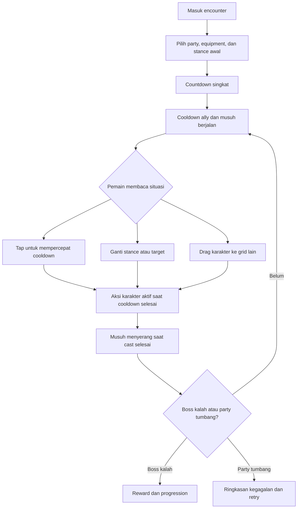

# Game Design Document: Gridbound Raid

> Judul kerja. Nama final belum ditentukan.

## 1. Informasi Dokumen

| Bidang | Isi |
|---|---|
| Jenis dokumen | Game Design Document |
| Versi | 0.1, konsep lengkap untuk prototipe |
| Status | Draft desain, siap masuk tahap vertical slice |
| Bahasa | Bahasa Indonesia |
| Genre | Real-time tactical RPG, formation battler, raid boss, roguelike |
| Platform utama | Mobile, orientasi portrait |
| Platform lanjutan | Tablet dan PC |
| Mode utama | Adventure berbasis cerita dan Endless Roguelike |
| Jumlah karakter aktif | 2 pada awal permainan, bertumbuh hingga 9 |
| Struktur arena | Formasi pemain 3×3 dan tiga jalur musuh |
| Model kontrol | Tap, multi-touch hingga dua jari, drag-and-drop |
| Durasi target per pertarungan | 2 sampai 5 menit untuk stage biasa, 5 sampai 9 menit untuk raid boss |
| Audiens target | Pemain RPG mobile yang menyukai timing, build, positioning, dan progression |

### 1.1 Fungsi Dokumen

Dokumen ini menjadi acuan untuk desain, prototipe, produksi konten, UI, balancing, audio, QA, dan evaluasi scope. Semua angka dalam tabel combat adalah target awal untuk pengujian, bukan angka final.

### 1.2 Referensi Visual dari Pengguna

Sketsa pengguna dipakai sebagai referensi tata letak: boss berada di area atas, sedangkan sembilan karakter menempati grid 3×3 di bawahnya. Sketsa tersebut tidak dianggap sebagai sumber instruksi tambahan. Dokumen ini hanya mengikuti permintaan tertulis pengguna.

## 2. Ringkasan Game

Gridbound Raid adalah RPG taktis real-time tentang sebuah party yang melawan boss besar dan kelompok minion di arena tiga jalur. Setiap karakter bertindak otomatis ketika cooldown aksinya selesai. Pemain tetap aktif melalui tiga keputusan utama:

1. Memilih stance atau skill yang akan dipakai pada aktivasi berikutnya.
2. Mengetuk karakter, termasuk dengan dua jari, untuk mempercepat cooldown secara terbatas.
3. Memindahkan karakter antar-grid untuk menghindari serangan tertunda, melindungi unit rapuh, dan mengubah target atau jangkauan.

Tantangan datang dari benturan antara perencanaan dan tekanan waktu. Mempercepat Wizard dapat menghasilkan burst besar, tetapi meninggalkan tank tanpa shield. Memindahkan Healer dapat menyelamatkannya dari serangan area, tetapi memberi penalti cooldown dan menunda heal berikutnya. Pemain terus membaca telegraph musuh, mengatur prioritas sentuhan, dan menyiapkan respons sebelum timer musuh selesai.

## 3. Visi Produk

### 3.1 Player Fantasy

Pemain berperan sebagai pemimpin raid yang mengarahkan sembilan petualang dalam formasi hidup. Party tidak menunggu perintah satu per satu. Mereka terus bertindak, sementara pemain mengubah niat, ritme, dan posisi mereka pada saat yang tepat.

### 3.2 Janji Utama

- Combat otomatis tetap membutuhkan tangan dan perhatian.
- Setiap grid memiliki makna taktis.
- Setiap class memiliki ritme sentuhan, target, dan risiko yang berbeda.
- Telegraph boss dapat dibaca dan direspons, bukan sekadar diterima.
- Progression menambah pilihan, bukan hanya angka yang lebih besar.
- Kemenangan ideal terasa seperti hasil koordinasi party, bukan satu karakter yang terlalu kuat.

### 3.3 Pilar Desain

#### Pilar A: Keputusan di Bawah Tekanan

Pemain selalu memiliki lebih banyak cooldown yang ingin dipercepat daripada jumlah sentuhan dan perhatian yang tersedia. Prioritas menjadi inti permainan.

#### Pilar B: Formasi yang Terus Berubah

Grid bukan tempat parkir karakter. Jalur, baris, serangan tertunda, cover, dan penalti relokasi membuat posisi berubah sepanjang pertarungan.

#### Pilar C: Identitas Class yang Terlihat

Warrior menahan ancaman, Rogue mencuri tempo dan gold, Archer memilih sasaran, Healer menjaga stabilitas, dan Wizard mengubah jendela singkat menjadi ledakan damage.

#### Pilar D: Telegraph yang Adil

Serangan berat selalu memberi informasi yang cukup tentang area, waktu, tipe ancaman, dan akibatnya. Kesulitan berasal dari keputusan, bukan kejutan yang tidak dapat dibaca.

#### Pilar E: Build yang Mengubah Cara Bermain

Equipment, skill tree, dan advanced class harus mengubah prioritas stance, pola formasi, atau cara pemain menggunakan tap. Peningkatan yang hanya menambah persentase tetap ada, tetapi bukan hadiah utama.

## 4. Target Pengalaman

### 4.1 Emosi yang Dicari

- Tegang ketika beberapa telegraph muncul bersamaan.
- Puas ketika shield aktif sesaat sebelum pukulan boss.
- Sibuk tetapi tidak panik ketika mengelola dua jari.
- Pintar ketika rotasi stance berhasil mengubah pertahanan menjadi burst.
- Penasaran ketika mendapatkan equipment atau cabang skill baru.
- Berani mengambil risiko ketika memilih gold tambahan melalui Rogue.

### 4.2 Kurva Penguasaan

| Tahap pemain | Hal yang dipelajari |
|---|---|
| 0 sampai 15 menit | Cooldown otomatis, satu sentuhan, ganti stance |
| 15 sampai 45 menit | Telegraph jalur, drag-and-drop, target Archer |
| 1 sampai 3 jam | Multi-touch, buff timing, minion priority |
| 3 sampai 8 jam | Synergy class, equipment, pola boss multi-fase |
| 8 jam ke atas | Advanced class, build khusus, Endless modifiers |

## 5. Struktur Arena

### 5.1 Papan Pemain

Papan pemain terdiri dari sembilan sel.

| Kode | Posisi | Peran posisi umum |
|---|---|---|
| F1 | Depan kiri | Tank, bruiser, pelindung jalur kiri |
| F2 | Depan tengah | Tank utama, penerima serangan frontal |
| F3 | Depan kanan | Tank, bruiser, pelindung jalur kanan |
| M1 | Tengah kiri | Melee support, Rogue, cadangan frontline |
| M2 | Tengah tengah | Healer atau pusat aura |
| M3 | Tengah kanan | Archer atau support |
| B1 | Belakang kiri | Ranged damage |
| B2 | Belakang tengah | Wizard atau Healer rapuh |
| B3 | Belakang kanan | Ranged damage |

Baris depan, tengah, dan belakang disebut rank. Kolom kiri, tengah, dan kanan disebut lane.

### 5.2 Papan Musuh

Pihak musuh memakai tiga lane yang sejajar dengan formasi pemain.

- Boss besar dapat menempati satu, dua, atau tiga lane.
- Minion menempati slot lane yang tersedia di depan boss, di samping boss, atau sebagai objek khusus.
- Satu lane dapat memuat satu unit tempur utama dan satu objek kecil, misalnya totem atau bomb.
- Boss tiga-lane tetap memiliki hit zone per lane agar serangan terarah dan efek break memiliki sasaran jelas.

### 5.3 Aturan Jarak

- Karakter melee umumnya menyerang unit terdekat pada lane yang sama.
- Jika lane kosong, melee dapat menyerang boss besar yang menempati lane tersebut.
- Jika target melee tidak tersedia, karakter menunggu atau memakai skill non-damage sesuai stance.
- Archer dapat menarget lane mana pun.
- Wizard dapat menarget lane tertentu atau area lintas-lane, tergantung skill.
- Healer menarget ally berdasarkan aturan stance.
- Rogue dapat menyerang lane yang sama, menyusup ke lane samping melalui skill tertentu, atau menarget unit bertanda.

### 5.4 Cover dan Proteksi

Karakter di rank depan memberikan cover kepada karakter pada lane yang sama di belakangnya.

- Serangan bertipe Front hanya mengenai rank terdepan yang terisi pada setiap lane sasaran.
- Serangan bertipe Pierce menembus cover dengan pengurangan damage per rank.
- Serangan bertipe Rain, Arcane, Burrow, atau Marked dapat mengabaikan cover.
- Cover tidak berlaku jika pelindung sedang Knocked Down, Airborne, atau Phased Out.

## 6. Alur Satu Pertarungan



### 6.1 Urutan Resolusi

Pada frame yang sama, sistem memakai urutan berikut:

1. Input stance dan target yang sudah diterima.
2. Penyelesaian perpindahan.
3. Efek defensif dan interrupt.
4. Heal dan cleanse.
5. Damage karakter.
6. Damage musuh.
7. Damage over time dan regeneration.
8. Pemeriksaan tumbang, phase change, dan kemenangan.

Urutan ini membuat shield yang selesai tepat waktu dapat menahan pukulan, serta mengurangi hasil yang terasa acak.

## 7. Sistem Cooldown

### 7.1 Prinsip Dasar

- Setiap karakter memiliki Action Cooldown.
- Ketika cooldown mencapai nol, karakter menjalankan skill sesuai stance aktif.
- Setelah aksi selesai, cooldown diisi ulang memakai base cooldown skill, Speed, buff, debuff, dan penalti relokasi.
- Stance yang dipilih adalah niat untuk aktivasi berikutnya.
- Pemain dapat mengganti stance selama cooldown berjalan.
- Pada 0,25 detik terakhir sebelum aktivasi, stance terkunci untuk mencegah perubahan yang tidak terbaca.

### 7.2 Rumus Awal

Target prototipe:

```text
cooldown_final = cooldown_skill / (1 + speed_bonus)
progress_per_second = 1 + haste_bonus - slow_penalty
```

Batas desain awal:

- Speed bonus dari semua sumber dibatasi pada 60 persen.
- Slow tidak dapat menurunkan progress di bawah 35 persen dari kecepatan normal.
- Cooldown minimum setelah semua modifikasi adalah 1,2 detik.
- Ultimate dan skill bertanda Ritual dapat memiliki batas minimum lebih tinggi.

### 7.3 Cooldown Musuh

Musuh memiliki dua tahap timer:

1. Intent: ikon awal menunjukkan jenis ancaman dan area kemungkinan.
2. Cast: area final dikunci, telegraph menyala, dan hit terjadi saat timer habis.

Boss dapat memiliki beberapa timer paralel. Contohnya, pukulan frontline aktif dalam 4 detik sementara meteor tertunda aktif dalam 7 detik.

### 7.4 Aturan Pause

Rekomendasi default:

- Tidak ada tactical pause pada tingkat kesulitan normal dan tinggi.
- Membuka menu sistem menghentikan simulasi pada mode Adventure solo.
- Endless leaderboard tidak mengizinkan pause untuk menjaga perbandingan run.
- Mode aksesibilitas dapat memperlambat waktu menjadi 75 atau 60 persen tanpa mengubah urutan event. Run dengan bantuan waktu dipisahkan dari leaderboard kompetitif.

## 8. Mekanik Tap dan Multi-Touch

### 8.1 Tujuan

Tap mengubah cooldown otomatis menjadi aktivitas fisik yang singkat. Mekanik ini tidak boleh menjadi spam tanpa keputusan atau menciptakan keuntungan tak terbatas bagi auto-clicker.

### 8.2 Focus Tap

- Mengetuk portrait atau tubuh karakter mengurangi sisa cooldown karakter tersebut.
- Satu sentuhan valid memberi pengurangan dasar 0,16 detik.
- Dua jari pada dua karakter berbeda mempercepat keduanya secara bersamaan.
- Dua jari pada karakter yang sama memicu Sync Tap dan memberi pengurangan total 0,38 detik jika kedua sentuhan masuk dalam jendela 120 milidetik.
- Sistem menerima maksimal 7 input efektif per detik untuk setiap karakter.
- Animasi tap tidak menghalangi telegraph atau angka cooldown.

Semua angka merupakan target prototipe.

### 8.3 Focus dan Fatigue

Setiap karakter memiliki meter Focus tersembunyi yang direpresentasikan melalui perubahan ring cooldown.

- Tap menambah Fatigue.
- Fatigue rendah memberi nilai tap penuh.
- Fatigue menengah mengurangi nilai tap menjadi 70 persen.
- Fatigue tinggi mengurangi nilai tap menjadi 40 persen.
- Tidak mengetuk karakter selama 1 detik mulai menurunkan Fatigue.
- Fatigue hanya memengaruhi percepatan manual, bukan cooldown alami.

Tujuannya adalah mendorong perpindahan perhatian antar-karakter dan mencegah satu unit menjadi pilihan terbaik sepanjang waktu.

### 8.4 Perfect Rhythm

Setiap ring cooldown memiliki tiga pulse kecil. Tap yang mengikuti pulse memberi bonus kecil dan feedback audio yang lebih jelas.

- Bonus rhythm maksimal 20 persen dari nilai tap.
- Gagal mengikuti rhythm tidak memberi penalti.
- Opsi Reduced Rhythm menghapus kebutuhan timing dan memberi nilai tap rata-rata.

### 8.5 Aturan Input

- Tap tidak boleh memicu drag jika pergerakan jari kurang dari ambang drag.
- Sentuhan 180 milidetik atau lebih dapat menjadi Hold Assist untuk aksesibilitas.
- Maksimal dua pointer dihitung untuk percepatan, tetapi pointer ketiga tidak mengganggu UI.
- Saat satu jari sedang drag, jari kedua tetap dapat mengetuk karakter lain.
- Tap pada karakter yang cooldown-nya sudah siap memberi feedback Ready dan tidak dikonsumsi.
- Tap tidak dapat mempercepat Stun, Silence, atau cooldown relokasi kecuali skill secara eksplisit mengizinkannya.

### 8.6 Anti-Eksploitasi

- Input dibatasi per karakter dan per perangkat, bukan berdasarkan frame rate.
- Nilai tap dihitung server-side jika game memakai layanan online.
- Pola input dengan interval identik dalam durasi panjang dapat ditandai untuk leaderboard, tetapi tidak mengganggu permainan offline.
- Tidak ada pembelian yang meningkatkan nilai tap.

## 9. Drag-and-Drop dan Relokasi

### 9.1 Operasi Dasar

- Drag ke sel kosong memindahkan karakter.
- Drag ke sel terisi menukar kedua karakter.
- Sel tujuan menampilkan warna valid atau tidak valid sebelum jari dilepas.
- Membatalkan drag mengembalikan karakter tanpa penalti.
- Perpindahan baru terkonfirmasi saat jari dilepas pada sel valid.

### 9.2 Waktu Relokasi

Target prototipe:

| Jenis perpindahan | Durasi | Penalti action cooldown |
|---|---:|---:|
| Satu sel ortogonal | 0,55 detik | Tambah 0,8 detik |
| Satu sel diagonal | 0,70 detik | Tambah 1,0 detik |
| Dua sel atau lebih | 0,90 detik | Tambah 1,3 detik |
| Tukar dua karakter | 1,00 detik | Tambah 1,0 detik pada keduanya |

Karakter tidak dapat melakukan aksi selama animasi relokasi. Cooldown alami tetap berjalan, lalu penalti ditambahkan setelah karakter tiba.

### 9.3 Interaksi dengan Serangan

- Posisi saat hit terjadi menentukan apakah karakter terkena, bukan posisi saat telegraph muncul.
- Serangan Tracking mengunci karakter, bukan sel, dan harus memiliki ikon berbeda.
- Serangan Ground mengunci sel dan dapat dihindari dengan berpindah.
- Serangan Sweep mengunci rangkaian sel secara berurutan.
- Karakter yang sedang bergerak tidak kebal.
- Jika dua karakter bertukar saat salah satu terkena hit, damage diterapkan berdasarkan posisi interpolasi yang telah melewati ambang 50 persen. Untuk keterbacaan, visual karakter harus snap ke sisi yang dianggap aktif.

### 9.4 Guard Move

Warrior dapat membuka kemampuan Guard Move melalui skill tree.

- Drag Warrior ke sel ally bertanda bahaya akan menukar posisi lebih cepat.
- Warrior menerima sebagian damage yang seharusnya mengenai ally jika tiba dalam jendela proteksi.
- Guard Move memiliki cooldown terpisah dan tidak dapat dipercepat dengan tap.

## 10. Stance dan Skill Queue

### 10.1 Model Stance

Setiap karakter membawa dua stance aktif ke pertarungan pada awal game. Slot ketiga terbuka melalui progression. Setiap stance menentukan skill otomatis yang dipakai saat cooldown selesai.

Contoh:

- Warrior: Assault atau Bulwark.
- Healer: Mend atau Blessing.
- Archer: Volley atau Marked Shot.
- Wizard: Arc Lance atau Nova.
- Rogue: Flurry atau Pilfer.

### 10.2 Pergantian Stance

- Tap tombol stance pada kartu karakter untuk memilih aksi berikutnya.
- Pergantian stance tidak mereset cooldown.
- Pergantian setelah stance lock berlaku untuk siklus berikutnya.
- Ikon skill di tengah ring cooldown selalu menunjukkan aksi yang akan terjadi.
- Menahan tombol stance membuka detail target, efek, dan perkiraan waktu aktivasi.

### 10.3 Manual Targeting

- Skill biasa memakai aturan auto-target.
- Skill berlabel Directed dapat diberi target melalui tap pada musuh.
- Target tersimpan sampai mati, keluar arena, atau pemain memilih target baru.
- Jika target tidak valid saat aksi aktif, sistem memakai fallback yang tertulis pada skill.
- Tidak ada aksi yang hilang hanya karena target mati satu frame sebelum cast. Skill dialihkan jika fallback tersedia.

### 10.4 Ultimate

Ultimate bukan bagian dari cooldown otomatis biasa.

- Party menghasilkan Resolve melalui menerima damage, melakukan Perfect Rhythm, memecahkan armor boss, dan menyelamatkan ally dari serangan mematikan.
- Ultimate dipicu manual agar momen penting tetap berada di tangan pemain.
- Satu party memakai meter Resolve bersama.
- Mengganti karakter tidak menghapus Resolve.
- Ultimate tidak boleh menjadi syarat untuk lolos dari serangan tanpa telegraph yang jelas.

## 11. Statistik Combat

| Stat | Fungsi |
|---|---|
| HP | Daya tahan sebelum tumbang |
| Attack | Dasar physical damage dan sebagian heal |
| Magic | Dasar magical damage, heal, dan shield tertentu |
| Defense | Mengurangi physical damage |
| Resistance | Mengurangi magical damage |
| Speed | Mempercepat cooldown alami |
| Precision | Akurasi, critical consistency, dan directed effect |
| Guard | Kekuatan shield dan ketahanan terhadap stagger |
| Luck | Peluang efek loot atau class-specific, tidak memengaruhi semua hasil |

### 11.1 Rumus Damage Awal

```text
raw_damage = power_skill × stat_source
mitigation = defense / (defense + K_level)
final_damage = raw_damage × (1 - mitigation) × modifiers
```

K_level naik mengikuti level encounter agar Defense tidak mencapai pengurangan penuh.

### 11.2 Critical

- Base critical chance adalah 5 persen.
- Critical multiplier dasar adalah 150 persen.
- Heal tidak critical kecuali node skill mengizinkannya.
- Shield tidak critical.
- Damage over time memakai snapshot stat saat diterapkan, tetapi membaca vulnerability target saat tiap tick.

### 11.3 Shield

- Shield menyerap damage sebelum HP.
- Shield baru dengan sumber dan nama sama mengganti durasi serta memakai nilai tertinggi, kecuali skill menyebut dapat ditumpuk.
- Shield dari sumber berbeda dapat ditumpuk sampai batas 60 persen max HP target.
- Damage yang melebihi shield diteruskan ke HP.

### 11.4 Tumbang dan Revive

- Karakter pada 0 HP menjadi Downed dan tetap memenuhi sel selama 6 detik.
- Downed tidak dapat bertindak, ditap, atau melindungi rank belakang.
- Jika tidak direvive, karakter keluar dari arena dan sel menjadi kosong.
- Revive mengembalikan sebagian HP dan memberi Recovery Lock agar revive berantai tidak mudah dieksploitasi.
- Seluruh party kalah jika tidak ada karakter aktif dan tidak ada revive yang sedang resolve.

## 12. Class Dasar

### 12.1 Ringkasan Peran

| Class | Daya tahan | Kecepatan | Jangkauan | Keunggulan | Risiko utama |
|---|---:|---:|---|---|---|
| Warrior | Tinggi | Rendah | Lane yang sama | Shield, cover, stagger | Damage lambat |
| Rogue | Rendah | Sangat tinggi | Lane sama atau infiltrasi | Tempo, steal, debuff | Mudah tumbang |
| Archer | Sedang-rendah | Sedang | Semua lane | Pilih target, minion control | Lemah saat ditekan |
| Healer | Rendah | Sedang-rendah | Semua ally | Heal, cleanse, buff | Sedikit damage |
| Wizard | Rendah | Rendah | Lane atau area | Burst, AoE, elemental setup | Cooldown panjang |

## 13. Warrior

### 13.1 Identitas

Warrior menjaga lane, menyerap pukulan, dan mengubah serangan boss menjadi kesempatan counter. Ia paling kuat di depan, tetapi masih dapat dipindah untuk melakukan penyelamatan.

### 13.2 Passive: Hold the Line

Selama berada di rank depan, Warrior memperoleh Guard dan mengurangi damage Pierce yang melewatinya. Bonus hilang sesaat setelah relokasi agar pemain tidak menggoyangkan posisi untuk mengeksploitasi passive.

### 13.3 Stance Dasar

| Stance | Skill otomatis | Cooldown awal | Efek | Auto-target |
|---|---|---:|---|---|
| Assault | Shield Bash | 4,2 dtk | Physical damage dan Stagger tinggi | Musuh terdekat di lane |
| Bulwark | Raise Guard | 5,4 dtk | Shield diri dan ally di belakang pada lane sama | Diri dan lane |
| Challenge | War Cry | 7,0 dtk | Taunt unit yang dapat diprovokasi dan kurangi damage lane | Lane saat ini |

### 13.4 Ultimate: Last Bastion

Warrior menancapkan perisai selama beberapa detik. Semua damage terhadap party berkurang, dan sebagian damage pada lane Warrior dialihkan kepadanya sampai batas tertentu.

### 13.5 Cabang Advanced Class

#### Guardian

- Fokus pada shield bersama, Guard Move, taunt, dan counter.
- Cocok untuk boss dengan serangan lane berat.
- Risiko: clear speed rendah.

#### Berserker

- Mengubah HP hilang menjadi Speed dan damage.
- Shield Bash berubah menjadi Armor Break.
- Risiko: membutuhkan timing heal dan dapat tumbang saat greedy.

## 14. Rogue

### 14.1 Identitas

Rogue adalah unit tempo. Cooldown pendek membuatnya nyaman untuk tap cepat, tetapi pemain harus melindunginya dari serangan acak. Rogue juga memberi jalur ekonomi yang memiliki biaya combat nyata.

### 14.2 Passive: Light Fingers

Serangan ketiga pada target yang sama menghasilkan Combo. Combo dapat dikonsumsi untuk bonus damage, mengurangi cooldown relokasi, atau memperkuat hasil Pilfer.

### 14.3 Stance Dasar

| Stance | Skill otomatis | Cooldown awal | Efek | Auto-target |
|---|---|---:|---|---|
| Flurry | Twin Cut | 2,8 dtk | Dua hit cepat, membangun Combo | Musuh terdekat di lane |
| Pilfer | Sleight | 4,6 dtk | Damage ringan dan peluang memperoleh battle gold | Musuh non-boss, lalu hit zone boss |
| Sabotage | Hamstring | 5,8 dtk | Damage dan memperlambat timer aksi musuh yang tidak kebal | Target bertanda |

### 14.4 Aturan Steal

- Pilfer tidak mencuri item permanen langsung dari setiap musuh.
- Setiap encounter memiliki Battle Purse dengan batas gold.
- Pilfer memindahkan gold dari Battle Purse ke reward aman saat menang.
- Jika party kalah, hanya persentase tertentu dari hasil curian yang dibawa pulang melalui perk.
- Boss tertentu memiliki komponen yang dapat dicuri satu kali, misalnya key fragment atau crafting token.
- UI harus menunjukkan kapan target sudah tidak memiliki loot agar Rogue dapat mengganti stance.

### 14.5 Ultimate: Vanishing Heist

Rogue menghilang dari grid, menghindari serangan Ground singkat, lalu menyerang target bertanda berkali-kali. Jika target memiliki loot khusus, satu roll Pilfer dijamin.

### 14.6 Cabang Advanced Class

#### Assassin

- Fokus pada Mark, execute, dan infiltrasi antar-lane.
- Damage besar pada target tunggal.
- Risiko: minim manfaat ekonomi dan sangat rapuh.

#### Trickster

- Fokus pada gold, bomb palsu, pengalihan telegraph, dan debuff.
- Dapat memindahkan tanda Tracking dari satu ally ke decoy.
- Risiko: damage langsung rendah.

## 15. Archer

### 15.1 Identitas

Archer mengontrol sasaran. Ia adalah jawaban utama terhadap minion, objek berbahaya, dan weak point boss yang tidak sejajar dengan frontline.

### 15.2 Passive: Clear Sight

Archer memperoleh Precision selama tidak berpindah. Stack berkurang saat terkena damage langsung atau melakukan relokasi.

### 15.3 Stance Dasar

| Stance | Skill otomatis | Cooldown awal | Efek | Auto-target |
|---|---|---:|---|---|
| Volley | Split Arrow | 4,4 dtk | Menembak hingga tiga target dengan damage terbagi | Minion lebih dulu |
| Marked Shot | Pinpoint | 5,2 dtk | Damage tinggi pada target pilihan, bonus ke weak point | Target manual |
| Suppression | Rain of Bolts | 6,8 dtk | Area lane yang memperlambat minion | Lane dengan unit terbanyak |

### 15.4 Ultimate: Horizon Breaker

Archer menembakkan panah yang menembus semua musuh pada satu lane. Damage meningkat untuk setiap weak point yang sudah dihancurkan.

### 15.5 Cabang Advanced Class

#### Sharpshooter

- Memperkuat target manual, critical consistency, dan weak point.
- Dapat mempertahankan sebagian Clear Sight setelah relokasi pendek.

#### Warden

- Memperkuat Volley, trap lane, dan kontrol minion.
- Dapat menandai satu lane sebagai kill zone.

## 16. Healer

### 16.1 Identitas

Healer mengatur kestabilan party. Pilihannya bukan sekadar heal atau tidak. Pemain memilih antara memulihkan kesalahan sekarang, membersihkan debuff, atau memperkuat jendela serangan berikutnya.

### 16.2 Passive: Triage

Healer menandai ally dengan persentase HP terendah. Skill heal otomatis memprioritaskan target tersebut kecuali pemain memasang Beacon pada ally lain.

### 16.3 Stance Dasar

| Stance | Skill otomatis | Cooldown awal | Efek | Auto-target |
|---|---|---:|---|---|
| Mend | Restoring Light | 5,0 dtk | Heal satu ally dan heal kecil pada diri | HP terendah |
| Blessing | Battle Hymn | 6,4 dtk | Buff Attack dan Magic pada satu rank | Rank dengan ally terbanyak |
| Purify | Cleanse Wave | 7,2 dtk | Menghapus satu debuff dan memberi resistance singkat | Prioritas debuff berat |

### 16.4 Ultimate: Second Dawn

Heal seluruh party. Satu karakter Downed dengan timer tersisa dapat bangkit. Jika tidak ada karakter Downed, party mendapat regeneration dan shield kecil.

### 16.5 Cabang Advanced Class

#### Cleric

- Fokus pada heal, cleanse, barrier, dan revive.
- Kuat untuk pertarungan panjang.

#### Bard

- Fokus pada buff rank, percepatan cooldown, dan penguatan rhythm tap.
- Kuat untuk tim agresif, tetapi heal darurat lebih lemah.

## 17. Wizard

### 17.1 Identitas

Wizard mengubah perencanaan menjadi burst. Cooldown panjang membuat percepatan manual sangat bernilai, tetapi mengalihkan dua jari kepadanya dapat membuat unit lain terlambat bertahan.

### 17.2 Passive: Arcane Residue

Setiap spell meninggalkan elemen pada lane target. Spell berikutnya dapat mengonsumsi residue untuk efek tambahan. Satu lane menyimpan maksimal dua residue.

### 17.3 Stance Dasar

| Stance | Skill otomatis | Cooldown awal | Efek | Auto-target |
|---|---|---:|---|---|
| Lance | Arc Lance | 6,0 dtk | Magical damage tinggi pada satu target | Target manual atau boss |
| Burst | Delayed Detonation | 8,5 dtk | Bomb yang meledak setelah delay, sangat kuat pada armor break | Target dengan HP tertinggi |
| Nova | Tri-Lane Nova | 10,5 dtk | AoE pada tiga lane, mengonsumsi residue | Semua lane |

### 17.4 Ultimate: Time Fracture

Menghentikan progress cooldown musuh dalam durasi singkat tanpa menghentikan animasi atau input pemain. Boss phase transition kebal, tetapi cast biasa dapat tertunda.

### 17.5 Cabang Advanced Class

#### Arcanist

- Fokus pada burst target tunggal, cooldown planning, dan Time Fracture.
- Sangat kuat pada jendela Armor Break.

#### Elementalist

- Fokus pada residue, damage over time, chain reaction, dan AoE.
- Kuat melawan minion, tetapi setup lebih lama.

## 18. Synergy Party

### 18.1 Contoh Kombinasi

| Kombinasi | Hasil |
|---|---|
| Warrior Bulwark + Healer Blessing | Frontline aman sambil menyiapkan burst |
| Archer Marked Shot + Wizard Burst | Weak point pecah sebelum bomb meledak |
| Rogue Sabotage + Wizard Nova | Waktu tambahan untuk menyelesaikan cast panjang |
| Bard buff + Rogue Flurry | Banyak aktivasi cepat selama jendela buff |
| Guardian cover + Sharpshooter | Archer mempertahankan Clear Sight lebih lama |

### 18.2 Aturan Anti-Dominasi

- Tidak ada class yang wajib untuk semua boss.
- Setiap fungsi kritis memiliki setidaknya dua sumber, misalnya shield dari Warrior atau equipment support.
- Boss tidak boleh kebal total terhadap identitas class sepanjang encounter.
- Hard counter hanya dipakai pada optional challenge yang memberi informasi sebelum party dipilih.

## 19. Desain Musuh

### 19.1 Kategori Musuh

| Kategori | Fungsi |
|---|---|
| Boss | Sumber pola utama, fase, dan kemenangan encounter |
| Elite | Ancaman khusus dengan satu mekanik dominan |
| Minion | Menekan lane, mengganggu target, atau melindungi boss |
| Summon | Unit sementara yang terhubung ke skill boss |
| Hazard | Objek grid seperti bomb, totem, crystal, atau trap |

### 19.2 Minion Dasar

| Minion | Perilaku | Respons yang diharapkan |
|---|---|---|
| Raider | Menyerang unit terdepan di lane | Tank atau bunuh cepat |
| Wisp | Menembak rank belakang | Archer target atau pindahkan unit rapuh |
| Cultist | Mempercepat cooldown boss | Interrupt atau fokus target |
| Bulwark Drone | Memberi armor pada boss | Pecahkan shield atau ganti lane |
| Burrower | Menandai sel acak lalu muncul | Relokasi tepat waktu |
| Mimic | Membawa Battle Purse besar | Risiko memakai Pilfer |

## 20. Sistem Raid Boss

### 20.1 Anatomi Boss

Boss dapat memiliki komponen berikut:

- Core HP sebagai syarat menang.
- Armor bar yang dapat di-break.
- Weak point per lane.
- Limb atau komponen yang dapat dihancurkan.
- Phase trigger berdasarkan HP, waktu, atau objective.
- Enrage timer untuk membatasi stall tanpa membuat build defensif tidak berguna.

### 20.2 Bahasa Telegraph

| Bentuk telegraph | Arti |
|---|---|
| Sel merah penuh | Damage Ground pada sel itu |
| Garis merah satu lane | Serangan Pierce sepanjang lane |
| Tiga sel depan oranye | Cleave ke frontline |
| Lingkaran mengikuti karakter | Tracking attack |
| Panah berurutan | Sweep dari sel pertama ke terakhir |
| Retakan ungu | Magical burst, Resistance relevan |
| Ikon rantai | Root atau relokasi dibatasi |
| Ring putih menyusut | Waktu tersisa sampai hit |

Warna selalu didampingi bentuk, ikon, suara, dan pola animasi agar informasi tidak bergantung pada warna saja.

### 20.3 Contoh Serangan Boss

| Nama | Telegraph | Cast | Efek | Counter utama |
|---|---|---:|---|---|
| Crushing Front | Tiga sel depan | 3,5 dtk | Physical damage besar | Bulwark, pindah rank, damage reduction |
| Tail Lottery | Tiga sel acak | 4,0 dtk | Ground damage tertunda | Drag karakter |
| Ember Track | Satu karakter bertanda | 3,0 dtk | Tracking magical hit dan burn | Shield, cleanse, split mitigation |
| Lane Breath | Satu lane penuh | 4,8 dtk | Multi-hit Pierce | Pindah lane, resistance, interrupt |
| Summon Brood | Slot musuh berkedip | 5,5 dtk | Memanggil tiga minion | Simpan Volley atau Nova |
| Devour Timer | Minion tertentu bertanda | 6,0 dtk | Boss memakan minion dan heal | Directed Shot, burst |

### 20.4 Armor Break

- Serangan tertentu menghasilkan Stagger.
- Saat bar armor habis, boss masuk Break selama beberapa detik.
- Saat Break, boss berhenti menambah cast baru dan menerima bonus damage.
- Cast yang sudah melewati titik komitmen tetap selesai kecuali efek interrupt secara jelas membatalkannya.
- Armor pulih setelah Break dan resistansi Stagger meningkat sementara untuk mencegah chain-lock.

### 20.5 Phase Transition

- Timer combat tidak berjalan selama cut-in singkat.
- Cooldown ally berhenti agar phase transition tidak memberi keuntungan acak.
- Telegraph lama dibersihkan atau diselesaikan sebelum fase baru.
- Boss menunjukkan satu demonstrasi aman untuk mekanik baru sebelum kombinasi mematikan.

## 21. Contoh Raid Boss: Vharok, Naga Bara

### 21.1 Narasi

Vharok adalah naga penjaga gerbang pertama menuju retakan dunia. Ia tidak langsung dibunuh dalam pertemuan awal. Party mematahkan segel pada sisiknya dan memaksanya mundur, lalu bertemu kembali dalam raid penuh.

### 21.2 Struktur Encounter

| Fase | Kondisi | Fokus mekanik |
|---|---|---|
| Fase 1 | 100 sampai 70 persen HP | Crushing Front dan minion dasar |
| Fase 2 | 70 sampai 35 persen HP | Tail Lottery dan weak point sayap |
| Fase 3 | 35 sampai 0 persen HP | Dua timer paralel, ember lane, enrage |

### 21.3 Rotasi Fase 1

1. Basic Claw pada lane dengan threat tertinggi.
2. Crushing Front dengan cast 3,5 detik.
3. Summon Brood pada dua lane acak.
4. Basic Claw.
5. Lane Breath pada lane dengan karakter terbanyak.

Rotasi memiliki variasi kecil, tetapi tidak boleh memilih kombinasi yang tidak mungkin direspons oleh party level rekomendasi.

### 21.4 Fase 2

- Sayap kiri dan kanan menjadi weak point.
- Menghancurkan sayap mengurangi jumlah target Tail Lottery.
- Minion Wisp mengganggu backline.
- Boss dapat menumpuk Ground telegraph dengan Tracking telegraph, memaksa pemain memilih siapa yang bergerak dan siapa yang diberi shield.

### 21.5 Fase 3

- Boss menyalakan satu lane setiap 12 detik.
- Sel di lane menyala memberi burn selama karakter berada di sana.
- Lane berpindah dengan urutan yang dapat dibaca.
- Enrage terjadi setelah durasi target dan mempercepat cast, bukan langsung membunuh party.

### 21.6 Reward Unik

- Ember Scale untuk crafting equipment fire resistance.
- Fragment cerita.
- Peluang blueprint Dragonhook Bow.
- First-clear unlock untuk Adventure chapter berikutnya.

## 22. Threat dan Targeting Boss

### 22.1 Threat

- Damage, heal, shield, dan taunt menghasilkan threat.
- Boss memakai threat hanya untuk serangan bertipe Aggro.
- Serangan Pattern, Ground, dan Tracking dapat mengabaikan threat.
- UI menampilkan crown kecil pada karakter dengan threat tertinggi.

### 22.2 Pemilihan Grid Acak

Random attack memakai weighted random yang dapat diaudit.

- Sel yang baru terkena serangan berat mendapat temporary protection weight.
- Game menghindari memilih sel sama berkali-kali tanpa warning khusus.
- Pilihan random ditentukan sebelum telegraph tampil.
- Seed disimpan dalam replay agar bug dapat direproduksi.

## 23. Status Effect

| Status | Efek | Counter |
|---|---|---|
| Burn | Damage over time | Cleanse, fire resistance |
| Bleed | Damage saat karakter bertindak atau bergerak | Cleanse, berhenti relokasi |
| Slow | Progress cooldown berkurang | Cleanse, haste |
| Haste | Progress cooldown bertambah | Buff positif |
| Stun | Tidak dapat bertindak atau menerima tap | Cleanse khusus, immunity singkat |
| Root | Tidak dapat direlokasi | Cleanse, teleport skill |
| Silence | Stance skill non-basic tidak aktif | Cleanse atau tunggu |
| Marked | Target serangan Tracking atau bonus damage | Decoy, cleanse tertentu |
| Vulnerable | Damage diterima meningkat | Defensive stance |
| Fortified | Damage diterima berkurang | Buff positif |

Setiap status memiliki ikon, durasi radial, kategori, dan prioritas cleanse.

## 24. Adventure Mode

### 24.1 Struktur Campaign

Campaign dibagi menjadi chapter. Setiap chapter memiliki peta node dengan jalur utama dan cabang opsional.

Jenis node:

- Story battle.
- Elite battle.
- Raid boss.
- Rescue atau recruitment.
- Treasure.
- Merchant.
- Camp untuk upgrade sementara dalam chapter.
- Puzzle formation.
- Character quest.

### 24.2 Progression Roster

Rekomendasi urutan unlock:

| Momen | Roster | Tujuan pembelajaran |
|---|---|---|
| Tutorial 1 | Warrior dan Archer | Cooldown, tap, shield, target |
| Tutorial 2 | Tambah Healer | Heal versus buff |
| Akhir Chapter 1 | Tambah Rogue | Tempo, loot, unit rapuh |
| Pertengahan Chapter 2 | Tambah Wizard | Burst, AoE, cooldown panjang |
| Chapter berikutnya | Varian karakter per class | Party composition dan synergy |

Pemain mulai dengan dua karakter agar dapat memahami ritme sentuhan tanpa langsung mengelola sembilan timer.

### 24.3 Pertumbuhan Ukuran Party

| Milestone | Maksimum karakter aktif | Area grid yang terbuka |
|---|---:|---|
| Awal | 2 | Tiga sel depan dan satu sel tengah |
| Chapter 1 selesai | 4 | Dua rank |
| Chapter 2 selesai | 6 | Grid penuh, maksimal enam unit |
| Chapter 3 selesai | 9 | Grid penuh, semua slot dapat dipakai |

Grid yang belum terbuka tetap terlihat redup agar pemain memahami arah progression.

### 24.4 Objective Variatif

- Kalahkan boss.
- Bertahan sampai portal terbuka.
- Lindungi NPC pada grid tertentu.
- Hancurkan tiga objek sebelum timer habis.
- Curi key item dan keluar hidup-hidup.
- Kalahkan boss tanpa membunuh minion tertentu.
- Menangkan encounter dengan batas perpindahan.

## 25. Story dan Dunia

### 25.1 Premis

Dunia terpecah menjadi wilayah yang dihubungkan oleh sembilan segel. Makhluk besar menguasai setiap retakan dan mengubah hukum lokal, termasuk waktu, cuaca, dan ingatan. Sang pemain memimpin kelompok kecil penjaga yang mampu menyelaraskan segel melalui formasi sembilan titik.

### 25.2 Tema

- Kerja sama antara orang yang memiliki tujuan berbeda.
- Harga dari kekuatan yang dipinjam.
- Ingatan sebagai bagian dari identitas.
- Memilih apa yang dilindungi ketika semua hal tidak dapat diselamatkan.

### 25.3 Struktur Tiga Babak

#### Babak 1: Party Terbentuk

Pemain merekrut lima class dasar, mempelajari fungsi sembilan segel, dan mengalahkan Vharok sebagai raid boss pertama.

#### Babak 2: Perpecahan

Advanced class diperkenalkan. Pilihan cabang karakter terkait dengan konflik pribadi, bukan hanya menu statistik. Boss mulai memanipulasi grid dan memisahkan party.

#### Babak 3: Sembilan Retakan

Party harus memilih urutan raid akhir. Urutan tersebut mengubah modifier boss berikutnya dan beberapa percakapan, tetapi tidak mengunci pemain dari konten utama.

### 25.4 Penyampaian Cerita

- Dialog singkat sebelum dan sesudah encounter.
- Banter kontekstual selama combat tanpa menutup telegraph.
- Character quest untuk advanced class.
- Camp conversation setelah milestone.
- Codex opsional untuk lore yang lebih dalam.
- Cutscene panjang dibatasi agar loop bermain tetap dominan.

## 26. Character Progression

### 26.1 Level

- XP diperoleh oleh seluruh roster agar karakter cadangan tidak tertinggal terlalu jauh.
- Karakter aktif mendapat bonus mastery untuk class yang digunakan.
- Level menaikkan stat dasar dalam rentang terkendali.
- Skill point diperoleh pada milestone, bukan setiap level.

### 26.2 Skill Tree

Setiap class memiliki tiga jenis node:

- Core: memperkuat identitas dasar.
- Branch: mengarah ke advanced class.
- Keystone: mengubah aturan skill atau tap.

Contoh node yang mengubah cara bermain:

- Warrior: Sync Tap saat Bulwark memberi shield kecil pada dua lane samping.
- Rogue: Pilfer yang gagal mengurangi cooldown berikutnya.
- Archer: Marked Shot dapat menembus minion menuju boss.
- Healer: overheal berubah menjadi shield dengan batas tertentu.
- Wizard: memindahkan karakter melewati residue memindahkan satu stack ke lane baru.

### 26.3 Respec

- Respec tersedia di hub dengan biaya gold rendah.
- Pemain dapat menyimpan beberapa loadout setelah fitur terbuka.
- Advanced class dapat diganti di luar encounter setelah quest cabang selesai.
- Tidak ada pilihan permanen yang tidak dijelaskan.

## 27. Equipment

### 27.1 Slot

| Slot | Fungsi utama |
|---|---|
| Weapon | Attack pattern, power, atau scaling |
| Armor | Defense, Resistance, dan respons terhadap posisi |
| Trinket | Efek build khusus dan ekonomi |

### 27.2 Rarity

- Common: stat sederhana.
- Uncommon: satu affix.
- Rare: dua affix atau satu rule modifier.
- Epic: modifier class-specific.
- Relic: mengubah cara bermain, dibatasi satu per karakter.

Rarity tidak menjamin semua item tingkat tinggi cocok untuk semua build.

### 27.3 Contoh Equipment

| Item | Class | Efek desain |
|---|---|---|
| Bastion Plate | Warrior | Shield pada ally belakang bertahan lebih lama |
| Coinspike | Rogue | Battle Purse lebih besar, tetapi HP turun |
| Dragonhook Bow | Archer | Marked Shot menarik Flying minion ke lane target |
| Bell of Clear Water | Healer | Cleanse memberi sedikit cooldown progress |
| Ashglass Focus | Wizard | Nova lebih cepat, tetapi residue dikonsumsi seluruhnya |

### 27.4 Upgrade dan Crafting

- Upgrade menaikkan item level sampai cap chapter.
- Material boss dipakai untuk modifier tematik, bukan sekadar kenaikan angka besar.
- Dismantle mengembalikan sebagian material.
- Equipment penting memiliki pity atau crafting path agar build tidak bergantung penuh pada drop acak.

## 28. Item dan Consumable

Pemain membawa maksimal dua consumable ke encounter.

| Item | Efek | Batas |
|---|---|---|
| Health Flask | Heal satu karakter | Satu charge |
| Cooling Salts | Reset Fatigue tap satu karakter | Satu charge |
| Smoke Bomb | Kurangi threat dan batalkan Tracking tertentu | Satu charge |
| Ward Stone | Beri resistance pada satu lane | Durasi terbatas |
| Phoenix Thread | Perpanjang timer Downed | Tidak revive langsung |

Consumable tidak aktif otomatis. Penggunaannya menghentikan input drag singkat agar tidak terjadi salah sentuh.

## 29. Ekonomi

### 29.1 Mata Uang

| Mata uang | Sumber | Penggunaan |
|---|---|---|
| Gold | Battle, quest, Pilfer | Upgrade, respec, merchant |
| Craft Material | Musuh dan dismantle | Craft dan reroll terbatas |
| Boss Token | Raid boss | Blueprint dan equipment tematik |
| Memory Shard | Story dan character quest | Advanced class dan lore unlock |

### 29.2 Sink dan Inflasi

- Biaya upgrade meningkat per tier, bukan tanpa batas.
- Respec menjadi gold sink ringan.
- Crafting menjamin target jangka menengah.
- Pilfer menambah pilihan ekonomi, tetapi Battle Purse membatasi farming eksploitatif.
- Tidak ada biaya untuk memulai ulang story encounter biasa.

### 29.3 Monetisasi

Model bisnis belum ditentukan. Prinsip desain yang harus dijaga:

- Tidak menjual power yang diperlukan untuk mengalahkan boss.
- Tidak menjual peningkatan nilai tap.
- Tidak mengunci solusi telegraph di karakter berbayar.
- Jika ada pembelian, prioritas pada kosmetik, expansion konten, atau paket premium yang transparan.

## 30. Endless Roguelike

### 30.1 Premis Mode

Pemain memulai run dengan roster kecil dan melintasi rangkaian encounter yang makin sulit. Level, relic, dan modifier dalam run direset ketika run berakhir. Unlock permanen dibatasi agar skill pemain tetap penting.

### 30.2 Struktur Run

1. Pilih dua karakter awal dari pool yang sudah terbuka.
2. Pilih satu dari tiga node.
3. Selesaikan encounter.
4. Pilih reward, recruit, heal, atau upgrade.
5. Hadapi mini-boss setiap beberapa floor.
6. Hadapi raid boss pada milestone.
7. Lanjutkan sampai party tumbang atau pemain mengambil extraction.

### 30.3 Jenis Node

- Combat.
- Elite.
- Recruit.
- Camp.
- Merchant.
- Event dengan pilihan risiko.
- Curse room.
- Raid gate.
- Extraction.

### 30.4 Relic Run

Contoh:

| Relic | Efek | Tradeoff |
|---|---|---|
| Twin Metronome | Sync Tap lebih kuat | Fatigue naik lebih cepat |
| Broken Compass | Relokasi bebas pertama tiap wave | Target otomatis dapat berganti lane |
| Glass Hour | Wizard cooldown lebih cepat | Wizard menerima damage lebih besar |
| Red Purse | Pilfer menghasilkan lebih banyak gold | Merchant lebih mahal |
| Choir Thread | Buff Healer mengenai dua rank | Heal langsung lebih lemah |

### 30.5 Mutator

- Grid tertentu terkunci setiap gelombang.
- Musuh meninggalkan hazard saat mati.
- Cooldown alami lebih lambat, nilai tap lebih tinggi.
- Semua Tracking attack berpindah target sekali.
- Shield decay, tetapi damage saat Break meningkat.
- Minion terus muncul sampai objek lane dihancurkan.

### 30.6 Meta Progression

- Membuka relic baru ke dalam pool.
- Membuka variasi encounter.
- Membuka kosmetik dan codex.
- Menambah pilihan awal, bukan stat permanen tanpa batas.
- Leaderboard memisahkan seed harian, mode bantuan waktu, dan versi balance.

## 31. Tutorial dan Onboarding

### 31.1 Tutorial 1: Dua Timer

- Party: Warrior dan Archer.
- Pemain melihat karakter menyerang otomatis.
- Prompt meminta tiga tap pada Archer.
- Boss dummy menyiapkan serangan depan.
- Pemain mengganti Warrior ke Bulwark.
- Tutorial selesai setelah shield menahan hit.

### 31.2 Tutorial 2: Pindah dari Bahaya

- Ground telegraph muncul pada Archer.
- Game memperlambat waktu, tetapi tidak menghentikannya.
- Pemain drag Archer ke sel kosong.
- UI menunjukkan penalti cooldown setelah tiba.

### 31.3 Tutorial 3: Target dan Minion

- Dua minion muncul.
- Pemain mengganti Archer ke Volley.
- Lalu satu Cultist muncul dan pemain memakai Marked Shot.

### 31.4 Tutorial 4: Heal atau Buff

- Healer bergabung.
- Pertama, pemain menyembuhkan Warrior.
- Berikutnya, boss masuk Break dan pemain memilih Blessing.
- Ringkasan menjelaskan bahwa stance adalah keputusan untuk aktivasi berikutnya.

### 31.5 Aturan Tutorial

- Satu konsep baru per beat.
- Prompt tidak menutup grid atau telegraph.
- Semua tutorial dapat diulang.
- Pemain berpengalaman dapat melewati tutorial setelah demonstrasi singkat.
- Glossary dapat dibuka dari layar pause.

## 32. UI Combat

### 32.1 Hierarki Layar Portrait

1. Area status boss dan tiga lane musuh.
2. Area telegraph dan projectile.
3. Grid party 3×3.
4. Bar ringkas untuk Resolve, consumable, speed, dan pause.

Area musuh tidak boleh terlalu tinggi sehingga sel belakang sulit dijangkau ibu jari.

### 32.2 Informasi pada Sel Karakter

- Karakter atau sprite.
- HP bar.
- Shield overlay.
- Ring cooldown.
- Ikon stance berikutnya.
- Status prioritas maksimal tiga ikon, sisanya dapat dibuka.
- Penanda target atau threat bila relevan.
- Indikator Fatigue tanpa angka wajib.

### 32.3 Feedback Input

- Tap: ring cooldown tersedot sedikit menuju nol.
- Perfect Rhythm: bunyi pendek dan pulse tajam.
- Sync Tap: dua garis bertemu di pusat karakter.
- Drag valid: sel tujuan memiliki outline stabil.
- Drag invalid: karakter kembali dan perangkat memberi haptic lembut.
- Stance queued: ikon lama bergeser ke ikon baru, bukan sekadar berubah tanpa transisi.

### 32.4 Stance Selector

- Tap karakter sekali memilih karakter tanpa mempercepat jika pemain menyentuh area stance khusus.
- Tombol stance berada dekat sel terpilih, tetapi tidak menutup sel tetangga.
- Quick-swipe pada ikon dapat mengganti stance.
- Hold membuka deskripsi lengkap dan angka.
- Opsi Simple Controls menempatkan stance selector pada panel bawah tetap.

### 32.5 Combat Speed

- 1× adalah default.
- 1,5× dan 2× terbuka untuk farming encounter yang sudah diselesaikan.
- Raid boss pertama kali dikunci pada 1×.
- Tap value dihitung terhadap waktu simulasi agar speed-up tidak memberi keuntungan input yang tidak adil.

## 33. UX dan Aksesibilitas

### 33.1 Input Alternatif

- Hold Assist menggantikan tap berulang dengan tekan-tahan yang menghasilkan percepatan rata-rata lebih rendah tetapi stabil.
- One-Hand Mode memindahkan stance selector dan consumable ke sisi pilihan.
- Drag dapat diganti dengan tap karakter lalu tap sel tujuan.
- Durasi long-press dan ambang drag dapat diatur.
- Haptic dapat dimatikan per kategori.

### 33.2 Keterbacaan

- Bentuk dan pola selalu mendampingi warna telegraph.
- Ukuran teks dapat dinaikkan tanpa menutupi grid.
- Damage number dapat diringkas atau dimatikan.
- Efek visual ally, musuh, dan hazard memiliki tingkat intensitas terpisah.
- Reduce Flash membatasi kilatan putih dan perubahan luminance tajam.
- Reduce Motion mengganti camera shake dan parallax dengan feedback statis.

### 33.3 Audio

- Setiap kategori telegraph memiliki motif suara.
- Serangan yang mengincar belakang berbeda dari serangan frontline.
- Countdown berbahaya memiliki tiga tahap bunyi.
- Audio cue tidak menjadi satu-satunya sumber informasi.
- Volume voice, SFX, telegraph, ambience, dan musik dapat diatur terpisah.

### 33.4 Kesulitan dan Bantuan

| Opsi | Dampak |
|---|---|
| Extended Telegraph | Cast musuh lebih lama |
| Reduced Rhythm | Tap bernilai rata-rata tanpa timing |
| Hold Assist | Menahan jari mempercepat cooldown |
| Slow Simulation | Waktu berjalan 75 atau 60 persen |
| Auto-Stance Suggestion | Memberi rekomendasi, tidak mengganti otomatis |
| Safer Relocation | Menampilkan preview jalur dan hit timing |

## 34. Art Direction

### 34.1 Prinsip Visual

- Siluet class harus dapat dibedakan pada ukuran layar kecil.
- Telegraph lebih penting daripada efek serangan.
- Setiap lane harus terbaca tanpa garis grid yang terlalu dominan.
- Boss terasa besar melalui framing, hit zone, dan animasi, bukan dengan menutupi informasi.
- Stance mengubah pose atau alat yang terlihat, bukan hanya ikon UI.

### 34.2 Identitas Class

| Class | Bahasa bentuk | Gerak |
|---|---|---|
| Warrior | Kotak, berat, lebar | Antisipasi kuat dan recovery lambat |
| Rogue | Tajam, diagonal, tipis | Cepat, rendah, perubahan arah mendadak |
| Archer | Garis panjang, busur, fokus | Tarikan jelas dan projectile terbaca |
| Healer | Lingkaran, kain, ritme | Gerak berulang seperti napas atau lagu |
| Wizard | Segitiga, orbit, pecahan | Wind-up panjang dan release besar |

### 34.3 Boss

- Boss memiliki pose idle yang memperlihatkan lane yang dikuasai.
- Bagian tubuh yang menjadi weak point memiliki perubahan bentuk saat aktif.
- Damage state terlihat pada model agar HP bar bukan satu-satunya indikator.
- Phase transition mengubah siluet atau tempo animasi.

## 35. Audio Direction

### 35.1 Musik

- Musik memakai layer yang bertambah saat phase boss berubah.
- Break state mengurangi layer ritmis sesaat lalu masuk ke motif burst.
- Saat dua atau lebih telegraph berbahaya aktif, musik tidak menambah suara perkusi yang menyerupai cue input.

### 35.2 SFX Fungsional

Prioritas mixing:

1. Telegraph mematikan.
2. Konfirmasi stance dan target.
3. Cooldown ready.
4. Hit dan shield break.
5. Loot dan ambience.

### 35.3 Voice

- Bark class singkat memberi informasi, misalnya shield ready atau cleanse needed.
- Bark yang sama memiliki cooldown agar tidak berulang.
- Dialog cerita berhenti saat telegraph prioritas tinggi aktif.

## 36. Kamera dan Presentasi

- Kamera utama statis untuk menjaga keterbacaan grid.
- Zoom kecil hanya dipakai saat ultimate dan tidak boleh menyembunyikan timer.
- Camera shake mengikuti kategori dan dapat dimatikan.
- Boss tiga-lane dapat bergerak di latar, tetapi hit zone tetap stabil.
- Cut-in ultimate maksimal singkat dan simulasi tetap konsisten.

## 37. Encounter Design Rules

### 37.1 Budget Perhatian

Pada kesulitan normal:

- Maksimal dua ancaman baru diperkenalkan pada saat yang sama.
- Maksimal satu serangan membutuhkan relokasi massal dalam satu jendela.
- Setidaknya satu respons defensif yang masuk akal tersedia untuk party level rekomendasi.
- Telegraph pertama dari mekanik baru tidak digabung dengan enrage.

### 37.2 Kombinasi yang Dilarang

- Root seluruh party lalu Ground lethal tanpa opsi cleanse yang dijamin.
- Menutupi timer boss dengan phase transition.
- Serangan random tanpa perlindungan terhadap pengulangan sel.
- Boss kebal Stagger sepanjang encounter tanpa informasi sebelum party selection.
- Minion yang wajib ditarget Archer jika Archer belum dibuka.
- Penalti relokasi lebih panjang daripada waktu telegraph minimum.

### 37.3 Tingkat Kesulitan

| Tingkat | Perubahan utama |
|---|---|
| Story | Damage lebih rendah, telegraph lebih panjang, revive lebih longgar |
| Normal | Target balance utama |
| Veteran | Kombinasi pola lebih rapat, minion lebih aktif |
| Mythic | Mekanik tambahan, enrage ketat, reward kosmetik dan mastery |

Kesulitan tidak hanya menaikkan HP. Pola, urutan, dan tuntutan posisi ikut berubah dengan tetap menjaga keterbacaan.

## 38. Contoh Timeline Combat

Contoh 30 detik awal melawan Vharok pada tingkat Normal:

| Waktu | Boss | Keputusan pemain yang mungkin |
|---:|---|---|
| 0 | Cooldown awal dimulai | Pilih Archer Volley, Warrior Assault |
| 3 | Basic Claw intent | Tap Warrior atau simpan perhatian untuk Archer |
| 5 | Basic Claw hit | Healer belum tersedia pada tutorial awal |
| 7 | Crushing Front telegraph | Ganti Warrior ke Bulwark dan percepat |
| 10,5 | Crushing Front hit | Shield menyerap damage |
| 12 | Dua minion muncul | Archer tetap Volley atau target Cultist |
| 16 | Lane Breath intent | Pindahkan unit dari lane target |
| 20,8 | Lane Breath hit | Warrior dapat menahan lane atau ikut pindah |
| 23 | Armor hampir break | Ubah semua stance ke damage |
| 27 | Break aktif | Prioritaskan Wizard atau Archer pada party lengkap |

## 39. Reward dan Hasil Pertarungan

### 39.1 Victory Screen

Menampilkan:

- Reward yang diperoleh.
- XP roster dan mastery class.
- Kontribusi yang relevan, seperti damage prevented, ally saved, weak point broken, dan gold stolen.
- Mekanik boss yang paling banyak memberi damage kepada party.
- Unlock baru.

Statistik tidak boleh menyederhanakan kontribusi menjadi damage saja.

### 39.2 Defeat Screen

Menampilkan satu sampai tiga petunjuk berbasis data run:

- Serangan apa yang menyebabkan tumbang terbanyak.
- Apakah shield atau heal sering terlambat.
- Berapa banyak karakter terkena Ground attack.
- Apakah minion prioritas hidup terlalu lama.

Saran harus menjelaskan masalah tanpa memaksa satu komposisi party.

## 40. Save dan Progression State

Data yang perlu disimpan:

- Story progress dan node state.
- Roster, level, mastery, skill tree, advanced class.
- Equipment, item, material, gold.
- Loadout party dan posisi grid.
- Opsi input dan aksesibilitas.
- Codex dan tutorial state.
- Endless unlock dan best run.
- Versi balance terakhir yang digunakan.

Autosave terjadi setelah reward dikonfirmasi, setelah upgrade, dan sebelum masuk encounter. Combat dapat memakai checkpoint hanya untuk mode Story, bukan leaderboard Endless.

## 41. Spesifikasi Sistem Teknis Tingkat Tinggi

### 41.1 Simulasi

- Fixed simulation tick disarankan agar cooldown dan hit timing konsisten.
- Rendering dapat berjalan pada frame rate berbeda dari simulasi.
- Semua input dicatat dengan timestamp simulasi.
- RNG memakai seed yang dapat disimpan.
- Combat log menyimpan event penting tanpa menyimpan setiap frame.

### 41.2 State Karakter

```text
Idle
Cooldown
Ready
Casting
Relocating
Recovering
Disabled
Downed
Removed
```

Perpindahan state harus eksplisit. Contohnya, Stun saat Casting dapat membatalkan cast hanya jika skill belum melewati commitment point.

### 41.3 Data Skill

Setiap skill minimal memiliki:

- ID stabil.
- Nama dan localization key.
- Class dan stance.
- Base cooldown.
- Cast time dan recovery.
- Target rule dan fallback.
- Damage, heal, shield, atau status payload.
- Tags, misalnya Physical, Magical, Directed, AoE, Ritual.
- VFX, SFX, animation cue.
- AI weight jika dipakai musuh.
- Upgrade hooks.

### 41.4 Data Telegraph

- Source entity.
- Target type: cell, lane, rank, character, atau global.
- Target list final.
- Intent time dan cast time.
- Shape dan pattern ID.
- Damage type.
- Tracking rules.
- Interrupt behavior.
- Accessibility cue.

### 41.5 Replay Debug

Replay minimal menyimpan:

- Build dan versi data.
- Seed.
- Party dan equipment snapshot.
- Input tap, stance, target, drag, consumable, ultimate.
- Event phase dan spawn.

Replay membantu QA mereproduksi kasus posisi 50 persen, target mati sebelum cast, dan dua event pada tick yang sama.

## 42. AI Musuh

### 42.1 Prinsip

- AI memilih pola, bukan membaca input masa depan.
- AI dapat merespons keadaan nyata seperti lane padat atau HP party, tetapi informasi tersebut harus sesuai aturan skill.
- Boss tidak mengganti target setelah telegraph final kecuali serangan bertipe Tracking.
- Kesulitan tinggi boleh memperpendek jeda antarpola, bukan melakukan input curang.

### 42.2 Pemilihan Aksi

```text
eligible_actions
-> filter berdasarkan phase, cooldown, dan kondisi
-> beri weight berdasarkan lane, minion, dan penggunaan terakhir
-> terapkan anti-repeat
-> pilih memakai seeded RNG
-> umumkan intent
-> kunci target pada waktu yang ditentukan skill
```

## 43. Telemetry dan Balancing

### 43.1 Metric Inti

- Win rate per encounter dan tingkat kesulitan.
- Durasi encounter.
- Penyebab tumbang.
- Damage yang dihindari melalui relokasi.
- Damage yang diserap shield.
- Distribusi stance per class.
- Tap efektif per detik dan distribusi Fatigue.
- Frekuensi Sync Tap.
- Waktu reaksi dari telegraph ke drag.
- Minion time-to-kill.
- Party composition dan posisi awal.
- Penggunaan bantuan aksesibilitas.

### 43.2 Pertanyaan Balancing

- Apakah tap terasa bermakna tanpa wajib dilakukan terus-menerus?
- Apakah dua jari memberi pilihan atau hanya meningkatkan APM?
- Apakah penalti relokasi membuat keputusan menarik tanpa terasa menghukum?
- Apakah Healer terlalu wajib?
- Apakah Rogue menghasilkan gold cukup untuk terasa unik tanpa menjadi pilihan farming otomatis?
- Apakah Wizard burst sebanding dengan perhatian yang dibutuhkan?
- Apakah Archer benar-benar unggul pada target selection?

### 43.3 Guardrail Data

- Jangan mengumpulkan data sentuhan mentah yang tidak diperlukan.
- Simpan agregat input jika cukup untuk balancing.
- Beri opsi privasi sesuai kebutuhan platform.
- Jangan memakai telemetry untuk menurunkan drop rate personal secara tersembunyi.

## 44. Content Pipeline

### 44.1 Template Encounter

Setiap encounter harus mendefinisikan:

- Tujuan.
- Roster minimum yang diasumsikan.
- Layout musuh.
- Daftar pola dan urutan unlock.
- Telegraph minimum.
- Enrage atau fail condition.
- Reward.
- Variasi kesulitan.
- Test cases khusus.

### 44.2 Template Karakter

- Peran dan fantasy.
- Base stats.
- Dua stance awal dan satu stance unlock.
- Passive.
- Ultimate.
- Target rules.
- Advanced class.
- Skill tree nodes.
- Equipment tags.
- Animation budget.
- Audio identity.

## 45. Scope Produksi

### 45.1 Prototype Mekanik

Tujuan: membuktikan apakah tap, stance, drag, dan telegraph menyatu dengan baik.

Isi minimum:

- Grid pemain 3×3.
- Dua karakter: Warrior dan Archer.
- Dua stance per karakter.
- Satu boss dummy dengan tiga pola.
- Satu jenis minion.
- Tap satu jari dan dua jari.
- Drag ke sel kosong dan swap.
- Cooldown penalty.
- Debug overlay untuk timer dan event.

Kriteria lulus:

- Pemain memahami aksi otomatis tanpa penjelasan panjang.
- Pemain dapat mengubah stance sebelum aktivasi.
- Tap memberi dampak yang terasa.
- Drag tidak sering tertukar dengan tap.
- Semua serangan berat dapat dihindari atau dimitigasi.

### 45.2 Vertical Slice

Isi target:

- Lima class dasar.
- Satu raid boss tiga fase.
- Enam minion atau hazard.
- Satu chapter pendek.
- Equipment dasar.
- Hub sederhana.
- Tutorial lengkap.
- Audio dan art representatif.
- Save dan settings.
- Satu run Endless pendek.

### 45.3 MVP

Rekomendasi scope awal:

- Tiga chapter Adventure.
- Lima class dasar dengan minimal dua karakter per class atau total roster yang setara.
- Tiga raid boss utama.
- Dua belas jenis minion dan hazard gabungan.
- Advanced class tier pertama.
- Sekitar tiga puluh equipment bermakna.
- Endless dengan beberapa biome dan boss rotation.
- Accessibility suite dasar.

Jumlah final harus mengikuti kapasitas tim. Lebih baik sedikit boss dengan pola kuat daripada banyak boss yang hanya mengganti angka.

### 45.4 Setelah MVP

- Advanced class tambahan.
- Raid challenge mingguan.
- Seed Endless harian.
- Boss dengan grid manipulation.
- Character quest lanjutan.
- Cosmetic stance dan skill effect yang tetap menjaga keterbacaan.

## 46. Milestone Desain

| Milestone | Pertanyaan yang harus terjawab |
|---|---|
| Paper test | Apakah aturan grid dan target dapat dipahami? |
| Input prototype | Apakah tap dan drag tidak saling mengganggu? |
| Combat prototype | Apakah pergantian stance menciptakan keputusan? |
| Boss prototype | Apakah telegraph adil dengan sembilan unit? |
| Vertical slice | Apakah class terasa berbeda dan progression menarik? |
| Content alpha | Apakah pipeline encounter cukup cepat? |
| Balance beta | Apakah build dan bantuan aksesibilitas tetap sehat? |

## 47. QA Plan

### 47.1 Input

- Tap cepat pada satu karakter.
- Dua jari pada satu karakter.
- Dua jari pada dua karakter.
- Drag sambil jari kedua tap.
- Drag keluar layar lalu kembali.
- Swap saat kedua karakter hampir Ready.
- Perangkat dengan refresh rate berbeda.
- Hold Assist dan tap-to-move.

### 47.2 Combat Timing

- Shield dan hit pada tick sama.
- Character move saat hit terjadi.
- Target mati tepat sebelum Directed skill.
- Stun pada commitment point.
- Phase transition saat meteor tertunda aktif.
- Break dan enrage pada tick sama.
- Revive saat seluruh karakter lain tumbang.

### 47.3 Save

- Tutup game setelah reward muncul tetapi sebelum konfirmasi.
- Putus koneksi saat cloud save.
- Load save dari versi balance lama.
- Equipment ID sudah dihapus atau diganti.
- Endless run aktif saat update versi.

### 47.4 UI dan Aksesibilitas

- Teks terbesar pada layar kecil.
- Mode buta warna.
- Reduce Motion dan Reduce Flash.
- Satu tangan kiri dan kanan.
- Tanpa audio.
- Tanpa haptic.
- Frame rate rendah saat banyak AoE.

## 48. Acceptance Criteria Vertical Slice

Vertical slice dianggap siap dievaluasi jika:

1. Semua karakter otomatis melakukan skill stance saat cooldown habis.
2. Pergantian stance selalu menunjukkan aksi berikutnya dengan benar.
3. Tap satu jari dan dua jari mempercepat cooldown sesuai batas.
4. Fatigue mencegah spam satu target menjadi strategi tunggal.
5. Drag, swap, dan cancel dapat dilakukan tanpa kehilangan karakter.
6. Penalti cooldown relokasi terlihat sebelum konfirmasi.
7. Boss memiliki serangan Front, Ground, Tracking, dan summon.
8. Telegraph dapat dipahami tanpa hanya mengandalkan warna.
9. Archer dapat memprioritaskan minion dan weak point.
10. Warrior dapat menahan serangan tiga sel depan.
11. Healer dapat memilih heal atau buff untuk siklus berikutnya.
12. Wizard memiliki direct, burst, dan AoE dengan cooldown berbeda.
13. Rogue dapat menghasilkan battle gold dengan batas yang jelas.
14. Encounter dapat diselesaikan dengan lebih dari satu komposisi.
15. Replay debug dapat mereproduksi urutan input dan RNG.
16. Tidak ada tombol combat yang hanya bersifat visual.

## 49. Risiko Desain dan Mitigasi

| Risiko | Dampak | Mitigasi |
|---|---|---|
| Terlalu banyak hal untuk dilihat | Pemain kehilangan telegraph | Batasi ancaman paralel, hierarki audio, mode slow |
| Tap melelahkan | Cedera atau bosan | Fatigue, Hold Assist, nilai tap terbatas |
| Drag tertukar dengan tap | Salah posisi | Ambang gerak, preview, tap-to-move |
| Healer wajib | Komposisi sempit | Sustain alternatif, encounter pendek, shield build |
| Wizard selalu terbaik saat Break | Meta tunggal | Armor type, residue setup, break duration bervariasi |
| Rogue dieksploitasi untuk farm | Ekonomi rusak | Battle Purse, cap, reward aman saat menang |
| Random attack terasa curang | Frustrasi | Weighted random, anti-repeat, seed replay |
| Sembilan karakter terlalu padat | Informasi tidak terbaca | Progressive roster, ikon ringkas, efek prioritas |
| Progression menjadi stat inflation | Build tidak bermakna | Keystone yang mengubah aturan dan cap chapter |
| Endless bergantung RNG | Run terasa kosong | Pilihan bercabang, pity, reroll terbatas, seeded mode |

## 50. Keputusan Produk yang Masih Terbuka

Keputusan berikut perlu diuji atau dipilih sebelum produksi penuh:

1. Apakah judul kerja Gridbound Raid dipertahankan.
2. Gaya visual final, misalnya stylized fantasy, pixel art, atau 3D diorama.
3. Apakah combat berjalan offline penuh atau membutuhkan validasi online.
4. Apakah Story mode memiliki energy system. Rekomendasi desain saat ini: tidak.
5. Model monetisasi dan target harga.
6. Jumlah karakter unik per class pada MVP.
7. Apakah advanced class mengubah penampilan penuh atau memakai layer equipment.
8. Apakah revive tersedia di semua tingkat kesulitan.
9. Batas durasi ideal untuk raid boss pada mobile.
10. Apakah PC memakai mouse multi-click, keyboard rhythm, atau mempertahankan sistem touch melalui pointer alternatif.

## 51. Prioritas Playtest

Urutan eksperimen yang disarankan:

1. Tap versus Fatigue: cari titik ketika tap terasa kuat tetapi tidak wajib tanpa henti.
2. Drag versus telegraph: cari cast minimum yang masih adil di layar kecil.
3. Dua jari: pastikan ini menjadi pilihan alokasi perhatian, bukan sekadar spam lebih cepat.
4. Stance queue: uji apakah pemain memahami bahwa pilihan berlaku pada aktivasi berikutnya.
5. Party 2, 4, 6, dan 9: ukur kapan beban informasi melonjak.
6. Boss plus minion: uji apakah tiga lane musuh cukup tanpa area musuh menjadi padat.
7. Healer buff window: pastikan heal dan buff sama-sama layak.
8. Rogue economy: ukur nilai gold yang membuat risiko terasa pantas.
9. Wizard burst: ukur kepuasan cast panjang dan kegagalan akibat target mati.
10. Accessibility: uji Hold Assist bersama pemain yang tidak nyaman melakukan rapid tap.

## 52. North Star Prototype

Satu momen prototipe dianggap berhasil ketika situasi berikut terasa jelas dan menyenangkan:

- Boss menandai tiga sel depan untuk dihantam.
- Warrior sedang berada dalam stance Assault.
- Pemain menggantinya ke Bulwark dan mengetuk dengan satu jari.
- Pada saat yang sama, meteor menandai Healer di tengah.
- Jari kedua menyeret Healer ke belakang sambil tetap mempercepat Warrior.
- Shield aktif sesaat sebelum pukulan depan.
- Healer selamat dari meteor, tetapi cooldown heal bertambah akibat relokasi.
- Boss masuk Break.
- Pemain mengganti Warrior dan Healer ke stance ofensif atau buff, lalu memusatkan dua jari pada Wizard untuk menyelesaikan burst.

Jika momen ini terbaca tanpa jeda panjang, responsif pada layar sentuh, dan memberi lebih dari satu solusi yang masuk akal, fondasi game bekerja.

## 53. Glosarium

| Istilah | Definisi |
|---|---|
| Action Cooldown | Timer sampai karakter menjalankan skill stance |
| Advanced Class | Cabang lanjutan yang mengubah kit class dasar |
| Battle Purse | Batas gold tambahan yang dapat diperoleh Rogue dalam encounter |
| Break | Kondisi boss saat armor habis dan menerima bonus damage |
| Cast | Waktu dari telegraph final sampai efek terjadi |
| Commitment Point | Titik saat cast tidak lagi mudah dibatalkan |
| Directed | Skill yang menerima target manual |
| Fatigue | Pengurang efektivitas tap berulang pada karakter yang sama |
| Focus Tap | Tap yang mengurangi sisa cooldown karakter |
| Ground | Serangan yang mengunci sel, bukan karakter |
| Lane | Kolom kiri, tengah, atau kanan |
| Rank | Baris depan, tengah, atau belakang |
| Relocation | Perpindahan karakter antar-sel |
| Resolve | Resource party untuk Ultimate |
| Stance | Pilihan aksi otomatis berikutnya |
| Sync Tap | Dua sentuhan hampir bersamaan pada karakter yang sama |
| Tracking | Serangan yang mengikuti karakter setelah target dikunci |
| Weak Point | Bagian musuh yang dapat ditarget untuk keuntungan khusus |

## 54. Ringkasan Arah Produksi

Game ini sebaiknya dimulai sebagai prototipe combat kecil, bukan langsung sebagai RPG penuh. Empat sistem yang harus dibuktikan terlebih dahulu adalah cooldown otomatis, stance queue, percepatan dua jari, dan relokasi berbasis telegraph. Setelah keempatnya menyatu, class, boss, progression, equipment, story, dan Endless dapat dibangun di atas fondasi yang sudah teruji.

Urutan paling aman untuk produksi adalah:

1. Dua karakter dan satu boss dummy.
2. Tambah minion serta target tiga lane.
3. Tambah Healer, Rogue, dan Wizard.
4. Bangun raid boss tiga fase sebagai vertical slice.
5. Tambah progression dan satu chapter.
6. Turunkan sistem yang sama ke format Endless.

Dokumen ini sengaja memisahkan aturan inti dari angka balance. Aturan inti menjelaskan mengapa pemain membuat keputusan. Angka dapat berubah selama playtest tanpa menghilangkan identitas game.
