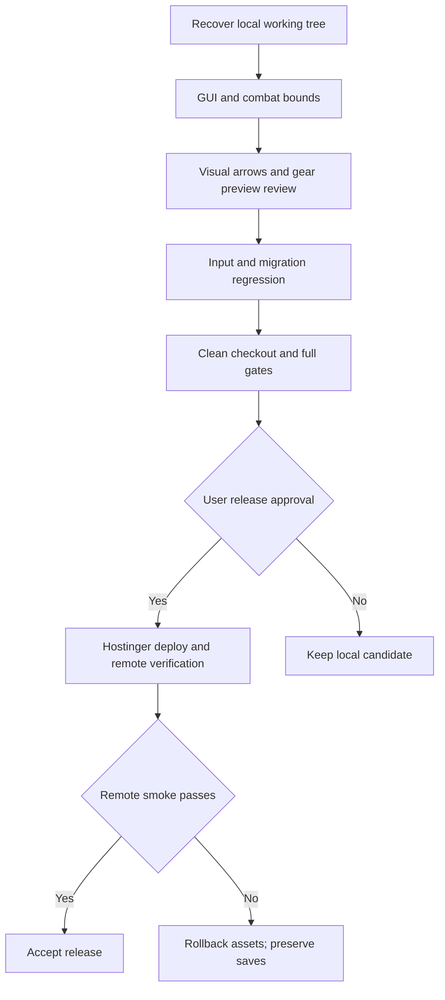

# Gridbound — next production handoff

Full planning package: [PRODUCTION-MASTERPLAN.md](PRODUCTION-MASTERPLAN.md). Dokumen ini tetap baseline handoff; masterplan memperluas rencana sampai launch/maintenance tanpa mengubah status implementasi.

## 1. Keputusan release

**Status: kandidat lokal v0.4.0; belum production-approved.**

- Workspace: `/Users/mac/Documents/Iqbal/Gridbound`.
- Branch hasil cek: `feature/rpg-progression-v04`.
- Commit terakhir saat handoff: `521f09c` — Hostinger entry/build support.
- Ekspansi RPG dan GUI masih working-tree changes, belum commit/push/deploy.
- Website Hostinger dilaporkan terpasang oleh user; URL dan versi remote belum diverifikasi independen.
- Kerjakan langsung di sesi utama menggunakan Astra; **tanpa subagent** sesuai permintaan user.
- Dokumen ini bukan izin publish, merge atau deployment. Perubahan tahap ini hanya dokumentasi.

## 2. Produk dan batas scope

Gridbound: Ashes of the Bell adalah browser tactical RPG berbasis Phaser/TypeScript/Vite. Core loop: persiapan hero → combat grid real-time → baca telegraph/tap/switch skill → victory → death animation → dialog terkunci satu detik → bank reward → progression → town/next wave.

Arah visual: pixel art lokal, forest/emerald dan brass; premium casual berarti layar fokus, kontrol jelas dan hasil input tidak mengejutkan, bukan sekadar ornamen. User mengizinkan sedikit scroll vertikal, tetapi menolak semua fitur menumpuk di satu halaman. Jangan menyembunyikan informasi wajib dengan overflow clipping.

Tidak termasuk scope saat ini: multiplayer, cloud save, akun pemain, monetisasi, gacha, random affix, voice acting, town free-roam, cerita bercabang. Jangan menambah scope tersebut sebelum polish dan release gate selesai.

## 3. Matriks implementasi dan bukti

| Area | Sudah ada | Bukti / batas |
|---|---|---|
| Campaign | 4 act, 16 chapter, 76 encounter; ending/journal | Traversal browser lulus; forced HP hanya untuk transisi, bukan balance |
| Roster/jobs | 9 hero, 5 basic jobs, 10 advanced, 10 third; 40 active skills | Tests gating/effects/save; dua skill aktif per hero |
| Hero progression | Level 1–40, XP individual, HP/power growth, SP; median-level recruitment | Unit/simulation dan browser progression lulus |
| Talent | 50 definisi, 34 berlaku per class/hero; prerequisites, keystone eksklusif, respec | Aturan gameplay dites; bukan 50 node ditampilkan sekaligus |
| Gear | 42 item, 3 slots, 6 set, class/level/quest gates | Efek combat, ownership dan bonus set dites |
| Enemy | 12 bentuk dasar, 48 records termasuk varian | 48 tekstur berbeda; bukan 48 model asli |
| Quest | 30: 12 hunt, 6 town chain, 9 companion milestone, 3 endless milestone | Tracking, klaim manual, idempotency dan reward XP dites |
| Repeatable play | Raid dengan varian, endless, 12 boons | Exhausted draft dan kelanjutan floor dites |
| Training GUI | Overview, skills, jobs, talent branches, gear, formation | Navigasi browser lulus; polish visual belum final |
| Collections | Campaign/quest/bestiary satu record per page | Default screen bounds diukur; seluruh page/state belum diaudit |
| Talent GUI | Branch navigation, SVG arrows dari prerequisite, detail node terpilih | Keberadaan arrows dites; clarity/crossing perlu visual review |
| Equipment UX | Select hanya preview; deskripsi/stat/perbandingan lalu konfirmasi buy/equip | Browser membuktikan selection tidak membelanjakan gold, confirm membeli |
| Victory UX | Menunggu death completion, lalu result lock 1000ms | Browser death readiness, disabled controls, defeat/retry lulus |
| Motion | Death 780ms normal, fade 120ms reduced motion | Contract/tests ada; kenyamanan fisik belum dites |
| Save | v2→v3, v2 dipertahankan, JSON export, incomplete-v3 protection | 84-test suite termasuk save-envelope regression lulus |
| Hosting | Vite dist, optional server.js, static ZIP/.htaccess | Node + Apache root/subfolder production smoke lulus lokal |

## 4. Evidence ledger

Hasil berikut berasal dari eksekusi sesi sebelumnya pada working tree, bukan CI atau Hostinger live. Pada perubahan dokumentasi ini tidak diklaim seluruh suite dijalankan ulang.

| Gate | Hasil terakhir | Command |
|---|---|---|
| Unit/contracts | 84 pass, 0 fail | `npm test` |
| Build | Pass; Phaser chunk warning masih ada | `npm run build` |
| Browser loop | Pass desktop, mobile 360/390, campaign, progression | `GRIDBOUND_URL=http://127.0.0.1:5193/ npm run test:browser` |
| Layout measurement | No horizontal overflow pada default screens; vertical masih ada | `node scripts/gui-layout-smoke.mjs` |
| Node production | Pass | `npm run test:webapp` |
| Static nested path | Pass | `npm run test:production` |
| Apache/Hostinger equivalent | Pass root dan /gridbound/ | `npm run package:hostinger && npm run test:hostinger` |
| Whitespace | Pass | `git diff --check` |
| Balance, sebelum polish GUI terakhir | 76 campaign encounters + 48 raid variants victory dengan earned build | `npm run balance` |

Layout default terakhir:

| Viewport | Vertical overflow range |
|---|---|
| 1440×900 | 0–41 px |
| 390×844 | 0–113 px |
| 360×740 | 0–232 px |

**Range ini bukan acceptance seluruh game.** Detail terbuka, preview gear, roster penuh, teks panjang, late-game, landscape, browser zoom dan combat final belum tercakup penuh. `gui-layout-smoke.mjs` mengukur tinggi tetapi belum menjadi gate vertical threshold yang lengkap.

Laporan di `artifacts/gui-release-evidence.json` dari audit agent lama adalah snapshot sebelum perbaikan terakhir; jangan pakai sebagai status terkini. Sumber terbaru untuk GUI: `docs/GUI-VERIFIED.md` dan dokumen ini. Output console yang masih menyebut total 34 talents/30 quests tidak berarti semua record dirender bersamaan; pagination/branch selector sekarang membatasi tampilan.

## 5. Yang belum selesai — backlog berurutan

### P0 — release blockers

- [ ] **GUI-01: ukur ulang combat final.** Arena, lane targets, sprite tap, stance, consumables, pause dan expandable inspector. Matrix minimum 360×740, 390×844, 768×1024, 1440×900, desktop pendek 1280×720. Bukti: JSON rect/scroll measurements + screenshots, tanpa overlap atau inaccessible control.
- [ ] **GUI-02: acceptance visual skill arrows.** Periksa seluruh branch/class, node multi-parent, keystone locked/owned, selected node dan keyboard focus. Semua parent harus bisa dipahami; jangan klaim garis sekadar ada sudah cukup.
- [ ] **GUI-03: bounded-page stress cases.** Roster penuh, semua talents unlocked, semua quest claimed, deskripsi gear/set panjang, preview terbuka, journal lengkap, empty results. Kurangi halaman yang masih tinggi melalui subpage/detail, bukan clipping.
- [ ] **UX-01: validasi user atas small-phone scroll.** Range 0–232px pada 360×740 masih perlu review. Usulan budget: ≤120px default page dan ≤160px expanded essential view; ini target usulan, bukan keputusan user atau gate yang sudah lulus.
- [ ] **QA-01: strengthening input gate.** Uji sustained touch/held key, Enter/Space/Escape, pointer-down sebelum reveal/pointer-up setelah reveal, reduced-motion, rapid reopen, retry dan background/resume. Timer token/unit pass tidak menggantikan seluruh uji input fisik.
- [ ] **SAVE-01: release migration drill.** Gunakan fixture v2 populated, v3 lengkap, v3 incomplete, malformed, future version, blocked storage. Cek save byte-identical saat protected; jangan gunakan profil browser asli untuk automation.
- [ ] **REL-01: clean checkout/CI validation.** Setelah approval commit, jalankan install/build/test dari checkout terpisah; CI pada commit v0.4 belum dibuktikan. Jangan anggap CI commit lama mewakili working tree baru.
- [ ] **REL-02: user approval + Hostinger staging/live smoke.** Dapatkan URL dan persetujuan deploy, verifikasi commit/artifact yang dipasang, assets/cache, save migration, touch dan result sequence di remote origin.

### P1 — kualitas setelah P0

- [ ] Physical Android Chrome + iPhone Safari; safe-area/notch dan orientation change.
- [ ] Firefox dan Safari desktop; keyboard navigation, focus restoration, contrast, screen-reader labels.
- [ ] Human playtest balance/pacing, late-game build diversity, quest reward economy dan grind; jangan memakai waktu simulasi sebagai durasi pemain.
- [ ] Performance low-end: load size, cold boot, sustained FPS, memory, thermal/input latency. Tetapkan budget setelah baseline; engine chunk warning belum diselesaikan.
- [ ] Audit art/font/audio dependency license ledger dan attribution sebelum public release.
- [ ] Implementasi import backup JSON jika disetujui; sekarang hanya export yang didokumentasikan/dites, bukan restore UI.

### P2 — optional, bukan blocker otomatis

- [ ] Tambahan chapter/quest cerita setelah balance dan UI disetujui.
- [ ] Variasi visual/audio dan tuning feedback berdasarkan human playtest.
- [ ] Cloud save/multiplayer hanya dengan scope/arsitektur baru, bukan kelanjutan otomatis.

## 6. Urutan next production dan definitions of done

1. **Recover baseline:** cek branch/status/diff, baca dokumen ini, pertahankan seluruh uncommitted changes. Jangan reset/clean.
2. **Polish GUI:** tutup GUI-01/02/03 + user review UX-01. DoD: semua screen states dalam matrix bisa dioperasikan, screenshot dan bound assertions tercatat.
3. **Safety/input:** tutup QA-01/SAVE-01. DoD: negative regression + real browser gestures hijau.
4. **Balance/performance/device:** prioritaskan smoke perangkat dan baseline performance; catat batas yang masih diterima user.
5. **Release candidate:** regenerate database/GDD, full test + production bundle + package checksum, clean-tree review. DoD: evidence terikat exact commit, tidak ada P0 terbuka tanpa waiver eksplisit.
6. **Hostinger:** approval → staging/deploy → read-back URL/version → smoke → observasi → acceptance. DoD: hasil remote, bukan hanya HTTP200 lokal.



## 7. Reproducible verification runbook

Prerequisites: Node >=22.12, installed package dependencies, Python3 for local ZIP/Apache tests, Chrome path supported by isolated CDP harness. Read README/package.json before installing. Do not use authenticated browser profile.

```sh
# Terminal A — pin a free port; do not silently accept Vite fallback
npm run dev -- --port 5193 --strictPort
# Terminal B — confirm the actual listener
curl -fsS -I http://127.0.0.1:5193/
npm test
npm run docs
npm run balance
npm run build
GRIDBOUND_URL=http://127.0.0.1:5193/ npm run test:browser
GRIDBOUND_URL=http://127.0.0.1:5193/ node scripts/gui-layout-smoke.mjs
npm run package:hostinger
npm run test:webapp
npm run test:production
npm run test:hostinger
git diff --check
```

Dev server startup is not a test result. Existing local URLs are transient; query listener/readiness rather than assuming a previous process survives. Keep simulations and browser forced-victory fixtures distinct. Record full command, exit status, commit hash, device dimensions and failures in release evidence.

## 8. Hostinger deployment and rollback

Preserved build settings: repo `https://github.com/sanadunt/Gridbound`, production branch historically `main`, root `.`, Node22 compatible, build `npm run build`, output `dist`. Optional Node entry `server.js`, start `npm start`. Do not change deployment to feature branch or push main without user scope/approval.

Before release:
- [ ] Record current live URL, Hostinger deployment ID and served version, repository visibility and auto-deploy behavior.
- [ ] Keep prior artifact/commit and export representative saves; credentials stay outside docs/logs.
- [ ] Build exact candidate; attach SHA256 and test evidence. Do not deploy an old ZIP with the same version filename.
- [ ] Review diff and explicitly approve push/deploy; source remains local until then.

After release:
- [ ] Verify actual live build, local assets, absence of dev QA global, browser console, navigation, gear preview/confirm, death+lock, normal encounter, save reload and old-save migration.
- [ ] Check root/subpath behavior matching actual deployment, HTML revalidation and hashed asset cache.
- [ ] Preserve browser origin: changing domain/subpath origin assumptions does not automatically migrate localStorage.

Rollback:
- Redeploy known-good prior commit/artifact using normal history, never force-push/reset recovery data.
- **App rollback is not save downgrade.** v0.3 uses v2 while candidate uses v3; original v2 remains but can be older than latest v3 progression. Retain/export both before rollback. No automatic v3→v2 conversion is claimed.
- Never clear localStorage to make a migration issue disappear. Protected writes and warning states must remain observable.

## 9. Source map for the next session

| Files | Responsibility |
|---|---|
| `src/game/{profile,levels,talents,quests,jobs,save}.ts` | Progression/content/economy/save validation |
| `src/game/{simulation,world,story}.ts` | Combat/state machine/encounters/story |
| `src/ui/{town,quests,result-gate}.ts` | Pages, preview, result input guard |
| `src/main.ts` | UI event wiring, death/result sequencing, persistence |
| `src/render/BattleScene.ts` | Enemy death animation/readiness and Phaser rendering |
| `src/{style,town,rpg,progression,paged-town,compact-combat}.css` | Cascade; inspect computed style before new overrides |
| `tests/{result-gate,battle-scene-death,save-envelope}.test.ts` | New safety contracts |
| `scripts/*smoke.mjs`, `scripts/*browser.mjs` | Real CDP and production tests |
| `scripts/export-database.ts`, `scripts/export-docs.ts` | Generated database/GDD; edit generator before regeneration |
| `docs/GUI-VERIFIED.md`, `PLAYTEST.md` | Evidence and prior verification history |
| `docs/HOSTINGER-GITHUB.md`, `docs/HOSTINGER.md` | Hosting field mapping/manual fallback |

## 10. Release handoff checklist

- [ ] P0 closed or explicitly waived with reason.
- [ ] Documentation and generated database/GDD match runtime.
- [ ] Final tests bound to candidate commit, no blanket claim based on prior output.
- [ ] User approved visuals and deployment boundary.
- [ ] Candidate committed/pushed and CI verified only after approval.
- [ ] Remote URL/build/save smoke verified; rollback retained.
- [ ] Final report separates implemented / tested / known limits / deployed.
