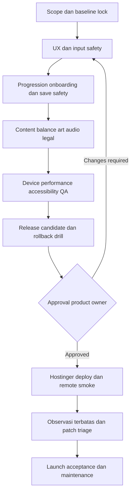

# Gridbound — Production Masterplan

**Dokumen perencanaan, bukan sertifikasi production.**

Working title: Gridbound: Ashes of the Bell. Baseline implementasi adalah kandidat lokal v0.4.0. Status konkret dan bukti terakhir ada di [NEXT-PRODUCTION.md](NEXT-PRODUCTION.md) dan [GUI-VERIFIED.md](GUI-VERIFIED.md). Semua milestone, budget, fitur tambahan dan target di dokumen ini adalah **usulan** sampai disetujui. Dokumen ini tidak mengotorisasi implementasi, pembelian layanan, commit/push, publikasi atau perubahan Hostinger.

## Navigasi paket

- [Status baseline dan handoff](NEXT-PRODUCTION.md)
- [Milestone dan backlog produksi](production/MILESTONES.md)
- [Roadmap fitur dan desain pengalaman](production/FEATURE-ROADMAP.md)
- [QA dan acceptance matrix](production/QA-ACCEPTANCE.md)
- [Release, save safety dan operasi](production/RELEASE-OPERATIONS.md)
- [Diagram index dan editable sources](production/DIAGRAMS.md)
- [Template keputusan dan evidence](production/TEMPLATES.md)

## 1. Definisi full production

Full production bukan berarti semua ide sudah dibuat. Artinya sebuah scope release yang eksplisit sudah diimplementasikan, diuji, disetujui, dapat dipasang secara repeatable, dapat dipulihkan bila gagal, dan memiliki penanggung jawab maintenance.

**Target release pertama yang diusulkan: polished single-player browser RPG.** Offline-first di sini berarti aset/logic tidak bergantung backend saat aplikasi sudah dimuat; jangan mengartikan sebagai installable/offline-reload PWA karena service worker/offline cache belum dibuktikan.

Production-ready harus memiliki:
1. Core loop lengkap dan aman dari kehilangan save/reward ganda.
2. GUI nyaman pada perangkat target yang benar-benar diuji.
3. Konten, ekonomi, onboarding dan ending yang dipahami pemain.
4. Art/audio/legal inventory yang dapat dipertanggungjawabkan.
5. Reproducible build, release evidence, backup dan rollback drill.
6. Remote smoke, user acceptance dan periode observasi rilis.
7. Jalur laporan masalah dan prosedur patch yang realistis.

Tidak ada klaim nol bug, performa universal, atau uptime yang belum diukur.

## 2. Product brief

**Pitch:** persiapkan tim Bellkeeper, percepat cooldown lewat tap yang terukur, baca telegraph dan selesaikan campaign tentang harga sebuah perlindungan yang menolak perubahan.

**Pilar:**
- Preparation bermakna: job, dua skill, talent, equipment dan formation mengubah keputusan combat.
- Input sederhana: tap utama jelas; aksi sekunder tidak menghalangi sprite.
- Ancaman terbaca: pemain mengetahui mengapa terkena damage dan pilihan counter.
- Progress terasa: XP individual, unlock dan quest punya feedback tanpa ledakan modal.
- Halaman fokus: satu pekerjaan utama per layar; informasi detail dipanggil saat perlu.
- Kepemilikan data: tanpa akun wajib; backup lokal dan penjelasan save jujur.

**Target pengguna sementara:** pemain casual RPG yang nyaman sesi pendek dan progression berulang. Validasi lewat playtest; bukan hasil market research.

**Target platform sementara:** desktop Chrome serta Android Chrome portrait; iOS Safari menjadi gate kompatibilitas yang perlu dibuktikan. Browser desktop lainnya diuji sebelum klaim dukungan. Landscape, controller, PWA dan tablet-specific layouts harus diputuskan eksplisit, bukan diasumsikan.

## 3. Scope release dan pengecualian

### Baseline yang dipoles, tidak dibangun ulang

9 karakter; 16 chapter/76 encounter; 5 basic jobs, 10 advanced, 10 third; 40 active skills; level hero sampai 40; 50 definisi talent/34 applicable per hero; 42 equipment/6 set; 12 enemy silhouettes/48 records termasuk varian; 30 quest; raid/endless dengan 12 boons. Angka runtime tetap otoritatif: gunakan generator saat berubah.

### Kandidat tambahan untuk release pertama

- Tutorial interaktif singkat dan contextual help.
- Import backup dengan validasi dan preview, tanpa silent overwrite.
- Hasil ekspedisi lebih jelas: alasan menang/kalah, XP, reward dan next action.
- Pengaturan accessibility dan feedback yang konsisten.
- UI version/build identification dan laporan bug manual yang tidak membawa save/secrets otomatis.
- Credits/license page.

Semua tambahan di atas **belum dianggap terimplementasi**. Pilih setelah scope review; jangan menahan perbaikan safety demi fitur kosmetik.

### Ditunda secara default

Cloud save, login, multiplayer/PvP, marketplace, ads/IAP, loot boxes, daily streak/FOMO, procedural story, free-roam town, voice acting, live-ops battle pass. Menambah salah satunya memerlukan desain baru untuk keamanan, biaya, privasi, operasional dan balance.

## 4. Model keputusan dan tanggung jawab

User adalah product owner dan pemberi approval scope/visual/release. Sesi utama Astra menjalankan dokumentasi/implementasi/tes hanya saat diminta; tidak memakai subagent. Human tester/perangkat target belum ditunjuk. Hostinger owner memberi akses melalui sesi yang disetujui, bukan membagikan password/token ke dokumen.

Satu milestone tidak selesai karena daftar pekerjaan habis; acceptance evidence harus diperiksa. Temuan kritis membatalkan gate sebelumnya yang terdampak. Semua waiver punya pemilik, alasan, batas dampak dan expiry/retest trigger.

Gunakan tiga label: **Implemented**, **Verified**, **Accepted**. Deployed adalah status terpisah. Fitur dapat implemented tetapi belum accepted atau deployed.

## 5. Urutan produksi

Tanggal dan biaya sengaja belum diisi: kapasitas implementer, perangkat, scope tambahan dan access hosting belum ditetapkan. Gunakan dependency dan exit criteria, bukan tanggal fiktif. Setelah M0, estimasi dalam rentang beserta asumsi; re-estimate setelah temuan P0.

## 6. Indikator keberhasilan dan budget usulan

| Area | Target usulan | Pengukuran |
|---|---|---|
| Safety | Tidak ada kehilangan save/reward ganda pada fixture yang disepakati | Regression + migration drill |
| Layout | Tidak ada horizontal overflow pada matrix target; default page ideal ≤120px extra vertical, expanded essential view ≤160px | DOM bounds + visual/device review; budget belum approved |
| Input | Primary touch target sekitar ≥44 CSS px tanpa overlap | Real DOM rect + multi-touch |
| Result | Death selesai dahulu; semua pilihan terkunci ≥1000ms setelah tampil | Browser timing dan physical held-input test |
| Performance | Mulai dari baseline cold-load dan p95 frame time perangkat referensi; target 60fps jika layak, minimum stabil yang disepakati | Performance capture, bukan browser headless saja |
| Learning | Pemain baru dapat mulai encounter, membaca satu telegraph dan mengganti skill tanpa bantuan fasilitator | Observasi playtest, bukan persentase rekaan |
| Retention | Belum ada target numerik | Wawancara dan feedback opt-in; tidak pasang analytics diam-diam |

Jangan menyelesaikan target layout dengan font terlalu kecil, kontrol mengecil, pemotongan informasi atau mengganti long page menjadi long nested scroll.

## 7. Risiko utama

| Risiko | Pencegahan | Trigger eskalasi |
|---|---|---|
| Save migration/rollback menghilangkan progression | Fixture lintas versi, protected writes, backup sebelum import/deploy | Setiap perubahan schema atau normalization |
| Auto-deploy main menerbitkan kandidat belum siap | Konfirmasi branch/auto-deploy, approval sebelum push | Perubahan pipeline/branch |
| GUI kompak tetapi sulit dimainkan | Physical playtest dan hit-area audit | Overlap/tap-through/tidak terbaca |
| Talent/gear dominan merusak pilihan build | Automated benchmark + human build comparison | Satu build menghapus semua counterplay |
| Feature creep | Scope freeze dan change request | Fitur baru menyentuh save/backend/monetisasi |
| Chunk engine/performa mobile | Baseline load/FPS/memory; optimasi berbasis trace | Crash/reload/thermal/input lag |
| Public launch tanpa legal provenance | Dependency dan asset ledger | Asset tanpa lisensi jelas |
| Laporan agen lama disangka evidence terbaru | Exact commit/evidence index, retest affected gates | Source berubah setelah test |

## 8. Definisi launch acceptance

- Semua blocker M0–M6 selesai atau waiver tertulis yang tidak menoleransi data loss/security kritis.
- Scope dan supported-device list disetujui.
- Candidate commit, artifact checksum, test evidence dan release notes sesuai.
- Remote URL/build diverifikasi setelah deploy; save dan normal combat diuji.
- Rollback package tersedia dan proses save downgrade dibedakan dari app rollback.
- Known issues disampaikan dengan batasnya.
- Bug-report channel dan pemilik triage disepakati.

Sesudah launch, freeze bukan permanen: iterasi patch memakai gate proporsional risiko, tetapi save/input/security regression tetap wajib.
