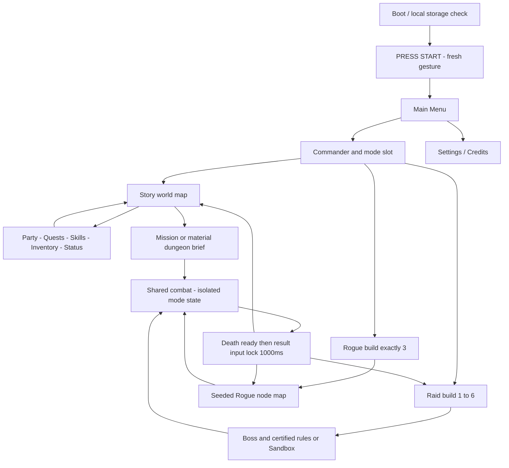
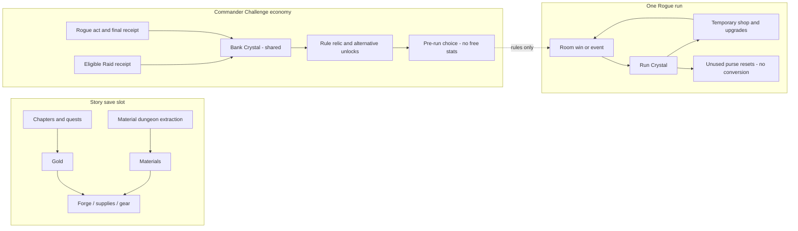
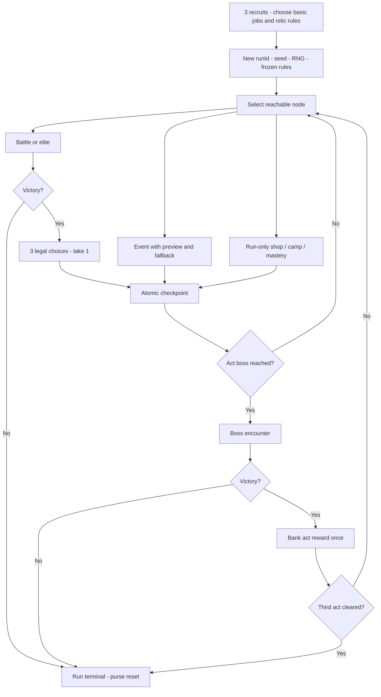
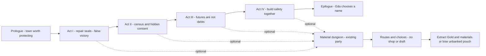
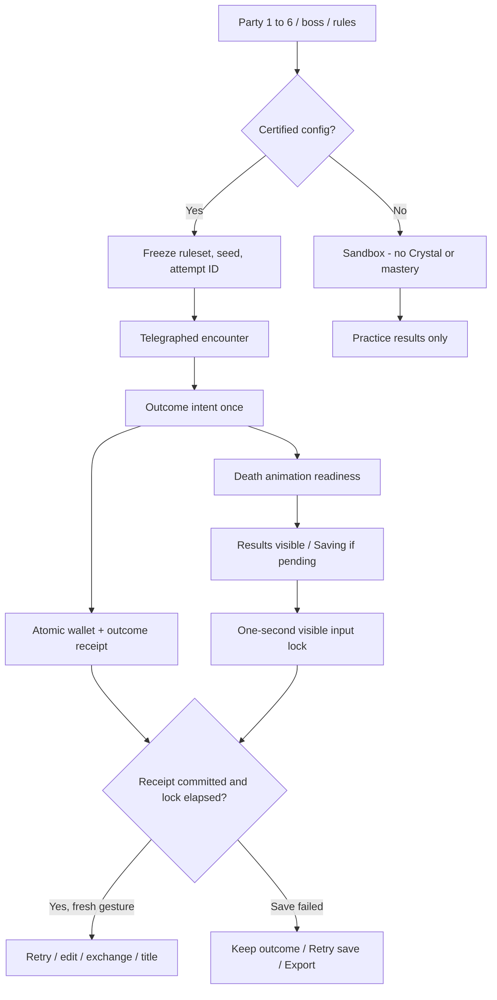
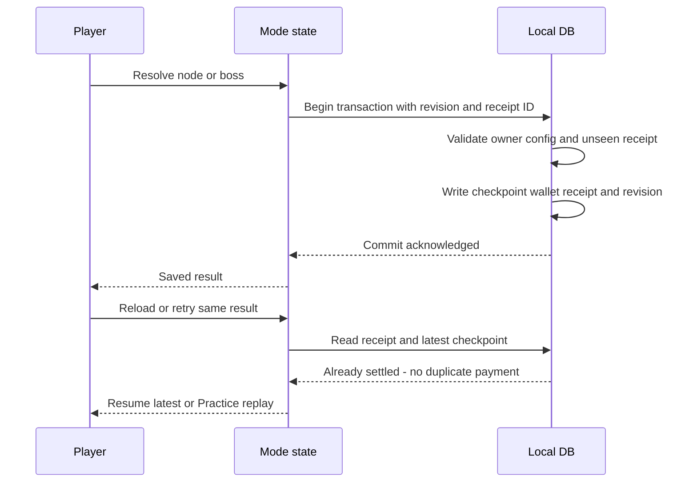
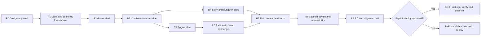
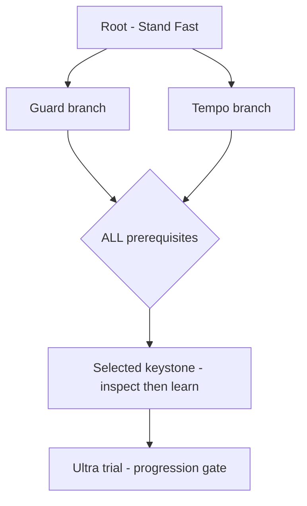

# Editable diagrams — R1 target, not implemented

[Package index](README.md). Mermaid source can be edited in any compatible tool. Offline SVG/HTML boards are separate renderable design studies. No external game assets.

## Title Navigation

[Source](diagrams/title-navigation.mmd)

## Mode Economy

[Source](diagrams/mode-economy.mmd)

## Rogue Loop

[Source](diagrams/rogue-loop.mmd)

## Story Journey

[Source](diagrams/story-journey.mmd)

## Raid Contract

[Source](diagrams/raid-contract.mmd)

## Save Settlement

[Source](diagrams/save-settlement.mmd)

## Production Gates

[Source](diagrams/production-gates.mmd)

## Skill Dependencies

[Source](diagrams/skill-dependencies.mmd)

## Offline design boards

- [Three-mode navigation](art/mode-navigation.svg)
- [Economy boundaries](art/economy-boundaries.svg)
- [Prerequisite tree geometry](art/skill-tree.svg)
- [12 original icon studies](art/icon-concepts.svg)
- [All boards as one HTML document](art/design-boards.html)

These are static documentation artifacts; no game controls or current gameplay screenshots are implied. Mermaid syntax/render validation status is reported in [VALIDATION](VALIDATION.md).
