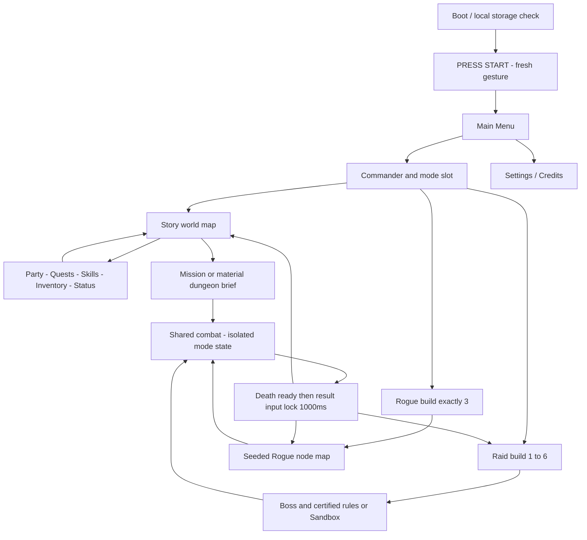
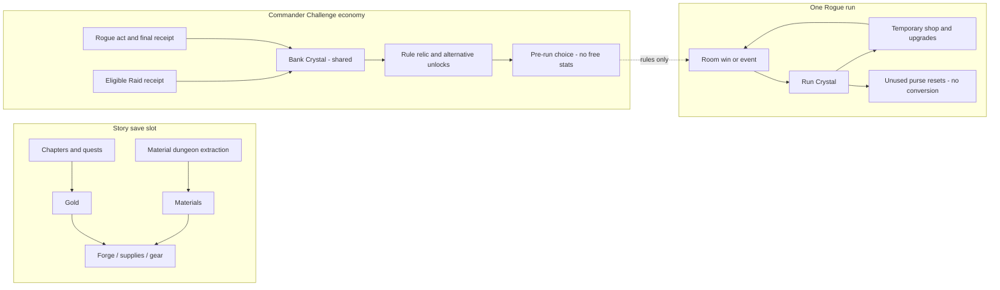
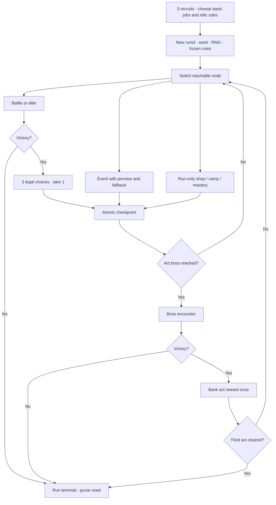
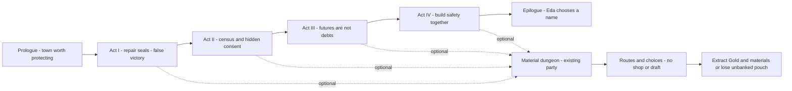
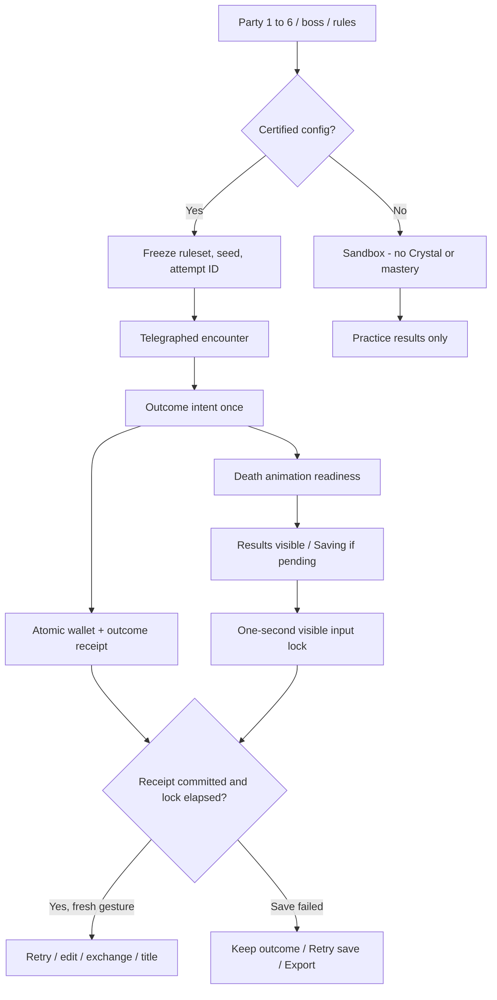
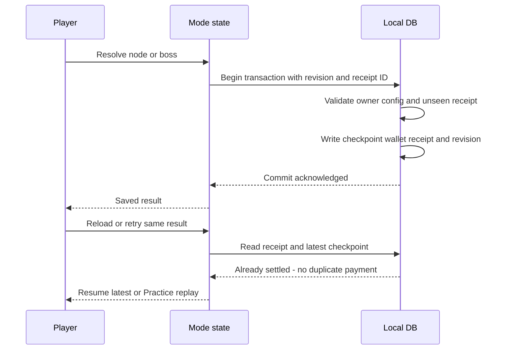
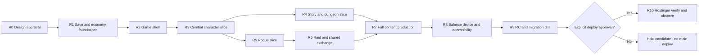
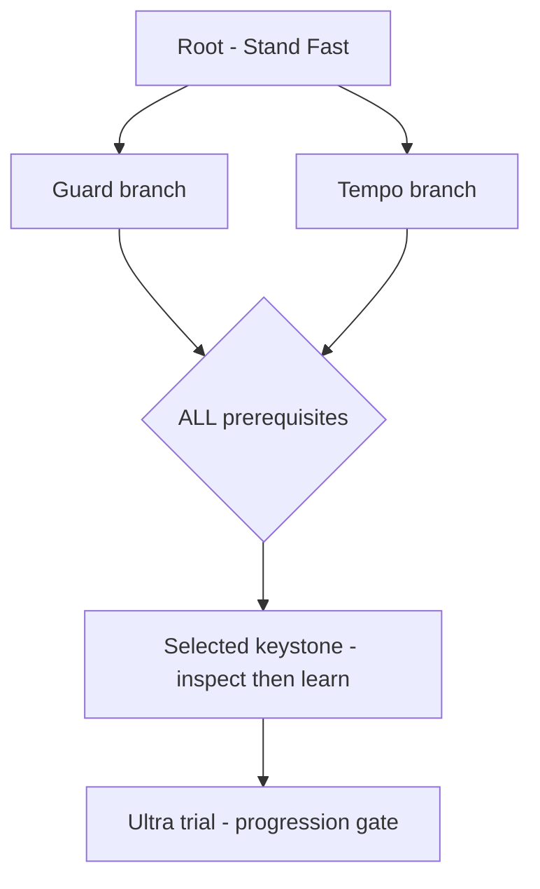

# Gridbound R1 — Complete target GDD & production plan

**D1–D8 APPROVED • DOCUMENTATION ONLY • IMPLEMENTATION NOT STARTED • 7 September 2026**

Runtime baseline: main / 7aced0b / v0.4.0. The user approved D1–D8 and requested publication of documentation to Git before execution. This book records that approval without changing gameplay. Editorial source: README, APPROVAL-D1-D8.md and named Markdown chapters beside this file. Tuning remains provisional; target features are NOT implemented or production-approved.

## Book contents

- [Gridbound R1 — game direction & target GDD](README.md)
- [Approval record — D1–D8](APPROVAL-D1-D8.md)
- [Target GDD — Gridbound: Ashes of the Bell](GDD-TARGET.md)
- [Riset referensi — arah game R1](RESEARCH.md)
- [Story bible — Ashes of the Bell](STORY-BIBLE.md)
- [Mode specification — Story dungeon, Roguelike, Raid](MODE-SYSTEMS.md)
- [Economy, crafting & challenge relics](ECONOMY.md)
- [Lima atribut, unique character kits & advancement](CHARACTERS-COMBAT.md)
- [Ultra skills — target catalog & unlock contract](ULTRA-CATALOG.md)
- [Save, Load & mode-profile architecture](SAVE-PROFILES.md)
- [Game UI, skill-tree graph & icon direction](UX-ART.md)
- [Technical production blueprint](TECHNICAL-PLAN.md)
- [Next production R1 — gated execution plan](NEXT-PRODUCTION-R1.md)
- [Request coverage — R1 design vs existing runtime](REQUEST-TRACEABILITY.md)
- [Editable diagrams — R1 target, not implemented](DIAGRAMS.md)
- [Validation scope — R1 documentation](VALIDATION.md)


---

Source chapter: `README.md`

# Gridbound R1 — game direction & target GDD

**Status: D1–D8 APPROVED / DOCUMENTATION ONLY / IMPLEMENTATION NOT STARTED.** R1 adalah revisi arah desain, **bukan** versi aplikasi. Baseline source `main` commit `7aced0b`; deployment Hostinger aktual belum diverifikasi. User menyetujui D1–D8 pada 7 September 2026 dan meminta dokumentasi masuk Git sebelum dieksekusi. Task saat ini hanya mencatat approval serta commit/push dokumentasi; runtime, save dan build configuration tidak berubah. [Approval record dan batas eksekusi](APPROVAL-D1-D8.md).

## Baca berurutan

Mulai dari [keputusan D1–D8 yang disetujui](APPROVAL-D1-D8.md); jangan menafsirkan target berikut sebagai fitur yang sudah diimplementasikan.

1. [GDD target](GDD-TARGET.md) — game promise, title/menu, batas mode, scope dan keputusan.
2. [Riset referensi](RESEARCH.md) — lima game, bukti, yang diadaptasi dan yang ditolak.
3. [Story bible](STORY-BIBLE.md) — prologue, world rules, act/chapter, payoff dan original sample script.
4. [Mode design](MODE-SYSTEMS.md) — Roguelike 3 hero, Raid 1–6, Story dungeon tanpa shop/upgrade.
5. [Economy & crafting](ECONOMY.md) — Gold/material Story, Crystal Challenge, merchant dan anti-duplicate ledger.
6. [Character/combat spec](CHARACTERS-COMBAT.md) — STR DEF INT DEX WIS, formulas, unique heroes/classes/skills.
7. [Ultra catalog](ULTRA-CATALOG.md) — starter Ultra + signature catalog, unlock, coefficients dan safeguards.
8. [UX/skill-tree/icon spec](UX-ART.md) — world map, focused screens, graph routing, spacing, icon language.
9. [Save/profile architecture](SAVE-PROFILES.md) — per-mode Load/Save, shared Challenge economy, migration/rollback.
10. [Technical blueprint](TECHNICAL-PLAN.md) — proposed module boundaries, command contracts dan test-only Balance Lab.
11. [Next production R1](NEXT-PRODUCTION-R1.md) — dependency milestones, content budget, acceptance/risks.
12. [Request traceability](REQUEST-TRACEABILITY.md) — setiap permintaan dipetakan, current vs target.
13. [Editable diagrams & design boards](DIAGRAMS.md) — Mermaid + offline HTML/SVG, bukan UI game yang bekerja.
14. [Validation record](VALIDATION.md) — pemeriksaan dokumentasi, bukan hasil playtest atau runtime QA.

[Full GDD gabungan](GRIDBOUND-R1-FULL-GDD.md) tersedia untuk baca/download satu dokumen; komponen di atas tetap sumber editorial.

[Word export dengan approval D1–D8](exports/Gridbound-R1-Target-GDD.docx) adalah convenience copy di Git. Markdown komponen tetap sumber editorial. Salinan Word/HTML lepas di root workspace bukan sumber resmi dan tidak ditimpa oleh task publikasi ini.

## Prinsip source of truth

- `src/` dan `data/database.json`: implementasi v0.4.0 yang ada sekarang.
- `Gridbound_GDD_GRID_RAID.md`: GDD implemented yang digenerate dari runtime. **Tidak diganti menjadi wish list R1.**
- Paket ini: target baru, dengan semua angka ditandai sebagai seed balance atau content budget, belum diuji di game.
- [Production masterplan sebelumnya](../PRODUCTION-MASTERPLAN.md): process/release baseline. Untuk scope baru, baca [R1 milestones](NEXT-PRODUCTION-R1.md); M0–M7 lama bukan bukti target R1 selesai.
- [GUI evidence sebelumnya](../GUI-VERIFIED.md): bukti lama, tidak menguji title, profile slots, mode-specific economy atau lima atribut karena fitur tersebut belum diimplementasi.

## Keputusan D1–D8 — APPROVED oleh user

| ID | Keputusan rancangan | Mengapa | Status |
|---|---|---|---|
| D1 | Crystal Raid + Rogue disimpan pada satu Commander profile; Story terisolasi | Progres lintas-mode sesuai permintaan tanpa menjual Story power | APPROVED |
| D2 | Crystal bank untuk meta-unlock; Crystal perjalanan untuk shop selama run; bank tidak boleh dibawa masuk | Run tetap menuntut pilihan, tidak bisa membeli kemenangan memakai tabungan Raid | APPROVED |
| D3 | Story roster 9, aktif 3 pada prologue lalu maksimum 6; bench mendapat catch-up | Selaras Raid 1–6, masih memberi ruang reposisi grid; desain cap disetujui, migrasi tetap perlu preview | APPROVED |
| D4 | Rogue tepat 3 recruit custom, job bebas dari 5 basic termasuk duplikat; job upgrade diperoleh di run | Kebebasan build tanpa membawa level/equipment Story | APPROVED |
| D5 | Rewarded Raid memakai boss/modifier tervalidasi; raw sliders masuk Sandbox tanpa Crystal | Customization tidak menjadi exploit hadiah | APPROVED |
| D6 | 3 Commander profiles; tiap mode 3 manual slot + 1 auto; satu run aktif per Challenge mode | Ganti profile tetap mudah, ekonomi tidak direwind oleh save lama | APPROVED |
| D7 | Story utamanya linear dengan pilihan konsekuensi kecil; satu ending utama dan epilogue flags | Cerita runut dan scope penulisan/test terkendali | APPROVED |
| D8 | Full target: 9 hero unik, 18 advanced + 18 third paths, 32 Ultra definitions; slice jauh lebih kecil | Luas tapi dipecah gate, bukan janji implementasi sekali jalan | APPROVED |

**Seluruh D1–D8 disetujui user.** Lihat [pesan persetujuan, scope Git dan batas eksekusi](APPROVAL-D1-D8.md). Persetujuan ini mengunci arah desain, bukan nilai balance, kalender produksi, QA, implementasi atau deployment. Seluruh kode R1 masih menunggu instruksi eksekusi setelah dokumentasi tersimpan di Git.

## Non-goals

Tidak ada account login wajib, cloud sync, online leaderboard, multiplayer, monetisasi Crystal, live-ops/FOMO, trade antar-player, procedural AI story, atau downloadable assets dari game referensi. Browser/static Hostinger tetap platform target; restart offline tanpa cache/service worker tidak dijanjikan.

---

Source chapter: `APPROVAL-D1-D8.md`

# Approval record — D1–D8

**Status: APPROVED DESIGN DECISIONS / DOCUMENTATION ONLY. Implementation has not started.**

- Decision owner: user / project owner, melalui percakapan langsung dengan Astra.
- Recorded: **7 September 2026, 14:06 WIB (UTC+07:00)**. Ini waktu pencatatan, bukan klaim digital signature atau waktu pesan yang terverifikasi terpisah.
- Runtime baseline: `main` / `7aced0b` / app `0.4.0`.
- Design revision: **Game Direction R1**, bukan versi aplikasi.
- Record scope: delapan keputusan di bawah, sesuai tabel D1–D8 yang dibaca user sebelum memberikan approval.

## Pernyataan user

> Oke aku sudah setuju dari D1-D8, tapi kita dokumentasikannya itu masukin ke Git dulu yaa sebelum dieksekusi

Artinya: **D1–D8 disetujui; catat dan simpan dokumentasinya di Git terlebih dahulu.** Task sekarang dibatasi pada dokumentasi dan publikasi Git. Jangan menyamakan approval desain dengan perintah mulai coding, menjalankan migrasi save pemain, atau merilis fitur R1.

## Keputusan yang disetujui

| ID | Keputusan disetujui | Status |
|---|---|---|
| D1 | Crystal Raid + Rogue disimpan pada satu Commander profile; Story terisolasi | APPROVED |
| D2 | Crystal bank untuk meta-unlock; Crystal perjalanan untuk shop selama run; bank tidak boleh dibawa masuk | APPROVED |
| D3 | Story roster 9, aktif 3 pada prologue lalu maksimum 6; bench mendapat catch-up | APPROVED |
| D4 | Rogue tepat 3 recruit custom, job bebas dari 5 basic termasuk duplikat; job upgrade diperoleh di run | APPROVED |
| D5 | Rewarded Raid memakai boss/modifier tervalidasi; raw sliders masuk Sandbox tanpa Crystal | APPROVED |
| D6 | 3 Commander profiles; tiap mode 3 manual slot + 1 auto; satu run aktif per Challenge mode | APPROVED |
| D7 | Story utamanya linear dengan pilihan konsekuensi kecil; satu ending utama dan epilogue flags | APPROVED |
| D8 | Full target: 9 hero unik, 18 advanced + 18 third paths, 32 Ultra definitions; slice jauh lebih kecil | APPROVED |

Tabel ini merekam keputusan pada saat approval. [Index desain](README.md) menyediakan alasan masing-masing; [target GDD](GDD-TARGET.md), [economy](ECONOMY.md), [profiles](SAVE-PROFILES.md) dan [production gates](NEXT-PRODUCTION-R1.md) menjabarkan konsekuensinya. Bila dokumen berikutnya mengubah arti D1–D8, buat decision amendment baru dan minta approval—jangan menulis ulang persetujuan ini seolah user pernah menyetujui keputusan lain.

## Batas otorisasi saat pencatatan

| Tindakan | Status |
|---|---|
| Catat D1–D8, sinkronkan komponen dan GDD gabungan | Diizinkan sekarang |
| Commit dan push dokumentasi R1 ke GitHub `main` | Diizinkan sekarang; melanjutkan arahan user untuk memakai `main` |
| Periksa link/katalog/export/diff dan CI baseline | Diizinkan untuk memverifikasi dokumentasi/repository |
| Coding fitur R1, perubahan schema/runtime/package/config | **Tidak dikerjakan dalam task ini** |
| Migrasi save pemain atau akses akun Hostinger | **Tidak diizinkan oleh approval dokumentasi ini** |
| Deploy/production sign-off fitur R1 | Gate terpisah setelah implementasi dan QA, belum diberikan |

Push ke `main` dapat memicu CI atau auto-build Hostinger yang sudah dikonfigurasi. Tidak ada perintah deploy manual, perubahan konfigurasi hosting, atau gameplay baru dalam commit dokumentasi ini. Keberhasilan push/CI tidak membuktikan keadaan website live.

## Status milestone dan hal yang belum dikunci

- **R0 / keputusan produk D1–D8: APPROVED**, dibuktikan oleh pesan user di atas, bukan oleh tanda tangan yang dibuat agent.
- R0 execution-preparation: belum dijalankan. Jadwal/budget/perangkat referensi, slice kerja pertama dan detail risiko teknis harus dibatasi saat ada instruksi eksekusi; approval ini tidak menciptakan deadline atau biaya.
- **R1–R10: NOT STARTED** untuk implementasi target. Daftar pekerjaan, diagram dan katalog bukan bukti feature completion.
- Harga Crystal, formula stat, coefficient skill/Ultra, angka encounter dan jadwal unlock rinci tetap **seed tuning**. D8 menyetujui target arah/jumlah, bukan mengesahkan balance atau menjamin semuanya masuk rilis pertama.
- Persetujuan D3 menentukan roster/active cap; mapping migrasi, urutan anggota aktif dan perlindungan hero bench masih perlu prototype dan preview user sebelum diterapkan ke save.
- Source R1 belum ada; runtime baseline tetap v0.4.0. Deployment Hostinger versi apa pun masih perlu pemeriksaan live tersendiri.

## Handoff berikutnya

1. Ambil dokumentasi dari Git; baca record ini dan [R0–R10](NEXT-PRODUCTION-R1.md).
2. Jangan menanyakan ulang D1–D8 tanpa perubahan konteks yang nyata; keputusan tersebut sudah disetujui.
3. Tunggu instruksi eksekusi sesudah publikasi dokumentasi. Saat eksekusi diminta, mulai dengan scope terbatas save/economy foundation, bukan langsung seluruh tiga mode.
4. Kerjakan langsung menggunakan Astra, **tanpa subagent**, kecuali user mengubah instruksi itu.
5. Approval produk, hasil test, commit repository dan live release tetap dicatat sebagai bukti yang berbeda.

---

Source chapter: `GDD-TARGET.md`

# Target GDD — Gridbound: Ashes of the Bell

**Working title dipertahankan. D1–D8 APPROVED; fitur target belum diimplementasikan atau lolos production acceptance.** [Approval record](APPROVAL-D1-D8.md) mengunci keputusan desain dan meminta publikasi Git terlebih dahulu; detail tuning tetap provisional. [Index & keputusan](README.md). [Referensi riset dan batas bukti](RESEARCH.md).

## 1. Pitch & player fantasy

Bangun party Bellkeeper, percepat aksi dengan tap terukur, baca niat musuh dan tentukan siapa yang dilindungi. Satu sistem combat mendukung **kisah authored**, **run build yang berubah**, serta **boss lab yang bisa langsung dimainkan**—masing-masing punya progression dan resource sendiri.

Rasa yang dicari: membuka sebuah game, bukan dashboard. Musik title, tombol Start yang jelas, world map sebagai rumah Story, brief pendek sebelum berangkat, kemenangan dengan ruang bernapas, dan progression yang dapat ditelusuri. “Premium casual” adalah target pengalaman, bukan klaim harga, polish atau hasil riset pasar.

## 2. Platform & controls

- Tetap browser desktop/mobile, Phaser + TypeScript + Vite; production static Hostinger, optional Node `server.js`. Tidak mengganti engine.
- Portrait-first mobile; desktop mengadaptasi komposisi, bukan memperbesar satu kolom panjang.
- Tap sprite → mengurangi cooldown dengan fatigue/cap; drag atau mode pindah → reposition; 2 equipped normal skills/hero; 1 equipped Ultra/hero.
- 5 atribut yang terlihat: STR, DEF, INT, DEX, WIS. Tidak ada level account tersembunyi yang menaikkan semua mode.
- Touch + mouse + keyboard; primary targets minimal 44 CSS px, fokus terlihat, safe areas. Dua sentuhan tidak boleh menjadi dua pembelian/dua Ultra.
- Pause/visibility loss membekukan combat dan timer ancaman; animasi title/motion optional. Background throttling bukan alat skip challenge.

## 3. First session flow

1. Load lokal → title artwork → **PRESS START / TAP TO START**, juga bisa Enter/Space. Tidak meminta login. Gesture Start boleh membuka audio sesuai pilihan, tidak memaksa fullscreen.
2. Title transition mengonsumsi pointer/key pemicu hingga release; tidak menekan menu di belakang.
3. **Main Menu:** Continue, Story Mode, Roguelike, Raid Boss, Profiles, Settings, Credits. Continue menampilkan mode/profile/checkpoint sebelum resume. Disabled Continue menjelaskan belum ada save.
4. Pilih mode → tampilkan Commander aktif dan mode slot. New, Load, Continue, Back selalu jelas; tidak menimpa slot hanya karena memilih New.
5. Story baru → prologue playable → Emberhollow/world map. Rogue baru → party 3 + relic/difficulty → node map. Raid baru → party 1–6 + boss/challenge → arena.
6. Semua mode tersedia dari menu; Story progress tidak wajib untuk mencoba Rogue/Raid. Spoiler boss/story assets disamarkan di Challenge sampai reveal opt-in atau milestone Story pada Commander itu.
7. Settings/credits/profile list adalah halaman sendiri. Tidak semua di bawah title.

## 4. Mode contract

Story active-party cap seed: 3 pada prologue; 4 setelah Ch02; 5 setelah Ch03; 6 setelah Ch04. Ini batas maksimum, bukan kewajiban membawa party penuh. Roster9 menyediakan pilihan bench, bukan9unit di arena. Cap dan recruitment checkpoint diuji terpisah.


| Hal | Story Mode | Roguelike: Sunken Bell | Raid Boss: Echo Crucible |
|---|---|---|---|
| Tujuan | Menyelamatkan kota tanpa mengulang pengorbanannya | Menyelesaikan run dengan build hasil pilihan | Mengalahkan boss/ruleset pilihan |
| Party | 9 hero authored; aktif 3→6 usulan | Tepat 3 recruit, job bebas | 1–6 echo unit, build dapat diedit |
| Growth | XP, atribut, talent, unique class, equipment | Run levels, upgrade draft, shop, mastery node | Budget/preset ternormalisasi, unlock pilihan; tidak farming level hero |
| Resource | Gold + material + supply | Crystal perjalanan saat run; bank Crystal untuk meta | Bank Crystal dari rewarded contracts |
| Persists | Quest/story flags/hero progress/inventory | Relic library, job/Ultra unlock, bank; build run reset | Presets/bestiary/mastery/bank; encounter state reset |
| Map | World map region → chapter/dungeon | Branching node map 3 acts | Boss constellation/contract board |
| Kalah | Checkpoint, tidak permadeath | Run selesai, unbanked run currency hilang | Retry, tidak kehilangan permanent gear |
| Bisa shopping di run? | Tidak pada Story dungeon | Ya: temporary-only dengan Crystal perjalanan | Sebelum battle saja; unlock alternatif, bukan live power |

**Tidak saling mengalirkan Gold, material, XP atau stat.** Rogue & Raid berbagi ChallengeWallet melalui Commander, tetapi slot run tidak memiliki salinan wallet yang dapat direwind.

## 5. Story world map & menu

World map menunjukkan satu region fokus dengan node main quest, side quest, material site, dungeon, town. Desktop boleh overview lalu zoom region; mobile memakai tombol region, bukan scrolling canvas tanpa batas.

Node click → panel brief khusus: nama, tujuan, cerita singkat, lawan diketahui, reward/material, recommended level, party, status save. **Depart membutuhkan konfirmasi**, bukan akibat tap peta.

Game Menu membuka: Party, Quests, Skills, Inventory, Status, Forge, Journal, Save/Load, Settings, Return to Title. Party memuat hero → Overview/Attributes/Gear/Skills/Advancement/Ultra. Skills dari game menu membuka hero terakhir; tidak menggandakan data.

Map mengikuti progression; replay chapter diberi label memory/expedition, tidak mengulang recruitment atau canonical ending. Peta challenge terpisah dari Story canon.

## 6. Combat identity

Pertahankan grid, intent, Guard/interrupt, cooldown/tap dan reposition dari baseline. Keterbacaan lebih penting dari menggandakan animasi. Lima stats menghasilkan mekanik yang terukur; skill berbasis dua atribut dapat membangun hybrid tanpa satu atribut mendominasi semua tugas.

Setiap action mempunyai source, target, coefficient, damage type, cooldown/charge, cap, status stacking dan icon ID. Primary skills berbeda dari Ultra. Definisi [combat](CHARACTERS-COMBAT.md) dan [Ultra](ULTRA-CATALOG.md) adalah target, bukan penggantian source otomatis.

Hasil: status terminal → block combat input → death visual bounded (victory) → layar hasil → **minimal 1000ms lock setelah tampil** → satu action baru setelah gesture lama dilepas. Reward settlement idempotent pada checkpoint/terminal transaction, tidak bergantung klik berulang. Retrying tidak membayar lagi.

## 7. Progression layers

1. **Hero Story:** level/allocated attributes/gear/unique talents/job quests/Ultra.
2. **Story town:** recipes, known material routes, optional dungeons dan journal.
3. **Rogue run:** 3-unit temporary build, rank/mastery, relics ditemukan, run purse, route choices.
4. **Challenge meta:** bank Crystal, challenge relic unlock, class/Ultra alternatives, presets. Bukan unlimited stat boost.
5. **Raid encounter:** frozen config and party, score/first-clear/bestiary mastery; victory receipt satu kali.
6. **Commander profile:** menampung sub-save tiga mode dan ChallengeWallet, bukan global transfer antar-Commander.

## 8. Full target & content budget, bukan janji rilis sekaligus

- Title/Main Menu/Profile Hub, Story world map, Rogue route map, Raid board.
- Story: playable prologue + 4 acts/16 chapter + epilogue; baseline 76 encounters dipertahankan sebagai inventory awal, bukan final count setelah authoring pass.
- 9 hero dengan 2 signature normal skills, 2 advanced branches dan third continuation masing-masing; 36 promotion definitions target. Target dibangun bertahap.
- 32 Ultra definitions target: 5 class starters, 18 signatures, 9 capstones; bukan 32 tombol di combat.
- Rogue content target: 3 biomes/acts, 30 upgrades, 12 events, 6 elite contracts, 9 camp recipes, 12 challenge relics; seed values belum tuned.
- Raid initial fully validated bosses 4 lalu 12 base archetypes. 8 authored modifiers awal; recolors bukan boss original tambahan.
- Story farming: 4 region material families + shared iron/cloth; 4 authored challenge dungeons; 12 multi-choice dungeon events target.
- Tidak wajib menambah musuh demi angka sebelum mode-loop lulus.

## 9. Vertical slice yang harus lulus dulu

Title → one Commander → mode slot → Story prologue dengan 3 hero; satu material dungeon; satu Rogue act dengan 3 hero dan node Shop/Event/Upgrade/Boss; satu Raid boss untuk party 1/3/6; dua challenge relic; save/import/suspend/settle. Hanya 1 advanced branch per hero slice, 5 class starter Ultra + 3 signatures. Scope diperluas setelah bukti loop/ekonomi/UI tidak rusak.

## 10. Art, sound, monetization boundaries

Forest emerald/brass pixel art dipertahankan. Title art, region maps, icons dan SFX original/local; semua aset berlisensi tercatat. No CDN requirement. Portrait narration bernada hangat/melankolis, tidak voice acting full sebagai gate.

Crystal adalah currency earnable lokal, **bukan premium paid currency**. Tidak ada ads, gacha, battle pass, IAP, stamina timer. Title premium casual tidak memberi izin monetisasi. [UX art dan icon](UX-ART.md).

## 11. Core risks

Scope membesar menjadi tiga progression system; UI saja tidak cukup. Shared wallet + manual save menciptakan dupe/rewind risks; normalisasi build migration bukan copy/paste gear. Party 1 membutuhkan tank/heal counter tanpa memaksa job tertentu. Formula stats dan banyak Ultra rawan proc loop. Cerita tentang masa depan yang dicuri harus punya aturan agar twist tidak terasa sewenang-wenang.

Semua diturunkan menjadi testable gates di [production R1](NEXT-PRODUCTION-R1.md). Full production berarti scope disetujui, dites, ada rollback dan remote verification—bukan dokumen panjang saja.

---

Source chapter: `RESEARCH.md`

# Riset referensi — arah game R1

**Riset dokumen publik, bukan hands-on playtest.** Diakses 7 September 2026. Halaman store berisi deskripsi penerbit: memadai untuk memahami mekanik yang mereka nyatakan, bukan bukti semua build seimbang, pemain menyukainya, atau game Gridbound akan berhasil.

## Ringkasan

Gridbound memerlukan tiga loop yang berbeda, bukan tiga tombol ke progression yang sama. Referensi memberi pola: build berubah sepanjang run, pilihan rute berisiko, telegraph yang dapat dibaca, karakter dengan identitas, dan persiapan ekspedisi. Adaptasi di bawah adalah **kesimpulan desain kita**, bukan pernyataan penerbit tentang Gridbound.

| Referensi | Fakta yang ditemukan | Adaptasi untuk Gridbound (usulan) | Yang tidak diambil |
|---|---|---|---|
| Hades | Escape attempts membuka cerita, Boons mengubah kemampuan, dan Mirror of Night memberi perkembangan permanen.[1] | Upgrade run dipisahkan dari unlock antar-run. Lore kecil kembali ke hub, tetapi kisah utama tidak dikunci di balik grinding Roguelike. | Mythology, dialog, aset, atau asumsi permanent raw-power grind harus menjadi inti semua mode. |
| Slay the Spire | Rute berubah, pemain memilih jalan aman/berisiko, interaksi relic memengaruhi build; custom mode memiliki run modifiers.[2] | Peta node Roguelike, preview risiko, pilihan upgrade dengan synergy; challenge relic mengubah aturan. | Card combat, daftar kartu/relic, nama event atau layout persis. |
| Into the Breach | Serangan musuh ditelegrafkan; upgrade senjata/pilot muncul sepanjang tantangan.[3] | Pertahankan intent terlihat pada combat Gridbound; mutator dilarang menghapus semua telegraph. | Mengganti game menjadi turn-based, atau mengklaim UI kita sudah terbaca karena memakai grid. |
| Octopath Traveler II | Traveler mempunyai asal/motivasi/skill unik; pengembangan jobs/skills dan latent power unik per traveler disebut eksplisit.[4] | Identitas Aldric berbeda dari Bran walau sama-sama Warrior; unique advancement dan Ultra per karakter. | Delapan traveler, dunia Solistia, sistem Break/Boost persis, atau tuntutan HD-2D mahal. |
| Darkest Dungeon | Merekrut, melatih dan memimpin party ke dungeon, dengan persiapan/pemulihan di town, risiko stress dan permadeath.[5] | Story dungeon memakai party persisten dan pilihan resource sebelum/saat ekspedisi. | Permadeath hero Story, stress spiral, hukuman farming yang bertentangan dengan casual premium. |

## Sintesis: hal yang cocok dan yang bertentangan

Hades dan Slay the Spire sama-sama menempatkan variasi di dalam percobaan/run, tetapi deskripsi Hades juga menekankan permanent upgrades, sedangkan Slay the Spire menyoroti deck/relic di tiap attempt.[1][2] **Keputusan R1:** meta Challenge terutama membuka alternatif dan tingkat tantangan; bukan multiplier stat permanen yang wajib digrind.

Darkest Dungeon menjual ekspedisi penuh attrition/stress/permadeath, sementara Gridbound diminta casual, beberapa profile, serta Story yang runut.[5] **Keputusan R1:** attrition hanya pada ekspedisi; kekalahan Story tidak menghapus karakter, ending atau slot save.

Telegraph eksplisit Into the Breach dan latent power unik Octopath memberi dua arah yang saling melengkapi: informasi musuh jelas, tetapi respons pemain bervariasi.[3][4] **Keputusan R1:** challenge berarti pola/tujuan berubah, bukan tooltip menghilang atau stat seragam membesar.

## Batas riset

- Web search dan web_extract gagal 403 pada backend retrieval. Dilanjutkan dengan direct HTTPS GET terhadap halaman publik Steam; lima halaman mengembalikan HTTP 200 dan bagian `About This Game` benar-benar dibaca.
- Situs Subset langsung timeout; halaman Steam Into the Breach dipakai sebagai sumber alternatif resmi distribusi.
- Tidak login, tidak mengambil akun privat, tidak mengunduh aset game, tidak membeli game.
- Tidak mengutip angka harga/review/retention sebagai evidence desain; snapshot store dapat berubah.
- Detail ekonomi, jumlah party, formula damage, durasi run dan harga di dokumen R1 adalah rancangan kita. Bukan hasil reverse-engineering game referensi.
- Riset tidak membuktikan pacing, balance, fun, readability, accessibility atau performa. Itu tetap gate prototype dan human playtest.

## Keputusan yang lahir dari riset

1. Title → mode → profile → hub/map; setiap mode menjelaskan persist/reset sebelum Start.
2. Story gold/material tidak berhubungan dengan Crystal Challenge.
3. Roguelike mempunyai node, toko, upgrade, event dan boss; bukan endless combat berulang dengan tiga opsi stat saja.
4. Story dungeon mempunyai rute/event/attrition tetapi **tidak** punya draft upgrade atau shop di dalam.
5. Raid rewarded memakai aturan tervalidasi; parameter bebas masuk Sandbox, tidak mencetak Crystal.
6. Membangun banyak Ultra tanpa identitas/kondisi unlock hanya menambah UI noise; R1 memakai katalog unik dan slot pilihan terbatas.

## Evidence singkat

- Hades: “Permanent upgrades mean you don't have to be a god yourself to experience the exciting combat and gripping story.”[1]
- Slay the Spire: “Choose a risky or safe path, face different enemies, choose different cards, discover different relics, and even fight different bosses!”[2]
- Into the Breach: “All enemy attacks are telegraphed in minimalistic, turn-based combat.”[3]
- Octopath II: “Each traveler possesses a unique latent power, which can be used to turn the tide of battle.”[4]
- Darkest Dungeon: “Recruit, train, and lead a team of flawed heroes through twisted forests, forgotten warrens, ruined crypts, and beyond.”[5]

Source IDs, URL dan kutipan didaftarkan serta diperiksa dengan ledger. [Ledger lokal paket](research-ledger.json) menyimpan provenance; full halaman riset hanya di ignored `artifacts/design-research/`, bukan dibundel sebagai aset game.

## Sources

[1] https://store.steampowered.com/app/1145360/Hades
[2] https://store.steampowered.com/app/646570/Slay_the_Spire
[3] https://store.steampowered.com/app/590380/Into_the_Breach
[4] https://store.steampowered.com/app/1971650/OCTOPATH_TRAVELER_II
[5] https://store.steampowered.com/app/262060/Darkest_Dungeon

---

Source chapter: `STORY-BIBLE.md`

# Story bible — Ashes of the Bell

**Original narrative proposal R1; mengembangkan cerita source, bukan mengklaim scene baru sudah playable. Spoiler penuh di dokumen ini.** English judul pendek boleh dipertahankan, dialog utama Indonesian casual-literary. Tidak menyalin dialog/lore game riset.

## 1. Janji cerita

Emberhollow selamat karena loncengnya membuang rasa sakit warga ke hutan. Para Bellkeeper memulihkan segel untuk melindungi kota—lalu menemukan bahwa perlindungan itu mengonsumsi nama, ingatan, dan kemungkinan hari esok. Pertanyaan cerita bukan “siapa yang jahat?”, melainkan **kapan menjaga seseorang berubah menjadi memilihkan hidupnya?**

Aldric mulai sebagai pelindung yang mengejar solusi sempurna. Lyra menanyakan apakah kebaikan yang diciptakan tetap nyata. Sable menyimpan bukti agar persetujuan tidak dapat dihapus. Akhirnya kota belajar perlindungan yang dikerjakan bersama, bukan jaminan ajaib tanpa harga.

## 2. Dunia yang bisa dipahami sebelum twist

### Tempat & kehidupan sehari-hari

- **Emberhollow:** kota persimpangan kayu/batu; sekolah, klinik, pasar, forge, ferry dan watchtower memberi alasan hidup yang konkret. Scene tidak hanya menjelaskan apocalypse.
- **Ashwood / Blackbriar:** hutan dan keep yang menyuplai resin, kayu, linen serta jalur pengungsi. Four seals adalah infrastruktur, bukan sekadar collectible.
- **Glassmere:** sungai/arsip/rumah perawatan; dokumen dan suara bergerak tidak sesuai pemilik. Material glass thread dari struktur, bukan mencuri ingatan manusia.
- **Frostward:** arsip dan orchard kemungkinan; pemain melihat masa depan yang gagal tanpa setiap hal dapat direwind seenaknya.
- **Old Tower:** machinery awal dan foundry; bentuk kota lama menjelaskan siapa membangun sistem dan kenapa.

### Faksi & kepentingan

| Faksi | Yang diinginkan | Konflik manusiawi | Wajah |
|---|---|---|---|
| Bellkeepers | Warga selamat | Terlatih memperbaiki sistem, bukan mempertanyakannya | Aldric/Bran |
| Ledger Keepers | Nama dan kontrak tetap tercatat | Bukti dapat melukai orang yang ingin lupa | Sable/Nyx |
| Hearth Cooperative | Obat, jalan, pangan tanpa korban tersembunyi | Butuh tenaga dan waktu, bukan satu boss kill | Mira/Kestrel |
| Choir custodians | Mengurangi penderitaan melalui mesin | Menganggap izin masa lalu berlaku selamanya | Mayor/Morrow caretaker |
| Echoes | Diakui sebagai akibat manusia, bukan hama | Ada yang berbahaya; memahami bukan berarti membiarkan menyerang | Lyra/Vharok/Elian |

Nama baru **Morrow** hanya usulan identitas caretaker antagonis pendukung; tidak mengganti twist Old Aldric. Mayor Maren punya keputusan salah dan alasan jelas, bukan pelaku final yang diganti mendadak.

### Aturan supernatural (tidak boleh dilanggar demi twist)

1. Bell memindahkan ingatan/kemungkinan, tidak menciptakan matter atau currency dari nol.
2. Resonance dapat meniru suara/tingkah laku yang tersimpan; tidak tahu pilihan baru sebelum dibuat.
3. Setiap loop perlu renewal contract dan mengonsumsi kemungkinan. Warga lupa pernah menyetujuinya; itulah sumber consent problem.
4. Echo bisa menjadi pribadi melalui keputusan barunya. Lyra bukan otomatis “palsu”; Eda tidak wajib menjadi Elian yang diproyeksikan Aldric.
5. Physical ledger, ukiran copper, luka dan benih adalah jejak yang kadang bertahan—tetapi tidak kebal universal. Tunjukkan mekanismenya sebelum menjadi solusi.
6. Mematikan mesin tidak mengembalikan orang, rumah atau waktu yang hilang secara ajaib. Ending menyelesaikan konflik, bukan membatalkan seluruh biaya.
7. Roguelike/Raid memakai **Echo rehearsal chamber**: tantangan non-kanonis, tidak membuka loop timeline Story lagi setelah ending. Replay campaign diberi label replay/memory; ending tidak dipanen ulang.

## 3. Prologue playable — A Bell Before Breakfast

Target 8–12 menit *untested*; story cards maksimal 2–4 kalimat per beat, dapat advance/skip dan dibaca ulang di journal. Tidak ada lore wall sebelum pemain mengendalikan hero.

| Beat | Scene | Aksi pemain / sistem diajarkan | Informasi cerita / hook |
|---|---|---|---|
| P0.1 | Pagi di sekolah | Press Start; pilih profile; satu optional audio gesture | Seventeen hooks untuk tas, hanya tiga tas terlihat; jangan jelaskan misteri |
| P0.2 | Latihan halaman | Tap Aldric 3 kali, switch guard skill; telegraph pertama pelan | Melindungi berbeda dari menyerang lebih cepat |
| P0.3 | Klinik/gerbang | Lyra heal, Rowan pilih lane, party3 | Kenal warga dan pekerjaan mereka sebelum bahaya |
| P0.4 | Jembatan runtuh | Pilih selamatkan cart obat atau bantu porter; keduanya berhasil dengan biaya berbeda | Agency kecil; choice flag memengaruhi ucapan Mira, tidak hard-lock ending |
| P0.5 | Serangan Ashfang | Mini-encounter; relocate, Guard; aman dari wipe tutorial pertama | Monster memakai potongan tali bel sekolah |
| P0.6 | Kembali ke town | Death → lock1s → hasil → first save cue | Sable belum pulang; broken arrow dan ledger tanpa nama |
| P0.7 | World map unlock | Klik Ashwood → mission brief → party/menu optional → Depart | Tujuan pertama sederhana: temukan scout, bukan “selamatkan seluruh realitas” |

**Sample script original (P0.4):**

> Mira: “Cart ini bawa obat. Porter itu juga perlu pulang.”
>
> Aldric: “Kalau aku pegang jembatannya, kalian punya waktu?”
>
> Rowan: “Sedikit. Cukup kalau lo berhenti cari cara yang sempurna.”
>
> Pilihan A — **Topang cart**: butuh Guard tutorial, obat utuh; porter ditolong Rowan.
>
> Pilihan B — **Tarik porter**: butuh reposition tutorial; satu peti obat hilang, Mira membuka supply pengganti tanpa menghukum pemain baru.
>
> Lyra, setelah semua sampai: “Bukan tanpa kehilangan. Tapi kita tahu siapa yang belum sampai.”

P0 scene path wajib berakhir di objective yang sama. Tidak ada stat bonus permanen eksklusif yang membuat jawaban moral menjadi optimization puzzle.

## 4. Empat act / sixteen chapter spine

Chapter IDs existing dipertahankan; tambahan prologue/epilogue punya ID terpisah. Tabel adalah editorial design, bukan janji semua dialog ditulis final.

| Ch | Judul / region | Tujuan terlihat | Reveal & seed | Perubahan world map / payoff |
|---|---|---|---|---|
| 1 | Ashwood Trail | Rescue Sable/scouts | Segel pecah, monster mempertahankan label nama | Sable recruit; forge basic; SD01 material route |
| 2 | Sunken Ruins | Temukan Orin/false voice | Echo meniru tetapi tidak memahami pertanyaan baru | Orin recruit; evidence notebook; party cap4; teaser Ultra trial (masih locked) |
| 3 | Blackbriar Keep | Bebaskan Bran/Kestrel | Lonceng kecil non-mesin membantu evakuasi | Recruit; active party cap5; warning bahwa guard bukan possession |
| 4 | Emerald Gate | Selamatkan Nyx/Mira/Vharok | Pemulihan seals membuat kota tenang terlalu cepat | Full roster9; active party cap6; advanced trials; Act I false victory |
| 5 | The Empty Census | Temukan seventeen nama | Kursi sekolah, Elian, tulisan Aldric memberi consent | Glassmere region; ledger flags; meja sekolah payoff P0 |
| 6 | The Glass Ferry | Seberangi sungai arsip | Ongkos ingatan, lagu Rowan berpindah ke Echo | Ferry; SD02; kenali monster sebagai ingatan yang dibuang |
| 7 | The Choir Ward | Selamatkan catatan/korban | Lyra adalah rasa bersalah yang diberi tubuh | Lyra companion turning point; heal bukan perintah |
| 8 | The Thirteenth Stroke | Evakuasi saat bell menyerang | Memulihkan seals memperbaiki mesin; pernah ada loop | Matikan city repeater; warga mulai mengingat harga perlindungan |
| 9 | Winter Ledger | Temukan heart/archive | Elian adalah kemungkinan masa depan yang ditukar | Frostward/SD03; sumber repeat/consent terjelaskan |
| 10 | The Unborn Orchard | Ambil benih tanpa merusak jalan | Bukan rewind; memberi kemungkinan tumbuh baru | Third class quest gate; Rowan memilih masa depan orang lain |
| 11 | Nine Funerals | Hadapi echo pilihan menyerah | Prediksi makam bukan kepastian; party sudah berubah | Nine companion beats converging, tidak battle UI 9 hero wajib |
| 12 | The Last Rehearsal | Tolak perfect rescue loop | Old contract tidak bisa menebak pilihan baru | Repeater global putus; capstone trials eligible |
| 13 | A City Without Bells | Jaga pekerjaan warga | Safety mundane: air, rute, klinik | Town map berubah; SD04; goal defend-time bukan HP-only |
| 14 | The Borrowed Crown | Bertemu first Bellkeeper | Old Aldric menyimpan tujuan tetapi membuang alasannya | Serahkan kendali tanpa forced redemption |
| 15 | A Name for Tomorrow | Lindungi benih & pilihan Elian | Ia memilih hidup biasa sebagai Eda | Escort objective, semua peran punya pekerjaan |
| 16 | The Unwritten Dawn | Lepaskan Vharok, padamkan inti | Mesin mempertahankan dirinya; tidak ada perfect undo | Ending → epilogue → optional postgame map, bukan reset canon |

Boss tetap harus membayar motif cerita: Vharok dibebaskan, bukan dibantai lalu hidup lagi tanpa alasan. UI battle “Victory / freed” bisa berbeda art death finish yang sekadar membuat enemy leave/fade. Mechanical death sequence berlaku, tetapi teks/FX disesuaikan boss rescue.

## 5. Foreshadow/payoff ledger

| Seed | Ditanam | Reframed | Payoff |
|---|---|---|---|
| Seventeen hooks/chairs | P0 | Ch5 census | Ch13 memorial, tidak orang baru tiba-tiba |
| Aldric tally scratches | P0 portrait detail | Ch8 loop count | Ch14 old-self contrast |
| Copper names retain dents | Ch1 Sable | Ch6 ferry manifest | Ch15 nama Eda ditulis sendiri |
| Lyra tahu obat lama | P0 clinic | Ch7 origin | Epilogue klinik atas pilihannya sendiri |
| Rowan melody | P0 | Ch6 kehilangan, Ch10 biarkan tumbuh | Lagu baru untuk Eda, bukan restore murah |
| Small hand bell | Ch3 | Ch8 evacuation | Lunch bell ending |
| Book cannot model a new answer | Ch2 | Ch9 future records | Ch12 refuse identical contract |

## 6. Character emotional arcs & quests

- Aldric: protector → controller guilt → consent. Companion quest mengembalikan shield milik orang lain; tidak memberi solusi moral dari damage stat.
- Bran: overprepared late arrival → menunggu/ditunggu. Quest memperbaiki bridge tanpa meninggalkan pekerja.
- Sable: thief → witness → public archive. Choices tentang bukti dan privasi warga.
- Rowan: memory keeper → sacrifice → pencipta lagu baru. Tidak semua loss dipulihkan.
- Lyra: doubt authenticity → memilih care → self-authored identity. Companion tidak memakai “buktikan manusia” meter.
- Kestrel: speed → koordinasi → civic signal. Trial Ultra tentang rescue timing.
- Nyx: names/forms → hidup bisa memilih bentuk → respect Eda. Ukiran penting untuk crafting/lore.
- Orin: forecast certainty → tolerate error → guide bukan oracle. Trial menghadapi seeded pattern yang berubah dengan pilihan.
- Mira: penolong kecil → organizer → kota punya kapasitas kolektif. Crafting/supply sebagai ekonomi masuk akal.

Companion beats selesai lewat expedition/trial/lore pilihan, **bukan cuma capai level**. Existing level-only quest bisa jadi prerequisite, tidak klaim seluruh arc sudah ditulis.

## 7. Ending & postgame

Ending utama satu: mesin berhenti, Eda memilih namanya, kota membangun perlindungan bersama. Epilogue optional 3 cards berdasarkan flags (sekolah, arsip, cooperative), tidak mengubah hak Eda atau memaksa grinding semua side quests.

Sample final exchange:
> Eda: “Kalau aku nggak suka nama itu nanti?”
> Aldric: “Kita sediakan papan baru.”
> Lyra: “Yang lama nggak perlu dibakar.”

Postgame world map memberi material dungeons, companion remainder dan replay story. Rogue/Raid rehearsals dilabel non-kanonis. Ending receipt hanya sekali per Story slot, tidak first-clear farming lewat manual load.

## 8. Narrative implementation contract

- SceneDef: sceneId, prerequisite flags, participants (bisa bench portrait), beats, choices, effects allowlist, journal reveal, skipResult, completionId.
- Skip menerapkan outcome default yang terlihat, menandai scene read/skip, tidak memberi pilihan tersembunyi/reward lebih besar.
- Reload sebelum choice memulihkan state; sesudah choice tidak mengganti outcome/RNG. Pilihan Story yang mengubah flags ikut save slot, tidak memengaruhi ChallengeWallet.
- Dialogue fokus: ≤60 kata/card seed; menu Back/log untuk reread. Bukan auto-scroll subtitle yang membuat card tak dapat dibaca.
- English names konsisten, glossary lore in Indonesian; content warning themes memory/loss/grief; tidak gore gratuitous.

## 9. Acceptance

Pemain baru bisa menjelaskan siapa tiga starter, kenapa pergi ke Ashwood, apa fungsi bell sebelum Ch1. Ch8 reveal didukung minimal dua clues, Ch14 reveal tidak bertentangan timeline. Story finished tanpa memainkan Rogue/Raid, tanpa rare material grind wajib atau membaca codex opsional. Nine hero bios, recruitment IDs, chapter unlock dan dialogue participants divalidasi. Playtest comprehension belum dilakukan.

---

Source chapter: `MODE-SYSTEMS.md`

# Mode specification — Story dungeon, Roguelike, Raid

**Proposal R1.** Semua reward/price/durasi angka awal untuk prototype, belum bukti balance. [Ekonomi](ECONOMY.md), [saves](SAVE-PROFILES.md).

## A. Roguelike — Sunken Bell

### A1. Pre-run build

- Pilih tepat 3 slot recruit. Setiap slot nama/avatar optional + salah satu 5 basic jobs; duplikat diizinkan dan tidak didiskon. Semua basic tersedia dari awal.
- Starting stat template/power budget sama untuk seluruh pemain pada ruleset. Pilih satu dari dua normal loadout starter per job, satu starter Ultra, dan formation. Tidak membawa hero level, gear, Gold/material atau talent Story.
- Challenge mastery hanya membuka skill/job alternatives, tidak gratis tambahan point budget. Full advanced class tidak dibawa sejak floor 1: pilih **aspiration path**, unlock mechanical promotion saat mastery node run.
- Pilih sampai 3 **challenge relics** dari library unlocked. Nol relic selalu valid. Preview perubahan aturan, risiko, reward eligibility dan incompatibility. Positive rules modifiers masuk Practice bila membuat kontrak reward lebih mudah.
- Start membuat runId, rulesetVersion, seed, configHash, frozen party, route/RNG state, ledger sequence; autosave node start. RNG seed bukan private key.

### A2. Bentuk run

Usulan run lengkap: 3 acts. Setiap act memiliki 5 depth dengan 2 node alternatif tiap depth, lalu 1 act boss. Satu path berarti 6 node/act, 18 per run. Start/exit bukan node reward tambahan. Target durasi 20–35 menit adalah **hipotesis**, ukur human playtest; short-run slice 1 act.

Node wajib per act: sedikitnya 1 shop dan 1 recovery reachable sebelum boss; tidak ada rute wajib resource check tanpa fallback. Jalur mungkin menawarkan:

| Node | Pilihan & hasil | Persist |
|---|---|---|
| Battle | Preview family/intent; victory Crystal perjalanan + draft 3 upgrade pilih 1 | Run saja |
| Elite | Optional pressure/objective lebih sulit; reward rare choice | Run saja + mastery receipt jika qualified |
| Workshop | Upgrade salah satu equipped skill atau replace satu; harga dalam Crystal perjalanan | Run saja |
| Merchant | Heal, purge downside, skill alternative, temporary relic; stock tersimpan saat entry | Run saja |
| Event | 2–3 opsi dengan risk/resource/stat preview dan Leave yang layak | State tersimpan sebelum resolve |
| Camp | Heal satu hero / restore party sedikit / class mastery; pilih satu | Run saja |
| Challenge | Objective ekstra, timer atau no-potion dengan minimum telegraph | Run reward/risk explicit |
| Boss | Multi-phase boss; act-clear bank reward tetap + next-act choice | Bank via receipt, build tetap sampai run akhir |

Upgrade draft tidak selalu tambah angka: examples “shield berubah ke lane tetangga tetapi durasi lebih pendek”, “second hit hanya pada marked target”, “heal cleanses tetapi cooldown lebih lama”. Tidak memberi upgrade untuk skill/class yang tidak ada kecuali jelas sebagai replace. Reroll dibatasi 1 per draft dan dibayar Crystal perjalanan; autosave sebelum reveal mencegah reroll reload. Class/Ultra content availability berbeda dari equip: run-rank4/9 memberi pilihan advancement, rank6 memberi signature Ultra choice yang eligible, rank10 memberi capstone choice yang eligible. Tiap threshold memiliki satu inter-node milestone prompt di checkpoint berikutnya (fallback bila tidak ada mastery node), bukan node ekstra dengan reward dan bukan guaranteed membeli power dari bank. Pemain selalu boleh keep current build.

### A3. Shop & choice examples

Harga seed: heal 12, purge debuff 18, upgrade rank 24, replace skill 20 Crystal perjalanan. Stock ditulis sekali per node; belum ada interest/farming idle. Bank Crystal tidak dapat menutup kekurangan purse.

**Event RL-E01: The Unlit Ferry**
- Bayar 10 perjalanan → lewati combat berikutnya, tanpa combat reward.
- Bawa lampu → next fight +1 summon wave, menang +18 perjalanan.
- Jalan kaki → tidak ada biaya/reward, next path normal.

**RL-E02: Clockmaker's Bench**
- Pinjam detik → satu skill cooldown -15% sepanjang run, setiap act boss memiliki extra telegraphed pulse.
- Kembalikan roda → restore 15% HP satu hero, tidak mengubah power.
- Lewati → baseline.

**RL-E03: A Name on Copper**
- STR/DEF route mengangkat peti → barrier next fight, lose potion.
- INT/WIS route membaca segel → preview dua node tersembunyi, tidak reward.
- DEX route bypass → skip elite; tidak menerima elite mastery.
- Stat check bersifat deterministic: check memakai **satu recruit terpilih** (STR+DEF pada orang yang sama, tidak menjumlah seluruh party). Bila semua gated opsi gagal, pilihan “Lewati / kembali ke route normal” selalu tersedia tanpa kehilangan slot/node. Threshold ditampilkan; bukan peluang palsu. RNG event jika dipakai menampilkan probabilitas dan state tersimpan.

### A4. Death, retry, bank & suspend

Downed hero tetap bagian 3-unit run, bukan rekrut pengganti gratis. Revival di Camp terbatas 1/act dan dibayar/run tradeoff. Party wipe mengakhiri run; purse/temporary upgrades hilang. Bank yang sudah diberikan act boss tidak dicabut. Abandon sama, tidak membayar sisa purse. Final success memberikan reward kontrak tetap, bukan konversi purse.

Suspend di node boundary aman; force-close mid-fight memulihkan snapshot awal encounter yang sudah committed dengan seed sama. Tidak ada shop reroll baru. Manual load lama tidak memulihkan run terminal atau ledger lama; boleh Practice fork tanpa rewards.

## B. Raid Boss — Echo Crucible

### B1. Build now, fight now

Pilih party **1 sampai 6**, job tiap slot, normal skills, Ultra, attributes allocation dan equipment template. Semua 5 basic jobs + serviceable base equipment tersedia; mastery membuka alternatif. Tidak perlu main Story.

Dua tab tegas:
1. **Contracts (rewarded):** author-validated boss tier, roster size normalized, certified modifier combos.
2. **Sandbox:** HP/damage/interval/sliders, preview semua skill, unit tetap1–6 dan slot2normal+1Ultra sesuai supported caps, practice spawn; banner **NO CRYSTAL / NO MASTERY**. Mengubah slider mentah mengubah mode sebelum Start, bukan diam-diam.

Contract customization: boss archetype, allowed variant tier, arena template, phase set, 0–3 challenge modifiers. Config frozen saat Start. Editing pending config tidak mengubah fight atau settlement yang sedang berjalan.

### B2. Solo–6 scaling proposal

Enemy HP factor `1 + 0.65*(N-1)`; per-target damage awal tidak dikali N. Heal/barrier AoE skill budget dinormalisasi terhadap jumlah target. Jumlah simultaneous targets maksimum `min(N, configuredTargets)`. Semua nilai wajib diuji roster 1/2/3/4/5/6 termasuk mono-class.

Solo: satu universal Guard/evade charge dan limited ration tersedia bagi semua jobs, bukan hanya healer. Tidak ada mechanic “dua hero wajib berdiri bersamaan”; multi-position objective memakai sequential pads pada N=1. Unavoidable all-grid harus punya universal counter, cooldown memenuhi worst-case frequency. Floor tick rate/timing minimum sama pada semua party sizes.

### B3. Eight initial challenge modifiers

| ID | Aturan | Risk points | Incompatibility / safety |
|---|---|---:|---|
| RM01 Fractured Armor | Barrier efektif -25% | 1 | Tidak gabung forbidden-shield rule |
| RM02 Long Night | Potion limit -1, minimum 0 | 1 | Solo rations tetap memiliki minimum 1 untuk baseline eligible |
| RM03 Echo Pulse | Aftershock telegraphed setelah ritual | 2 | Minimum delay 1.5s; no overlap impossible |
| RM04 Hunting Choir | Weakest mark menyusul breath | 2 | Target preview, tidak instant |
| RM05 Restless Brood | Extra minion wave saat phase transition | 1 | Spawn cap dan no target lock obstruction |
| RM06 Narrow Paths | Satu tile temporary blocked bergilir | 1 | Minimal satu jalur aman; fixed center spawn cap |
| RM07 Patient Colossus | Boss HP +20%, windup +10% | 0 | Net harder belum terbukti: Practice sampai calibrated |
| RM08 Last Lantern | Optional secondary lantern objective | 2 | Gagal objective mengurangi bonus, tidak mendadak wipe |

Risk points bukan otomatis multiplier. Hanya combos masuk allowlist calibration memperoleh bonus. Sandbox sliders, mutually impossible settings, over-budget gear atau edited imports menonaktifkan ranked-local reward eligibility. Ini bukan anti-cheat server.

### B4. Reward & meta shop

Victory mengeluarkan contract receipt. Repeated legal runs boleh farming Crystal dengan effort wajar, tetapi receipt yang sama tidak pernah membayar dua kali. First-clear bonus per boss/tier/config family pada Commander, bukan per manual slot.

**Crucible Exchange:** unlock boss modifier, cosmetic banners, alternative loadout recipes/Ultra trials. **Sunken Archive:** unlock challenge relic rule cards, rogue mastery trials, cosmetic maps. Keduanya memakai bank Crystal yang sama dan badge “Shared Challenge Wallet”. Story tidak menerima manfaat stat.

## C. Story challenge dungeon — Rootbound Expeditions

Ini **bukan mode Rogue dengan shop disembunyikan**. Masuk dari world map memakai current Story party, permanent level/gear/skills/Ultra dan supply yang dibeli/disiapkan di town. Party/loadout terkunci saat berangkat; tidak merekrut atau promosi di tengah.

- 1–6 active sesuai roster cap; prologue mulai 3. Dungeon routes 5 room + guardian seed untuk slice/full template.
- Room types: combat, fork, obstacle, lore choice, extraction/guardian. **Tidak ada upgrade draft, merchant, workshop atau temporary relic power.** Tidak ada latent upgrade UI yang hanya disabled.
- Event effects: resource trade, stat threshold memilih jalan, info/risk, heal dari supply, membuka rute, modifier ancaman berikutnya. Tidak permanent stat reward sampai expedition selesai.
- Material pouch unbanked sampai extraction. Checkpoint safety di designated room memungkinkan bank sebagian dengan aksi Return; memilih Return mengakhiri ekspedisi. Wipe kehilangan pouch yang belum bank, **tidak** inventory/material/gold lama, XP/hero/quest yang sudah disimpan.
- Gold reward/XP/material diterima saat extraction atau guardian terminal. No Crystal reward; no relic unlock; no story chapter claim ganda.

### Dungeon contoh

| ID | Region | Material target | Challenge khas |
|---|---|---|---|
| SD01 Charcoal Aqueduct | Ashwood | Ember resin / linen | pilih menahan banjir atau jalan lebih panjang |
| SD02 The Ledger Vault | Glassmere | Glass thread / ore | door rune dua-stat thresholds dengan alternate combat |
| SD03 Orchard Beneath Ice | Frostward | Pale sap / frost alloy | escort seed, optional dangerous harvest |
| SD04 Silent Foundry | Old Tower | Bellsteel / memory cloth | guardian part choice mengubah room akhir |

**SD-E01 Broken Winch:** STR+DEF >=32 (seed) memindahkan puing tanpa fight; DEX>=20 mengambil jalur tali dengan 1 supply; pilih stairway selalu tersedia tetapi combat tambahan. Tidak menciptakan upgrade.

**SD-E02 Glass Relief:** bayar 1 bandage untuk bantu warga → lore + route intel; ambil ore dari reruntuhan → next fight guardian kuat; lewat → safe/no extra reward. Bukan morality meter palsu.

**SD-E03 Last Harvest:** pilih ambil 2 material ekstra dan guardian hazard aktif, atau ambil 1 guaranteed dan exit. Preview menjelaskan pouch/risiko hilang sebelum confirm.

## D. Mode invariants / acceptance

- Party Rogue tidak bisa Start jika bukan 3; Raid valid N=1..6, di luar itu error friendly; Story obey active cap.
- Story dungeon route generator tidak pernah memilih upgrade/shop payload.
- Wrong-mode currencies dan item ids ditolak, termasuk melalui save import.
- Reload event/shop tidak reset RNG, stock, purchase receipt atau claim eligibility.
- Raid custom enemy configuration tidak mengambil reward rate dari field yang dapat diedit pemain.
- Semua normal jobs punya minimal satu viable counter untuk baseline solo Raid; testing simulations + human, bukan formula saja.
- Return to Title, switch profile, Suspend/Continue dan defeat tidak membuka dupe/softlock.

---

Source chapter: `ECONOMY.md`

# Economy, crafting & challenge relics

**Proposal; semua jumlah adalah seed tuning, bukan economy yang sudah live.** [Mode definitions](MODE-SYSTEMS.md). Tidak ada microtransaction, exchange uang, atau currency yang dapat diuangkan.

## 1. Currency ownership

| Resource | Pemilik | Sumber | Sink | Tidak boleh |
|---|---|---|---|---|
| Gold | Story save slot | chapter, quest, replay, dungeon extraction | equipment purchase, craft fee, supply, respec | ditukar Crystal; membeli relic Challenge |
| Material | Story save slot inventory | targetable farming/dungeon, quest, dismantle bound gear | recipe, gear upgrade | diterima Rogue/Raid atau dijual ke Crystal |
| Bank Crystal | Commander ChallengeWallet | eligible Raid receipt; Rogue act/final clear receipt | relic rule unlock, alternative mastery/Ultra trials, cosmetics | transfer antar-Commander; langsung top-up purse run |
| Crystal perjalanan | satu Rogue run | room win/event/risk | run shop/heal/upgrade/reroll | carry ke run baru, konversi ke Gold, copy dari bank |
| Supplies | Story slot / carried expedition | Gold/recipe di town | healing, alternate route | auto-refill gratis lewat save reload |

Dua scope Crystal tetap tema/currency yang sama, tetapi bukan saldo yang dapat dipindahkan: **ikon Crystal isi solid = bank; Crystal outline dengan badge RUN = perjalanan**. Setiap shop menyebut sumber saldo, apa yang persist/reset, dan tidak menampilkan saldo salah. Pemisahan ini keputusan D2 yang [sudah disetujui](APPROVAL-D1-D8.md); coding dan pengujian ekonominya belum dijalankan.

## 2. Story economy loop

World map menunjukkan lokasi material yang diketahui, guaranteed drop dan risiko bonus. Siklus: pilih recipe → Pin materials → peta menyorot rute → dungeon/extraction → craft preview → confirm. Penggilingan material memberi pilihan, bukan syarat grinding langka untuk story boss mandatory.

### Material catalog awal

| ID | Material | Region & cara memperoleh | Fungsinya |
|---|---|---|---|
| MAT-IRON | Iron scrap | Jalur biasa/SD01 guaranteed | weapon/armor basic |
| MAT-LINEN | Field linen | Quest supply/SD01 | healer gear, bandage |
| MAT-RESIN | Ember resin | Ashwood branches/SD01 | fire/resistance craft |
| MAT-GLASS | Glass thread | Glassmere/SD02 | focus, precision |
| MAT-SAP | Pale sap | Frostward/SD03 | restoration |
| MAT-FROST | Frost alloy | Guardian SD03 | guard/slow resistance |
| MAT-BELL | Bellsteel | Old Tower/SD04 | late weapon/core |
| MAT-MEMORY | Memory cloth | SD04 side rescue/quest | signature equipment catalyst |

Drop proposal dungeon: guaranteed target 2 per successful extraction, guardian +1, optional hazard +1. RNG cosmetic/bonus boleh ditambah tetapi required recipe tidak bergantung low-probability-only drop. Preview menampilkan pouch yang bisa hilang. Quest materials tidak dapat soft-lock jika dismantled: ada repeatable safe route.

### Recipe examples (design IDs, tidak memakai existing IDs secara diam-diam)

| Recipe ID | Hasil | Cost seed | Gate | Design purpose |
|---|---|---|---|---|
| RC-SHIELD | Watchman's Rim | 80 Gold +3 Iron +1 Resin | Ch1 | DEF/WIS barrier hybrid |
| RC-BOW | Ferry String | 110 Gold +2 Glass +2 Linen | Ch6 | DEX/STR precision |
| RC-STAFF | Mercy Reed | 100 Gold +2 Sap +2 Linen | Ch9; basic healer gear tetap tersedia sejak Ch1 | WIS/INT healing |
| RC-COAT | Orchard Coat | 180 Gold +3 Sap +2 Frost | Ch9 | physical survival tanpa tempo |
| RC-DAGGER | Copper Witness | 170 Gold +2 Bell +2 Glass | Ch13 | DEX utility + reveal |
| RC-SIGIL | A Name Kept | 200 Gold +2 Memory +1 Bell | companion quest | signature sidegrade, tidak ending requirement |

Ferry String baru craftable Ch6 saat SD02 tersedia; Mercy Reed Ch9 saat SD03 terbuka. Recipe boleh muncul grey-preview lebih awal, tidak menjadi quest yang mustahil. Target data-authoring wajib memvalidasi material-route gate <= mandatory requirement gate.

Gear masih memakai Weapon/Armor/Charm. Upgrade **+0 → +3** target cap: beda kecil dan satu perk pilih, bukan infinite stat slope. Upgrade preview merinci before/after semua affected stats, skill output examples dan set break. Unique template tidak di-dismantle tanpa warning; owned swap free, craft spends sekali. Respec stat points gratis di town saat tutorial dan setelah rebalance patch; biaya Gold kecil setelah itu optional, jangan memaksa farming untuk memperbaiki salah klik.

### Anti-loop

- Dismantle mengembalikan paling banyak sebagian material yang benar-benar dibayar; zero Gold. Quest-granted/free copy memakai provenance `refund=0`.
- Tidak bisa craft→dismantle menghasilkan lebih dari input. Price/rounding floor satu kali, tidak rekursif set bonus.
- Pertama kali recipe dibuka bukan hadiah berulang dari membuka UI. Inventory full/blocked save membatalkan atomic transaction; tidak potong resource dahulu.
- Item quantity integer bounded; unknown ID, negative cost, NaN/Infinity, wrong-mode item ditolak.

## 3. Crystal bank reward model

**Raid contract seed:** `reward = floor(Btier * (1 + bonusAllowed) * objectiveFactor)`.

- Tier base `Btier`: 12 / 18 / 26 Crystal untuk Bronze / Silver / Gold.
- `bonusAllowed = min(0.60, 0.10 * validatedRiskPoints)`; hanya certified modifier combination. Unknown/unvalidated config → Practice, reward0. Risk points diberi cap sesudah compatibility checks.
- `objectiveFactor`: 1 untuk victory primary; optional objective success dapat menjadi bonus terpisah yang sudah masuk contract data. Jangan memberi failure payout dari abandon/retry. Prototype default tetap1.
- Reward tidak bertambah berdasarkan party size: HP/targets sudah diskalakan. Solo ditantang tetapi bukan payout eksploit.
- First clear per boss+tier memberi bonus base sekali. Duplicate/import/reload receipt tidak membayar ulang.
- Payout mengacu immutable contract record, bukan boss custom HP, client elapsed seconds, atau nilai reward dari imported save.

**Rogue seed:** clear act1 +6 bank, act2 +8, act3 +12; clear full run +10. Total base full success 36; wipe act2 setelah act1 mempertahankan6. Challenge relic certified memberi maximum +60% pada masing-masing payout (floor per receipt); tidak ada reward dari sekadar masuk/restart.

**Tidak ada purse conversion.** Ini menghapus strategi “jangan pernah belanja karena coin akhir jadi meta”. Crystal perjalanan yang tersisa diringkas di result sebagai unspent, lalu reset. Repeated legitimate runs masih boleh memberi Crystal; target effort/reward diuji pada boss termudah serta challenge combo tersulit. Tidak pakai daily cap/streak untuk menutup tuning yang jelek.

### Harga meta seed & pacing hypothesis

| Purchase | Cost seed | Yang dibuka |
|---|---:|---|
| Basic challenge relic | 30 | Pilihan aturan tambahan, bukan +stat permanen |
| Advanced relic | 60 | Aturan gabungan setelah mastery trial |
| Alternative skill trial access | 24 | Trial unlock; bukan langsung upgrade menang |
| Ultra specialization trial | 48 | Unlock route yang dibatasi budget |
| Banner cosmetic | 20 | Tanpa reward multiplier |

Contoh **aritmetika, bukan measured pacing**: tiga Bronze base wins menghasilkan36; satu basic relic30 menyisakan6. Satu Rogue full base run36 juga dapat membeli basic relic dan menyisakan6. Tradeoff unlock vs cosmetic jelas. Tidak ada “bagus” yang dibuktikan oleh angka ini tanpa waktu completion/playtest.

## 4. Challenge relic library — target 12

Relic library unlock permanen; **memasang relic gratis**, melepas gratis, hanya sebelum run. Stack maksimum3. Relic ditemukan di run dinamai **Run Relic** untuk membedakan rule card meta. R1 slice hanya CR01/CR02, full baru setelah calibration.

| ID | Nama | Rules change | Seed risk | Guardrail |
|---|---|---|---:|---|
| CR01 | Cracked Bell | Every act boss punya aftershock tambahan | 1 | telegraph tambahan ≥1.5s |
| CR02 | Narrow Lantern | Satu tile bergilir unavailable per elite | 1 | jalur aman & area party cukup |
| CR03 | Miser's Prism | Heal shop +25%, camp recovery +10% | 0 | benefit+cost; Practice sampai net-risk measured |
| CR04 | Restless Root | Extra minion wave tiap elite | 1 | cap minion/sprite/input |
| CR05 | Glass Bargain | Semua upgrade rare punya downside | 2 | three choices tetap legal |
| CR06 | Patient Hour | Skill base cooldown +10%, tap cap tetap | 1 | tidak mendorong tapping patologis |
| CR07 | Open Ledger | Event risiko/stock revealed, shop price +15% | 0 | insight modifier, bukan free reward |
| CR08 | Hollow Feast | Boss heal reduction debuff pada phase2 | 2 | cleanse/counter universal tersedia |
| CR09 | Last Watch | Guardian challenge objective tambahan | 2 | not instant fail/safe fallback |
| CR10 | Ashbound Purse | Start purse0, elite reward +10 | 0 | target baseline start20; higher net reward Practice sampai calibrated |
| CR11 | Twin Omens | Pattern order remix dengan preview | 1 | no simultaneous impossible patterns |
| CR12 | Unwritten Path | Dua event slots menjadi elite choice | 2 | mandatory camp/shop preserved |

Unlocked tidak berarti equipped. UI menjelaskan rank/risk, change list dan unsupported combo. Relic yang memberi benefit tanpa net higher risk tidak membayar risk bonus. CR02 + crowded-arena modifier wajib generator compatibility validation.

## 5. Settlement ledger & fairness

Transaction fields target: txnId, ownerCommanderId, mode, runOrAttemptId, checkpointId, type, currencyScope, amount, sourceRuleId, configHash, revision, status. Commit wallet/unlock/receipt dalam **satu local transaction**. Claim button hanya acknowledgment/UI, bukan sumber kebenaran.

Crash sebelum transaction: retry valid. Crash sesudah commit sebelum dialog: receipt ditemukan, tampilkan hasil tanpa membayar ulang. Purchase transaction menyimpan inventory unlock dan pengurangan wallet atomik. Multi-tab writer lease dan revision compare mencegah overwrite. Save slot load bukan rollback wallet.

**Batas jujur:** semua ini konsistensi aplikasi offline, bukan tamper-proof economy. Pemilik browser dapat mengedit file/DB, menggandakan profile, atau memulihkan backup lama. Tidak ada kompetisi/leaderboard finansial; jangan mengklaim anti-cheat. Imported full Commander menjadi profile baru/provenance backup, tidak digabung additive ke wallet existing.

## 6. QA economy gates

- Enumerasi tiap recipe termasuk gates, required routes, dismantle loops, zero paid provenance.
- Simulasi minimum/maximum party, solo baseline job, repeated easiest boss; ukur Crystal per minute, lalu gunakan human playtime untuk menetapkan target—bukan hardcode multiplier dari asumsi.
- Initial Commander bank0 punya Rogue dan Raid playable; tidak wajib farm Story atau membeli relic.
- Ledger duplicate, negative/unknown currency, foreign Commander, old slot, crash points, two tabs, import ulang, quota exceeded harus test.
- Non-zero Rogue purse di ending/abandon tidak pernah masuk bank; only authored receipt. Shop tidak membaca Story Gold.

---

Source chapter: `CHARACTERS-COMBAT.md`

# Lima atribut, unique character kits & advancement

**Target design R1, bukan schema/rumus yang sedang dipakai game.** [Target GDD](GDD-TARGET.md). Semua coefficient seed; keseimbangan harus diuji setelah combat adapter dibuat. Jangan menggabungkan multiplier level lama dengan formula baru secara otomatis.

## 1. Atribut & derived values

| Stat | Fungsi utama | Fungsi sekunder | Batas anti-dominant-stat |
|---|---|---|---|
| STR | physical power, break/impact | sebagian HP, beberapa DEF hybrid attack | tidak mempercepat semua skill |
| DEF | physical mitigation, barrier | HP, shield-based offense | tidak menjadi kebal, reflect tidak mengisi charge |
| INT | magic damage, ritual strength | sebagian heal/control potency | tidak memotong telegraph musuh di bawah minimum |
| DEX | precision/physical hybrid, cooldown | capped critical chance | dua diminishing curves; crit tidak proc rekursif |
| WIS | heal, support/ward | magic mitigation, HP | tidak membesarkan semua damage sekaligus |

**Seed template Challenge level1** (budget60 total, angka bukan hasil balance):

| Basic job | STR | DEF | INT | DEX | WIS |
|---|---:|---:|---:|---:|---:|
| Warrior | 18 | 16 | 6 | 12 | 8 |
| Rogue | 10 | 8 | 8 | 24 | 10 |
| Archer | 14 | 10 | 8 | 20 | 8 |
| Healer | 7 | 10 | 13 | 8 | 22 |
| Wizard | 6 | 7 | 22 | 10 | 15 |

Story hero memakai class template dengan redistribusi ±4 personal tanpa mengubah total. Level Story cap40 tetap sebagai target, tetapi growth baru: 2 auto stat points sesuai job +2 discretionary per level. Total discretionary78 saat level40. All 5 allocations ditampilkan sebelum confirm; respec mengembalikan point budget tepat sekali. Base+growth+gear+buff ditampilkan terpisah. Suggested allocation bisa dipakai, tidak auto-spend tanpa persetujuan.

Rogue max run rank12 proposal; tiap rank-up memberi2auto+2discretionary seperti growth Story, sehingga budget non-gear104 pada rank12. Raid normalized level20 proposal memakai budget non-gear136:60base+38auto+38allocation; preview/reset bebas sebelum attempt. Tidak memakai level hero Story; gear templates membayar budget khusus yang sama untuk semua loadout. Job change tidak memperbanyak total points atau preserve buff dari class lama. Advanced mechanics bukan flat double stats.

### Formula reference (deterministik; round hanya di output)

Untuk output nonnegative, `round(x)` berarti `floor(x + 0.5)`; jangan memakai banker rounding pada satu platform dan half-up pada platform lain. Simpan intermediate dalam precision penuh sebelum cap dan rounding terakhir.

```
S = base + growth + allocated + gearFlat
S_effective = clamp(S * (1 + sum(statPctBuffs)), 1, 250)
HPmax = 180 + 8*STR + 10*DEF + 4*WIS
rawSkill = basePower + a*STR + b*DEF + c*INT + d*DEX + e*WIS
cooldown = max(1.2, baseCD * (1 - 0.25*DEX/(DEX+50)) * (1 - haste))
0 <= haste <= 0.20
critChance = min(0.20, 0.02 + 0.18*DEX/(DEX+60))
physicalMitigation = min(0.70, targetDEF/(targetDEF+100))
magicMitigation = min(0.60, (0.5*targetWIS)/(0.5*targetWIS+100))
rawHealExample = 10 + 0.85*WIS + 0.35*INT
rawBarrierExample = 12 + 0.65*DEF + 0.45*WIS
```

Damage pipeline: rawSkill → named additive modifiers (cap +100%) → crit1.4 if eligible → target mitigation → universal Guard factor (0.65 seed) → shield absorption → HP. Final damage half-up once sesuai `round(x)` di atas; damaging hit minimum1, immunity explicit. Critical per **action** not per decorative projectile; heals/barriers/DoT tidak crit default. Break window +20% damage masuk named additive cap, bukan separate multiplying chain. DOT applies mitigation sekali saat tick dan bersumber skill budget, tidak on-hit chain.

Area heal/barrier/offense menyebut **total budget** atau **per target**. Default budget shared across actual eligible targets, kecuali coefficient explicitly per-target kecil. Mengequip same team aura tidak stack; highest potency refresh capped duration. True damage bukan default balancing shortcut.

Normal cooldown progress dari tap tetap rate-capped dan fatigue; efek “-cooldown” tidak mengulang free cast pada frame sama. Time-control maksimum satu delay trigger/0.5s, total delay suatu intent <=25% base interval; windup yang sedang tampil tidak dipersingkat di bawah1.5s default contract minimum. Endgame raw stats boleh tinggi tetapi derivative cap, threats dan resource counters tetap meaningful.

### Worked examples — arithmetic only

Contoh raw physical `18 + 1.6STR + 0.6DEX`, target DEF20, tanpa crit/Guard/gear/buff. Tabel dihitung dengan script sesuai formula di atas, bukan DPS test. Heal adalah `rawHealExample` dan CD sebelum haste. Jangan memakai contoh physical ini sebagai default action semua job: Wizard/Healer memiliki skill coefficients lain.

| Template | HP | Contoh physical raw | Setelah DEF20 | Heal contoh | CD dasar6s |
|---|---:|---:|---:|---:|---:|
| Warrior | 516 | 54.0 | 45 | 19 | 5.7097s |
| Rogue | 380 | 48.4 | 40 | 21 | 5.5135s |
| Archer | 424 | 52.4 | 44 | 20 | 5.5714s |
| Healer | 424 | 34.0 | 28 | 33 | 5.7931s |
| Wizard | 358 | 33.6 | 28 | 30 | 5.7500s |

Stat budget non-gear:StoryLv40=216, RogueRank12=104, RaidLv20=136. Ini total points, bukan power-equivalence antar-mode; encounter rulesets dituning terpisah.

## 2. Baseline vs target identity

Baseline `ROSTER` berisi Aldric/Bran Warrior; Sable/Nyx Rogue; Rowan/Kestrel Archer; Lyra/Mira Healer; Orin Wizard. Banyak skills/jobs shared by base class. **Target:** base common pool tetap ada, tetapi tiap named hero punya mechanic, 2 signature normal skills, 2 unique advancement routes, 2 signature Ultras dan1 capstone. Ini rewrite design bertahap, bukan klaim saat ini sudah unik.

Story identity tetap immutable: Aldric tidak diubah jadi Wizard hanya untuk farming optimal. Respec memilih route dalam karakter. Rogue/Raid custom unit memilih job bebas; optional **Echo mentor lineage** memilih satu named kit sesuai base job. Menambahkan lineage tidak menumpuk passives; satu lineage aktif, signature unlock via Challenge trial independen dari Story. Rogue memulai starter, mastery node membuka owned lineage option di dalam run. Raid dapat memakai unlocked lineage dalam equal build budget.

## 3. Personal kits — 18 signature normal actions target

Notation: P physical, M magic, H heal, B barrier; `N` active party count; coefficients action-total. Semua masih memakai 2 equipped normal slots, bukan semua skill menjadi tombol baru.

| Hero / resource | Signature 1 (seed) | Signature 2 (seed) | Weakness / role difference |
|---|---|---|---|
| Aldric · Oath max3 dari protected ally hits | **Keep the Line**: B `16+.7DEF+.3WIS`, shared lane, CD6; Oath+1 jika barrier benar-benar menyerap | **Promise Cut**: P `10+.7STR+.4DEF`, CD5; spend Oath3 untuk break+20 | defensive counter, bukan fastest damage |
| Bran · Bastion max3 saat guard first impact | **Spare Shield**: B `12+.9DEF`, ally lowest barrier, CD6.5; tidak overwrite shield lebih besar | **Grounded Return**: P `12+.45STR+.65DEF`, CD6; +one taunt window3s | menahan/redistribute, lemah menghadapi magic tanpa WIS |
| Sable · Evidence max3 dari marking different intent families | **Expose Receipt**: P `8+.65DEX+.25INT`, CD5; mark+10% damage4s, highest-only | **Borrowed Opening**: P `10+.7DEX+.25STR`, CD4.5; spend3 Evidence untuk cleanse1 enemy buff | utility/debuff, tidak unlimited Gold steal |
| Rowan · Quarry satu enemy | **Thread the Branch**: P `12+.75DEX+.35STR`, CD5, +break versus Quarry | **Shelter Arrow**: B `10+.45DEX+.5WIS`, CD6; protect one ally in targeted lane | precision dengan support opportunity cost |
| Lyra · Mercy max3 dari effective heal, sekali/cast | **Name the Wound**: H `12+.9WIS+.3INT`, CD5.5; weakest ally; spend3 Mercy cleanse1 | **Living Chorus**: H `10+.65WIS+.25INT` dibagi3 tick party-total, CD8 | heal/cleanse, tidak damage aura universal |
| Kestrel · Cadence max3 dari planned relocation, per2s | **Signal Step**: B `10+.6DEX+.25WIS`, CD5.5; one ally move penalty -0.3s next move | **Crosswind Volley**: P `12+.65DEX+.35STR`, CD5; total split minions; spend3 cadence mark lane | mobility support, cap mencegah drag-spam |
| Nyx · Inscription max2 pada target berbeda | **Copper Rune**: M `10+.55INT+.55DEX`, CD6; delayed hit after1s | **Namekeeper's Knot**: B `12+.5WIS+.4DEX`, CD6.5; bind one debuff expiry extension only once | hybrid setup, burst perlu waktu |
| Orin · Forecast max2 dari interrupt successful | **Uncertain Star**: M `14+.95INT+.2WIS`, CD7; choose lane before cast | **Margin of Error**: M `8+.6INT+.4WIS`, CD8; interrupt interruptible ritual, cooldown if failed | control/burst, low HP, no perfect future dodge |
| Mira · Supply max3 first effective heals on different allies | **Field Dressing**: H `10+.7WIS+.3DEF`, CD5.5; overheal tidak supply | **Safe Passage**: B `12+.6WIS+.4DEF`, CD7; shared lane, spend3 Supply remove1 temporary blocked tile at safe phase | sustain/logistics, tidak menambah inventory supply permanen |

Resource reset encounter kecuali mode contract explicitly permits carry; cannot gain from Ultra/reflect/duplicate proc. Resource gain icon hanya feedback, tidak extra sixth attribute.

## 4. Unique advancement — 18 routes +18 third continuations

Story advanced gate proposal: Lv8 + Ch4 clear + hero trial. Third: Lv20 + Ch10 clear + parent trial; companion capstone Ultra later Ch12+. Trials tersedia setelah hero direkrut dan tidak memerlukan Rogue/Raid. Dua routes mutually exclusive per hero; respec di town, learned alternate route tidak bertumpuk.

Rogue equivalent gate: run rank4/9 + mastery nodes; jika tidak menemui mastery pilihan, node act transition menawarkan fallback. Raid: mastery trial + normalized build budget; menu preview prerequisite jelas.

| Hero | Advanced A → third A | Advanced B → third B | Branch mechanical choice |
|---|---|---|---|
| Aldric | Oathguard → Dawnbastion | Bell Duelist → Covenant Breaker | lane protection/Oath spending vs break-pressure/mark |
| Bran | Stonebearer → Last Rampart | Gate Marshal → Open Gate | personal absorb distribution vs party reposition window |
| Sable | Ledger Knife → Truthbinder | Night Broker → Unbought Shadow | expose/buff cleanse vs evasion/choice info, no economy multiplication |
| Rowan | Trail Warden → Greenwood Sentinel | Stringseer → Far-Horizon | Quarry+shelter vs charged weakpoint hits |
| Lyra | Mercy Cantor → Living Hymn | Echo Shepherd → Self-Named Saint | heal cadence vs cleanse/anti-echo control |
| Kestrel | Wind Courier → Skyrelay | Alarm Ranger → Stormcaller | movement windows vs precise mark/interrupt chains |
| Nyx | Runecarver → Namewright | Veil Artisan → Unmasked | hybrid delayed inscriptions vs defensive mirage, no untargetable loop |
| Orin | Star Scribe → Unwritten Sage | Rift Auditor → Horizon Keeper | forecast burst vs phase/rule-safe control |
| Mira | Hearth Medic → Common Dawn | Pathmaker → Refuge Architect | sustained recovery vs supply-efficient guard/route support |

Each advanced adds1 signature normal action; third upgrades/replaces that action, **does not add another equipped slot**. Full design budget: 18 personal normals +18 advanced actions +18 third replacements =54 personal action records, plus existing shared pool for reuse. Exact normal-action coefficients for the 36 promotion actions are **not authored yet**; class names/mechanics above are directional, production milestone R7 owns full executable spec (R3 authors the slice subset). Jangan memasukkan dummy skills dan menghitungnya implemented.

## 5. Talent graph & specialization depth

Per hero template target26 nodes: 4 foundation, 6 hero-identity nodes, 6 routeA nodes, 6 routeB nodes, 4 Ultra/trial nodes. Only selected branch spent path active. Full library `9*26=234` positions, reuse node mechanics allowed but signature labels/effects character-specific. This is content budget, not new runtime count; baseline50 definitions unchanged.

Point budget intentionally tidak cukup untuk semua route sekaligus. AND prerequisites explicit; OR unlock uses typed `anyOf`, bukan ditarik dua arrows seolah AND. Levels/quest/point/gold conditions shown in node detail; unlocking skill ≠ automatically equip. [Graph layout rules](UX-ART.md) are acceptance-critical.

## 6. Balance strategy & debug scene specification

Future **Balance Lab** local/test-only harness (not implemented): 5 equal-budget templates; each enemy intent can be forced, damage/heal/absorb/charge breakdown; visible coefficient source; seed replay; pause/single-step; dump report with mode/config. Build a 1/3/6 party matrix plus mono-job parties. Test same stat redistribution vs primary+secondary builds; no claim stat combinations are balanced before measurement.

Regression gates: zero/infinite stats rejected, respec refund once, class swap budget conserved, double-aura/cast/reflect loop forbidden, DPS vs survivability tradeoff, solo universal counter, UI damage preview matches simulation rounding, baseline legacy level multiplier removed in new ruleset only. Legacy ruleset can still load safely until user approves migration.

---

Source chapter: `ULTRA-CATALOG.md`

# Ultra skills — target catalog & unlock contract

**32 definitions usulan; belum ada di runtime.** Source baseline `simulation.ts` memiliki satu shared `ultimate()` / Ninefold Dawn; `UPGRADES` berisi tiga upgrade lama dan **bukan** tiga Ultra berbeda. R1 menggantikan kebingungan itu dengan label serta catalog eksplisit. Jangan mengubah legacy save saat dokumentasi saja.

## 1. Input & activation contract

- Setiap hero memasang **satu Ultra** dari pilihan yang di-unlock, di luar 2 normal skills. Combat punya satu button Ultra berukuran nyaman → memilih caster/target → Confirm; bukan32 tombol sekaligus.
- **Shared Resonance 0–100**, start encounter0; tidak diisi dari idle tap, overheal, reflect, self-damage atau Ultra. Normal effective action memberi4 max sekali/hero/detik; successful Guard/interrupt memberi5; total seluruh sumber **cap5/detik/team**. Angka seed, perlu tempo testing.
- Semua Ultra biaya100, global lock6s, maksimum1 pemakaian per hero per encounter. Basic skill/equipment tidak bisa menghapus cap. Mengganti equipped Ultra di tengah combat dilarang. Stage baru adalah encounter baru hanya jika StageDef mengatakan demikian; wave spawning bukan reset cap.
- Cancel target picker tidak mengonsumsi charge. Confirm atomik: mode battle/status valid, caster alive, equipped/unlocked, target legal, charge dan per-encounter cap dicek lagi. Gesture membuka menu tidak bisa sekaligus Confirm.
- Tidak semua harus damage. Offensive Ultra biasanya single-target budget; area/shared defensive budget tidak linear meledak mengikuti N. Revive di bawah ini eksplisit limited, tidak standar semua heal.
- Animation0.4–0.9s, reduced-motion fade0.12s; tidak memakai white-screen flash. Simulation pause? **Tidak** pada cast; telegraph tetap readable dan damage/event timing eksplisit. Target picker boleh pause single-player dan replay state; picker tidak mengurangi enemy timer tanpa cost.
- Ultra tidak mengisi Ultra, tidak memicu on-cast Echo recursion, tidak menggandakan drop/Crystal. No invulnerability chain/perma interrupt.

## 2. Unlock semantics

| Gate | Story | Roguelike | Raid |
|---|---|---|---|
| Starter | Tersedia saat basic job direkrut; prologue tutorial memakai one starter | Semua 5 tersedia saat build | Semua 5 tersedia saat build |
| Signature A/B | Hero Lv12 + relevant advanced branch/trial; branch B sama gate tanpa wajib punya A | Challenge lineage trial unlocked; **run rank6/mastery node** baru menawarkan equipped upgrade | Challenge lineage trial selesai + corresponding build route |
| Capstone C | Hero Lv28 + Ch12 clear + companion decision/trial | Lineage capstone trial unlocked + run rank10 final-act mastery node | Advanced challenge trial, budget/cap sama; tidak wajib main Story |

Progress memisahkan content availability dan current equip eligibility. Membeli akses trial dengan Crystal tidak instant unlock. Trials punya deterministic objective yang dapat diulang, tanpa stamina/daily gating. No Story→Challenge raw-power transfer.

Notation: STR/DEF/INT/DEX/WIS milik caster. Semua formula action-total, sebelum common damage pipeline. `B` barrier total dibagi eligible allies; `H` heal total, dibagi sesuai target rule; durations/percent adalah seed. Biasa `M` magic, `P` physical. Semua status tunduk stacking/delay cap di [combat](CHARACTERS-COMBAT.md).

## 3. Lima class starters

| ID | Job / nama | Efek seed | Kondisi/counterweight | Icon concept |
|---|---|---|---|---|
| U-WAR | Warrior — Hold the Horizon | B `40+1.2DEF+.5STR`, shared party; Guard window+2s | tidak heal, damage tetap bisa menembus setelah barrier habis | shield + horizon |
| U-ROG | Rogue — Open Secret | P `36+1.2DEX+.4INT`; mark+10%6s | single target, same-type mark tidak stack | dagger + open eye |
| U-ARC | Archer — Guiding Comet | P `40+DEX+.7STR`, split lane target | tidak auto-hit semua lane | bow + comet |
| U-HEA | Healer — Dawn Chorus | H `32+1.1WIS+.6INT`, lowest-HP weighted | no revive, no overheal barrier default | bell + rising line |
| U-WIZ | Wizard — Falling Constellation | M `44+1.3INT+.3WIS`, one target; splashes memakai budget yang sama | delayed1s, no infinite stagger | three stars + descending arc |

## 4. Sembilan hero: dua signature dan satu capstone

| ID | Hero / nama | Gate | Efek seed | Batas / identity | Icon concept |
|---|---|---|---|---|---|
| U-ALD-A | Aldric — A Promise Kept | A | B `44+1.3DEF+.4WIS`, lane terancam; satu guaranteed intercept nonlethal hit | intercept hanya sekali, damage tidak hilang menjadi heal | shield + knot |
| U-ALD-B | Aldric — Break the Covenant | B | P `40+.9STR+.7DEF`, boss break+25 | memakan semua Oath, no shield | cracked sword + seal |
| U-ALD-C | Aldric — No One Owes Tomorrow | C | B `60+DEF+.8WIS`, party; satu ally fatal hit dilindungi hingga1HP selama4s | satu proc total, bukan revive party | dawn + open hands |
| U-BRA-A | Bran — The Spare Rampart | A | B `48+1.5DEF`, shared two lowest-barrier allies | tidak damage, max2 target | twin shields |
| U-BRA-B | Bran — Make a Way | B | P `30+.5STR+DEF`; hapus satu tile hazard dan buka safe corridor3s | hazard boss wajib non-removable hanya ditunda capped | gate + footprint |
| U-BRA-C | Bran — We Waited for You | C | H `24+.6WIS+.8DEF` pada satu downed ally sebagai revive HP cap25% | revive hanya jika corpse eligible, once/team/encounter; no dead target refunds exploit | lantern + return arrow |
| U-SAB-A | Sable — Read the Fine Print | A | P `34+DEX+.5INT`; hapus satu removable boss buff | boss immutable trait tidak dihapus | ledger + blade |
| U-SAB-B | Sable — No Debt to Shadows | B | P `42+1.1DEX+.5STR`; caster evasion satu marked strike4s | no team invulnerability | broken chain + dagger |
| U-SAB-C | Sable — The Record Stands | C | P `40+DEX+.6INT`; expose+15%6s dan reveal phase intent queue2 | expose highest-only, tidak mengubah RNG/reward | copper page + eye |
| U-ROW-A | Rowan — Path Through Ash | A | P `42+1.2DEX+.4WIS`, Quarry; satu ally cleanse root | single-target, no Quarry = no bonus | branch + arrowhead |
| U-ROW-B | Rowan — Beyond the Last Branch | B | P `48+.9DEX+.9STR`, one target delayed1.2s | strongest burst, tidak interrupt | longbow + horizon |
| U-ROW-C | Rowan — A Song Newly Made | C | P `28+.7DEX+.4STR` dan H `20+.7WIS` shared party | budgets terpisah kecil, tidak pure damage/heal terbaik | arrow + music leaf |
| U-LYR-A | Lyra — Mercy Has a Name | A | H `44+1.3WIS+.4INT`, chosen ally; cleanse2 normal debuffs | no revive, cleanse immunity fixed | named bandage + small light |
| U-LYR-B | Lyra — I Choose to Stay | B | B `38+.9WIS+.7INT` shared; anti-Echo damage taken -10%4s | species tag validated, no stacking mitigation beyond cap | hand + echo ring |
| U-LYR-C | Lyra — A Life of Her Own | C | H `48+1.4WIS+.5INT` party-total over4s; first1 overheal portion35% becomes B | effect tidak meregenerasi resource/charge | sprout + heart |
| U-KES-A | Kestrel — Signal in the Gale | A | B `32+.9DEX+.5WIS`; next voluntary move semua allies tanpa move penalty | satu move per hero, bukan haste permanen | flag + wind |
| U-KES-B | Kestrel — Thunder Between Bells | B | P `38+DEX+.6STR`; interrupt1 eligible ritual | ritual yang kebal tetap damage tanpa stunlock | bell + lightning |
| U-KES-C | Kestrel — Every Road Returns | C | P `24+.6DEX+.3STR`, B `30+.6DEX+.5WIS`; party safe reposition preview | tidak memindah hero tanpa confirm, no unavoidable unsafe auto move | crossroads + bell |
| U-NYX-A | Nyx — Name Carved in Copper | A | M `40+.8INT+.8DEX`; inscribed target takes delayed burst1s | one pending mark, no duplicate | chisel + nameplate |
| U-NYX-B | Nyx — The Unmasked Door | B | B `36+.7DEX+.8WIS`; one marked target redirect ke highest barrier ally | cannot redirect onto downed/invalid slot | mask + open door |
| U-NYX-C | Nyx — Be Who You Become | C | M `30+.7INT+.5DEX`, H `24+.6WIS`; remove1 ally debuff | no stat copying/permanent job mutation | unfinished face + star |
| U-ORI-A | Orin — The Unwritten Star | A | M `50+1.5INT+.3WIS`, next phase weakness if visible | no hidden weakness spoilers | quill + star |
| U-ORI-B | Orin — Margin for Tomorrow | B | M `28+.8INT+.5WIS`; delay next intent by min1.5s or25% interval | active telegraph not erased, total delay cap | hour arc + quill |
| U-ORI-C | Orin — Close the Book | C | M `44+INT+WIS`, burst boss; cleanse1 party fear | no rewind/revive/reset timers | closed book + sunrise |
| U-MIR-A | Mira — The Work of Many Hands | A | H `36+WIS+.6DEF`, lowest-weighted party | tidak generate permanent supply/material | three hands + bandage |
| U-MIR-B | Mira — Shelter We Build | B | B `44+DEF+.7WIS`, shared party; hazard damage -10%4s | total mitigation cap, no field permanent | roof + path |
| U-MIR-C | Mira — A Morning for Everyone | C | H `36+WIS+.5INT`, B `24+.6DEF+.4WIS` | split budget, no unlimited sustain loop | sun + town roof |

Setiap baris sudah memiliki concept motif; final icon asset dan manifest belum dibuat. Tidak memakai generic sparkle untuk menutupi icon yang belum authored.

## 5. Availability/progression schedule

Slice:5 starters +3 signatures (Aldric A, Rowan A, Lyra A). Story act1 memberi tutorial starter dan preview locked signatures; trials/signatures available act2. Capstones menjadi rewards act3/companion payoff, bukan collectible otomatis dari membeli Gold.

Full target32 bukan rollout satu patch. Add one Ultra: formula/test/telegraph interaction/icon/localization/keyboard control → review → content manifest. Satu class jangan dikunci tanpa Ultra viable sampai postgame.

## 6. Acceptance matrix

- Catalog IDs unik; all heroIDs/classes exist; gates reachable dari mode sendiri; no icon reuse yang membuat skill berbeda tak dapat dibedakan.
- UI shows cost100, equipped slot, locked requirement, caster, target, damage/heal preview, caps. Disabled menjelaskan alasan.
- Charge generator cap invariant pada N1/N3/N6, proc-heavy build, overheal spam, same-time multi-touch, held keyboard, pause/resume.
- Revive once/team, no-target cancellation, boss phase change mid-confirm, dead caster, death terminal race, repeated confirm, save reload tested.
- Semua attack/defense formulas berbeda secara role; efek yang memperkenalkan mechanic baru wajib simulation test. Katalog bukan bukti implementasi atau fun.

---

Source chapter: `SAVE-PROFILES.md`

# Save, Load & mode-profile architecture

**R1 proposal, bukan schema yang sudah digunakan.** Current source menyimpan satu Profile v3 di `gridbound.v3` dan membaca backup v2/v1. R1 **tidak boleh** sekadar memasukkan bank Crystal ke setiap snapshot lalu berharap reload tidak menggandakan hadiah.

## 1. Apa yang pemain lihat

Title → Profiles menampilkan hingga **3 Commander profiles** (seed UI limit; bukan account online). Setiap card memiliki nama/avatar, last played, mode terakhir, Story chapter dan Challenge bank Crystal. New/Rename/Export/Delete sebagai aksi jelas; Delete memerlukan preview data terdampak + hold/confirm bukan double-click cepat.

Di setiap Commander:
- **Story:** 3 manual slots +1 rolling autosave; Load preview chapter, active party, Gold/material, playtime, saved build/ruleset.
- **Roguelike:** 3 manual checkpoint bookmarks +1 rolling autosave; satu active reward-eligible run. Load preview runId short, act/node, party3, Run Crystal, eligible/finished/Practice status.
- **Raid:** 3 manual loadout/attempt slots +1 auto; satu active attempt. Load preview party1–6, boss/config, ruleset, reward eligibility.
- Shared bank/relic library tampil di kedua mode Challenge, dengan label **Shared on this Commander**. Bukan account-wide lintas Commander dan tidak terhubung Story slots.

Switch Commander saat run aktif menawarkan **Save & Suspend**, **Abandon**, **Cancel**. Tidak menghapus run hanya karena membuka menu. Switch mode boleh setelah suspension committed. Jika storage blocked, tampilkan mode session-only + export option; jangan pura-pura autosave berhasil.

## 2. Storage boundary

**Target pilihan teknologi:** IndexedDB transaction untuk multi-record atomicity, bukan banyak localStorage keys tanpa transaction. localStorage v3 tetap read-only migration source. Ini keputusan teknis usulan yang harus spike dengan Safari/private/quota behavior sebelum acceptance.

```text
SaveDatabase (draft schema4; ruleset R1 terpisah)
  CommanderManifest [commanderId, activeMode, activeSlotIds, revision]
  Settings [audio, reducedMotion, textScale] — global device preference optional
  StorySlot [commanderId, slotId, storyState, inventory, checkpoint, rulesetId]
  RogueCheckpoint [commanderId, slotId, runId, seed, rngState, node, party, purse]
  RaidSlot [commanderId, slotId, attemptId, normalizedBuild, frozenContract]
  ChallengeWallet [commanderId, bankCrystal, unlockIds, mastery, revision]
  RunLedger [commanderId, runId/attemptId, checkpointSeq, status, configHash]
  Transactions [txnId unique, commanderId, sourceId, amount, receipt, revision]
  Recovery [lastGoodSnapshot, migrationSourceDigest, schema/content versions]
```

Schema version mendeskripsikan format; rulesetId formula/game balance; contentVersion dictionary IDs. Semuanya harus ada dalam header import. Profile name tidak dipakai sebagai key/file path dan selalu escaped di UI.

## 3. Saving protocol

1. Freeze relevant gameplay state pada safe boundary. Validate mode, IDs, quantities, slot count, PRNG state, relationships dan size limits.
2. Acquire writer lease for Commander + compare expected revision (lease alone not enough).
3. Within one DB transaction write checkpoint, ledger status, wallet delta/receipt if any, and manifest revision.
4. Commit result → baru tampilkan **Saved** timestamp dan stable checkpoint. Jika gagal, original lastGood tetap ada, state dirty warning, retry/export.
5. Broadcast revision to other tabs. Tab stale masuk read-only/refresh prompt; jangan last-writer silently overwrite.

Frame-by-frame autosave tidak perlu. Checkpoints: sebelum reveal event/shop/draft, setelah pilihan/pembelian, node terminal, safe camp, mode switch. Victory settlement idempotent jika render dialog membuka/menutup berkali-kali. Settlement terjadi dari outcome event, tidak menunggu claim/Continue click. Result dapat tampil setelah death readiness dengan status Saving; navigation tetap terkunci hingga save receipt committed dan one-second visible lock selesai. Save gagal menjaga pending outcome untuk Retry/export.

### Reload behavior

- Story: manual save boleh rewind Story state, karena tidak memberi bank/reward Challenge atau global first-clear gift. Kemajuan tiap slot independen; player memilih snapshot jelas.
- Rogue: snapshot sebelum node memakai seed/RNG yang sama. RunLedger progression monotonic. Load snapshot lebih tua dari ledger yang telah settled **tidak** mengurangi seq/undo wallet; tawarkan view build / fork Practice no-reward / continue latest. Tidak ada branch snapshot yang menggandakan runId eligible.
- Raid: old loadout bisa dipakai untuk **attempt baru dengan ID baru**; old completed attempt dapat replay Practice, receipt lama tetap spent.
- Crash mid-combat: restore encounter-start snapshot dengan seed/config sama, HP dan supplies dari encounter start; tidak restore reward yang sudah terminal sebagai unclaimed. If terminal transaction committed, return to results/checkpoint, not refight for another receipt.
- Tidak ada exact mid-frame combat save di R1. UI harus mengatakan “resumes from encounter start”, bukan berpura-pura screenshot frame resume.

## 4. Import/export

**Whole Commander export**: manifest + all owned mode slots + wallet/ledger + version metadata, optional settings; user-download JSON. **Mode-only export** hanya state/build tanpa additive wallet. Max uncompressed10MiB proposal, bounded arrays/strings/numbers, reject unknown executable payload/URLs; JSON hanya data.

Import flow: pick file → parse bounded → validate complete envelope → migration preview → list counts/progress/currencies → destination **New Commander** atau explicit replace with pre-import backup → confirm → transaction → readback revision → success. Never merge Crystal balances atau first-clear lists dengan penjumlahan.

Mode-only Rogue import dari Commander berbeda: bisa mengimpor **build preset** atau **Practice snapshot**; tidak memberi rewards dan tidak menghapus unlocks wallet tujuan. Raid preset import menjalani normal budget validator. Unknown/future version protected; show needs compatible app; no drop unknown fields then overwrite source.

**Checksum hanya corruption detection, bukan signature anti-cheat.** Pemilik local files dapat mengubah data; single-player offline tidak menyatakan fairness online. Full backup restore di browser baru bisa mengembalikan progression lama, tetapi tidak dapat dijumlahkan ke Commander lama lewat UI.

## 5. Migration v3 → target

1. Detect v3 secara lengkap dengan validator yang ada; corrupted/incomplete/future data tidak otomatis fresh-save.
2. Prompt **Create R1 copy**; simpan v3 byte-identical + export reminder. Tidak migrate diam-diam saat halaman terbuka.
3. Create Commander default dengan Story slot copy. Gold/material mapping: existing Gold tetap Story; existing gear inventory valid tetap menjadi legacy-owned recipe/template item, no free dismantle payout. Old raids/endless metrics jadi legacy statistics, **bukan bank Crystal**.
4. Named hero IDs, XP, chapter/quest flags, formation (9 slots) dipertahankan. Five-stat growth baru dihitung dari level/class baseline + refund allocated budget; preview memperlihatkan sebelum/sesudah. Old talents/jobs disimpan mapping manifest; unknown paths tidak dibuang—migration blocked atau tetap Classic.
5. Story active cap6 sesuai [D3 approved](APPROVAL-D1-D8.md): original roster9 tetap, sisanya masuk bench; pemain memilih anggota aktif dalam migration preview. Tidak menghapus equipment/XP hero cadangan. Approval cap bukan izin mengubah save pemain sekarang; mapping dan preview tetap wajib sebelum migrasi.
6. Generic old advanced jobs tidak dipetakan ke unique hero path dengan nama asumsi. Mapping table authored per hero/job, skill slots revalidated, semua investasi yang invalid dikembalikan sesuai historical paid provenance, tidak menghasilkan loop refund.
7. Store `migrationId` + source digest dalam target; repeat import same source mengarah ke copy/replace jelas, bukan reward baru. Target fresh ChallengeWallet0; basic jobs playable.
8. Commit R1 copy; opening Classic version membaca v3 lama, tidak menulis schema baru.

**Schema rollback ≠ app rollback.** Deploy asset lama tidak boleh mencoba menormalisasi save R1. Legacy save tetap tersedia; bila user lanjut banyak di R1, returning Classic mengorbankan progress R1 yang belum compatible dan harus dijelaskan. Release drill wajib memakai backup nyata fixture, bukan production user data.

## 6. Required states & UX

Slots: empty, valid, incompatible-version, corrupted/protected, active-checkpoint, terminal-replay, dirty-unsaved. Cloud sync tidak ada di scope; jangan menampilkan status seolah cloud sedang tersedia.

Load/cancel tidak mutate active profile. Dialog warning tidak auto-close; Enter dari file picker tidak confirm overwrite. Focus dikembalikan ke slot button. Save status local time boleh ditampilkan jika waktu sistem tersedia, tetapi transaction order memakai integer revision bukan jam wall-clock.

## 7. Acceptance fixtures

- Zero saves, full slots, rename/delete current, blocked storage, quota, Safari private, two tabs editing, power-loss before/after commit.
- v1/v2/v3 valid, v3 incomplete, schema4 unknown fields, future version, empty arrays, wrong hero/job ID, NaN/Infinity/negative resources, overlength name, HTML/script-looking name, huge import.
- Same receipt twice, same event before/after reveal, old node bookmark, wallet unlock purchase crash, retry after victory render crash, foreign Commander mode import.
- Full export→fresh origin import exact semantic round-trip; restore backup replaces instead of sums wallet; current backup preserved.
- Switching mode cannot heal/refill an active Rogue run or change frozen Raid config.
- Automated validator tests + browser interactions + physical device storage checks needed. Tidak ada yang lulus hanya karena schema di dokumen lengkap.

---

Source chapter: `UX-ART.md`

# Game UI, skill-tree graph & icon direction

**Design specification R1; boards/SVG di paket ini adalah dokumentasi, bukan layar game baru yang bisa dimainkan.** [Mode definitions](MODE-SYSTEMS.md).

## 1. Information architecture — bukan dashboard

| Screen | Primary decision | Content yang boleh terlihat | Dipisahkan ke halaman lain |
|---|---|---|---|
| Press Start | Memulai interaksi | Logo, key art, profile hint, Start, versi kecil | Stats, gear, semua mode descriptions |
| Main Menu | Continue / pilih mode | Continue card, 3 mode cards, profile/settings/credits | Party detail, story journal, shop inventory |
| Profiles / mode slots | Load / New / Export | Slot preview, save state, mode, parent Commander | Seluruh world map |
| Story world map | Pilih destinasi | Region fokus, nodes, party miniature, Game Menu | Inventory/quest list penuh |
| Mission brief | Depart atau prepare | Threat/reward/supply/party summary | Full skill tree |
| Rogue build | Tiga hero/job + challenge rules | Three slots, branch aspiration, relic cards | Shop stock yang belum ditemui |
| Rogue route map | Pilih node berikut | Reachable paths, type icons, danger, purse | Semua upgrade detail sekaligus |
| Raid build | Party/boss/challenge/preset | Stepper Party → Boss → Rules → Review | Raw Sandbox slider dalam rewarded mode |
| Combat arena | Read threat, tap/move/skill | Arena, compact status, selected hero, actions | Roster9 biography / inventory |
| Hero detail | Satu hero dan satu subtab | Attributes / Gear / Skills / Advance / Ultra | Semua subtabs stacked |
| Results | Baca outcome lalu pilih | Short totals, level/unlock highlights, Continue | Expandable breakdown terpisah |

Game Menu bisa overlay sheet/tombol, tetapi destination berupa full focused screen. Back selalu ke konteks asal (map node/run node/raid draft), bukan reset selection. Tidak ada modal bertumpuk di atas modal.

## 2. Screen flows

**Story:** World Map → Game Menu → Party → Aldric → Attributes / Gear / Skills / Advancement / Ultra → Back to Party → Back to Map. Quest pin deep-links ke relevant map region. Inventory item → preview → equip/craft confirmation, tidak transaksi pada select.

**Rogue:** Menu → Profile → New Run / Continue → Build3 → Relic rules → Route map → Encounter/Event/Shop/Draft → Next node → Act result → Final/Defeat → Archive. **Leave shop** selalu tersedia tanpa beli. Nilai temporary ditandai RUN.

**Raid:** Menu → Profile → Build1–6 → Boss → Challenge → Final config/reward preview → Start → Result → Edit/Retry/Map. Config summary mudah dibandingkan; Sandbox banner ditampilkan dari awal sampai receipt.

## 3. Layout & spacing tokens (proposal)

- Base spacing scale:4/8/12/16/24/32 CSS px. Body card padding16 desktop,12 mobile; touch controls min44×44. Hit target boleh lebih besar dari icon tanpa bertabrakan.
- Text blocks line-height1.45–1.6; body14–16px default, mobile tidak diperkecil menjadi10px demi nol scroll. Body uses local readable font; pixel heading short, bukan semua paragraf pixel.
- Major sections separated24px desktop/16px mobile; text boxes tidak menempel border. Long item names wrap dua baris, bukan overflow di belakang icon.
- Page header compact (title/back/profile/currency mode). Footer primary action fixed hanya jika safe-area + content padding menjamin tidak menutupi teks.
- Default pages target satu viewport, boleh sedikit scroll pada360×740. **Target budget**:0 horizontal, ≤120px overflow default390×844, ≤160px default360×740; bukan keadaan v0.4 yang sudah lulus. Detail expanded/200% text scaling boleh scroll lebih panjang, tetapi konten tetap bisa dicapai.
- Tidak memakai `overflow:hidden` global untuk “membuktikan” nol scroll. `min-height:0` dan scroll regional untuk dialog detail boleh jika fokus/scroll affordance jelas.
- Bounded lists: quest/story log1–3 entries/page sesuai content, inventory6–8 compact cards dengan detail terpisah, main chapter per region. Pagination state/filters ikut Back restoration.
- Mobile combat: **Arena / Hero / Log** tabs; arena tetap primary, Hero detail dedicated page/sheet dengan Back jelas. On Hero/Log single-player combat **pause** secara eksplisit, bukan fighting tak terlihat di belakang. Panel raid config tidak dapat dibuka untuk mutate saat fighting.

## 4. Skill tree — semantics dulu, arrows kemudian

### Graph data

Each node: nodeId, heroId/classId, branchId, rank, kind, prerequisites typed `allOf`/`anyOf`, exclusivityGroup, content unlock, cost, level/trial gates, iconId. Tidak menebak prerequisite dari urutan array/nama file.

- Top-to-bottom invariant: root rank0 di atas, descendants lebih bawah. Mobile tidak membalik arah hanya karena1-column; rank rows tetap masuk akal.
- DAG validated: unique IDs, all targets exist, no cycles; rank(child)>rank(parent), no self-edge. Edge meaning `allOf`=AND, `anyOf`=OR group. Promotion prerequisite dari branch lain tampil ghost-linked dan label, bukan hilang.
- Group branch view: Foundations / Personal / Path A / Path B / Ultra. View hanya5–8 nodes sekaligus; overview graph bisa zoom/pan, tidak memaksa membaca26 cards pada phone sekaligus.
- Locked branch visible preview; learn terpisah dari inspect. Locked bukan disabled inaccessible text. Inspect opens selected-node detail panel yang menunjukkan *seluruh* unmet gates.
- Branch keystone mutually-exclusive diberi connector/bar bracket bertanda **choose one**. Arrow tidak dipakai untuk berarti exclusion.

### Geometry & arrow routing

1. Measure node boxes setelah local fonts ready; gunakan `ResizeObserver`/layout scheduler untuk resize/text scale. Layout data coordinates terpisah DOM screen coords.
2. Node min footprint96×56 mobile proposal dengan hit44px; desktop132×64. Row gap **minimum32px**, column gap **minimum24px**. Card internal gap8px. Mobile width360 content328: dua96px nodes +24 gap muat, bukan tiga cards kecil paksa.
3. Draw orthogonal cubic/rounded paths dari bottom-center parent ke top-center child, edges layer **di belakang opaque card**. Stem12px dan arrowhead10px berakhir **6px sebelum border**; bukan masuk text.
4. Multi-parent: route shared trunk/junction di gutter, per-parent branch visible. AND junction solid dot/“ALL”; OR hollow diamond/“ANY”. Jumlah endpoint harus sesuai data, tidak satu ornamental arrow di heading.
5. Edges tidak menembus node lain. Crossing yang tak dapat dielakkan memakai bridge/offset dan highlight selected ancestry. Cross-branch prerequisite pakai labelled ghost node + jump link; semua dependency masih dapat ditemukan keyboard.
6. Selected, learned, available, locked dibedakan shape/icon/text/dash; warna bukan satu-satunya channel. Selected ancestry high contrast; unselected masih terbaca.
7. Text detail berada **di luar graph**, bukan membuat satu node meluas tanpa rerouting. Short node label tetap terbaca; long names detail on inspect.

### Graph tests (future runtime)

Fixtures: diamond AND, OR group, shared prerequisite, cross branch, exclusive A/B, long localized names,26-node hero, collapsed group, narrow viewport,200% text scale. Assert every required edge, endpoint offset within tolerance, arrow direction positive rank, no segment/card intersection, buttons not overlapped, keyboard select and learn confirmation. DOM test + screenshot inspection; screenshot alone tidak membuktikan prerequisite benar.

## 5. Equipment, skills & stats preview

Select item hanya membuka preview; tidak memotong wallet atau mengubah loadout. Preview memuat:
- icon/name/slot/rarity, **Story Gold+materials atau Challenge context**, requirement dan owned/equipped status;
- full description, five stat delta, derived HP/CD/skill examples, set bonus aktif→nonaktif;
- cost breakdown per material/currency dengan after balance; missing material → Pin route;
- Confirm **Buy & Equip / Craft / Equip owned** sesuai action, serta Cancel/Back;
- schema changed / not enough funds / wrong hero / active expedition → reason, no partial purchase.

Atribut: base+growth+allocated+gear ditampilkan; preview allocation before commit. Skills: icon, cooldown, formula sederhana “INT+WIS”, effect, unlock source. Advanced menu memisahkan inspect, learn dan equip. Ultra slot shows progress requirement, bukan spam32 cards di combat.

## 6. Icon art system — original/local

**Bukan menyalin icon Hades/Octopath.** Buat silhouette pada32×32 grid, primary safe area26×26, scale2×/3× tanpa blur. Silhouette beda ketika grayscale. Foreground brass/ivory, accent class-specific; minimal contrast3:1 non-text,4.5:1 body labels (verify rendered palette, bukan klaim otomatis).

| Layer | Makna | Contoh |
|---|---|---|
| Main silhouette | Action family | blade physical, starburst magic, bandage heal, shield barrier, broken ring interrupt |
| Secondary motif | Hero identity | Aldric knot, Bran gate, Sable ledger, Rowan leaf, Lyra bell, Kestrel pennant, Nyx chisel, Orin quill, Mira roof |
| Small corner badge | Variant/target | lane chevron, shared dots, delayed clock; not more than1 badge |
| Border/frame | Slot category | normal square, Ultra double-outline, challenge relic angled corners |
| Lock/progress | Availability overlay | padlock + text in detail, tidak menghapus silhouette |

Icon IDs stable (`icon.skill.aldric.promise-cut`, `icon.ultra.aldric.promise`, `icon.node.shop`). Tooltips bukan satu-satunya label mobile; aria-label text ada, icon decorative alt kosong jika text label sama. No emoji sebagai final art fallback.

**Asset budget target:** common UI/action family12 prototypes sekarang di design sheet; full kit art18 signature normals +18 advanced +18 third variants +32 Ultras; reuse motif boleh, exact actions tidak identical. Same ID reuse semantic pada multiple screens desirable. Placeholder must say placeholder in manifest; no fake production asset count.

[Offline concept icon sheet](art/icon-concepts.svg) adalah 12 original SVG study symbols, bukan final pixel assets atau implementation. Nama dan outline membantu art direction. Future deliverables: `.aseprite`/editable vector masters, PNG32/64 atlas, icon manifest, source/license ledger, per-icon acceptance checklist. Tidak mengubah `src/art`/`public` dalam task ini.

## 7. Motion, audio, accessibility

- Title idle scene subtle leaves/bell glow, no aggressive flashing. Press Start consumes first input; audio respects mute, no volume jump.
- Victory enemy death780ms existing target normal /120ms reduced as starting reference; rescued boss use escape/release animation not corpse logic. Outcome membuat settlement intent satu kali. Death animation dan local save transaction boleh berjalan paralel; results menunggu death readiness, menampilkan Saving jika receipt belum committed. Navigasi result aktif hanya setelah **kedua** syarat:1000ms sesudah visible dan receipt commit sukses, plus fresh pointer/key release. Save gagal menampilkan Retry save/Export dengan data masih utuh, bukan Continue yang membuang reward. Screen reader live region announces outcome then ready, not repeatedly each frame.
- Reduced motion stops shakes/drifts/rapid particles; all mechanics still visible. Colorblind mode combines shapes/text. Keyboard: Escape backs one layer after locked transition, Tab stable focus, arrows graph navigation optional.
- Pause on background; fullscreen optional explicit user click, no browser permission prompt on boot.
- Human QA reading speed, thumb zones, skills names, hearing/screen reader, text zoom and physical low-end Android/iOS remain necessary.

## 8. Design-board acceptance

[Presentation boards](art/design-boards.html) memperlihatkan target IA/economy/tree, bukan screenshot hasil game. Bisa dibuka offline tanpa fonts/CDN atau login. SVG layout harus XML valid, tidak merujuk aset remote, arrows visibly stop before card boxes. Visual review artifact tidak sama dengan final GUI QA.

---

Source chapter: `TECHNICAL-PLAN.md`

# Technical production blueprint

**Proposed module boundaries and debug tooling, not files already implemented.** Phaser/TypeScript/Vite remain the stack. No Godot migration, server game backend, new package install, or config change is authorized by this document.

## 1. Proposed component tree

```text
src/ (future implementation paths; do not assume they exist)
  app/
    navigation.ts        Title / Menu / Profiles / Mode hub / Overlay stack
    input-boundary.ts    Gesture consumption, focus, result/Ultra locks
    mode-session.ts      ModeID, active Commander, slot and run identity
  persistence/
    schema.ts            Versioned envelope / bounded validators
    database.ts          IndexedDB atomic transactions and recovery
    migration-v3.ts      Copy-only migration with preview/mapping report
    checkpoint.ts        Save/Load without wallet rewind
  economy/
    story-inventory.ts   Gold/material ownership and craft provenance
    challenge-wallet.ts  Bank Crystal / meta unlocks
    run-purse.ts         Run Crystal, no bank top-up/conversion
    settlement.ts        Immutable receipts / duplicate rejection
  modes/
    story/               Scene flags, world map, material dungeon allowlist
    rogue/               Build3, seeded route, event/draft/stock state
    raid/                Build1–6, certified config vs Sandbox
  combat/
    rulesets/            Legacy vs R1 adapters
    stats.ts             Five-stat derived values and common effect pipeline
    actions.ts           Signature / Ultra effects and caps
    battle.ts            Deterministic state transitions and threats
  presentation/
    pages/               Focused DOM pages and selected-item panels
    tree-layout.ts       DAG rank + AND/OR + collision-free connector geometry
    icon-manifest.ts     Stable semantic icon IDs to local atlases
    BattleScene.ts       Phaser presentation; not wallet authority
  dev/
    balance-lab.ts       Test-only scene/data explorer, absent from production
```

The real project currently organizes systems in `src/game`, `src/ui` and `src/render`. New directories above are a boundary proposal, **not an instruction to move all files at once**. Introduce adapters around current systems, prove behavior, then reorganize only when useful. Preserve IDs; don't rename arrays and silently break save mappings.

## 2. Authority boundaries

- ModeSession selects a typed ruleset/context, never a loose bag of optional flags where Story and Raid fields mix.
- Combat calculates outcome, not wallet rewards. ResultPresenter displays terminal snapshot, not recomputes eligibility from current UI sliders.
- Settlement resolves rule IDs from trusted authored definitions, validates owner/run/attempt/config/revision, and commits once with checkpoint.
- Renderer death animation exposes readiness, cannot itself credit currency. Game logic terminal state suppresses combat gestures; presenter waits for animation then full1s lock and fresh gesture.
- UI inspect has no authority to purchase. Confirm dispatches an explicit command; authority validator rechecks cost, slot, ownership, phase, and revision.
- StoryDungeonGenerator and RogueRouteGenerator have different node-kind types/allowlists. Not the same generator with hidden store icon.
- Save bookmark refers to a run ledger sequence; it cannot embed authoritative wallet copy. User-owned backup still can restore a full Commander, never additive merge.

## 3. State transition contracts

| Command | Preconditions | Writes | Failure / cancellation |
|---|---|---|---|
| StartStory | Valid Story slot, no blocking modal | Mode state + safe checkpoint | No overwrite if empty slot not confirmed |
| StartRogue |3valid units, relic combo supported | Frozen run config + node seed + ledger | Show invalid slot/rule; no wallet spend |
| StartRaid |1–6units, normalized budget | AttemptId + configHash + eligibility | Invalid raw modifiers move to Sandbox confirmation |
| ChooseEvent | Active event revealed, choice legal | RNG outcome/effects/checkpoint once | Reload shows existing outcome; no extra roll |
| PurchaseRunItem | Run active, stock exists, purse enough | Purse decrement + run item + receipt atomic | No partial write if checkpoint fails |
| UnlockRelic | Commander bank enough, no duplicate ownership | Bank decrement + unlock + receipt atomic | Duplicate is no-op with explanation |
| CraftStoryGear | Story in town, materials/Gold valid | Inventory/payment/provenance atomic | Preview missing materials, keep selection |
| SettleTerminal | Unseen terminal ID + frozen rules | Mode rewards + ledger + checkpoint | Already committed → read result, no new credit |
| SwitchProfile | Safe checkpoint or explicit abandon | Active manifest only after successful suspend | Storage failure keeps old active session |

## 4. Debug-room blueprint

Future Balance Lab is a dedicated local route/scene behind development/test build guard. It must not be bundled in release, not inspect normal user's saves and not grant real currency. Suggested panels: Spawn, Build, Stats, Timing, Intents, Events, Ledger Sandbox, Hit Geometry, Graph Fixtures. Debug state uses separate namespace/browser profile.

Controls: seed input; N1/3/6 quick presets; basic/lineage selection; set bounded stats; select signature/Ultra; force enemy intent/phase; pause/0.25×/single-step; render hit rectangles; toggle reduced motion; show damage/heal/absorb/charge components; simulate commit failure; export a sanitized deterministic report. Timers, sim state and presentation state shown separately.

Required seed scenarios:
1. Solo Wizard vs unavoidable ritual with universal counter.
2. Six support units, healing cap and shared Resonance rate.
3. Three duplicate Rogues, no proc/economy loop.
4. Multi-parent talent graph with long label and phone width.
5. Victory → scene reset while death wait unresolved → stale presenter rejected.
6. Wallet transaction before/after crash; no duplicate claim.
7. Story dungeon event with insufficient supply and guaranteed alternate path.

A debug command `bossHp=0` proves UI terminal transitions only. Separate full-input policy combat establishes reachability, and humans establish readability/fun. Reports explicitly identify forced state.

## 5. Runtime-content manifests

Every authored record needs stable ID, version, mode scope, display/localization key, art/icon ID, mechanics data and availability gates. Cross-reference validator checks hero/job/action/material/relic/event/scene IDs; all texture variants count separately from base silhouettes.

Build manifest records appVersion, sourceCommit, rulesetVersion, contentVersion, saveSchema, local asset hash list. UI shows friendly version in Settings/bug export. Do not include platform tokens, local path usernames or complete save data in automatic reports. No remote telemetry by default.

## 6. Performance and release boundaries

No heavy build/framework migration required for docs target. Future design profile page changes cannot create hundreds of hidden DOM nodes or Phaser textures per frame. Render one branch/page, cache icons, virtualize where real measurements justify it, coalesce ResizeObserver work and avoid resize loops. Small screens get dedicated pages, not tiny text.

Offline once loaded and local storage are current principles; cold offline boot requires separate caching/PWA decision (out of scope until approved). Static files remain `dist`; optional Node entry is hosting-only, not authoritative anti-cheat service. Hostinger remote verification and save rollback remain independent gates.

---

Source chapter: `NEXT-PRODUCTION-R1.md`

# Next production R1 — gated execution plan

**Documentation only; keputusan R0/D1–D8 APPROVED, execution-preparation belum berjalan, implementasi R1–R10 NOT STARTED.** Scope baru mengubah core gameplay/data, bukan cosmetic patch. Checklist M0–M7 lama dan 84 tests lama **tidak** berarti R1 diterapkan. [GDD](GDD-TARGET.md), [current implemented evidence](../GUI-VERIFIED.md), [release operations baseline](../production/RELEASE-OPERATIONS.md).

## 1. Definition of done

R1 production-ready hanya jika: scope approved; profile/save/economy aman; tiga mode punya playable complete loop; Story runut; UI touch/mouse/keyboard wajib (gamepad di luar scope); semua referenced content real bukan placeholder; bounded layout/readability; balance/human/device gates; clean checkout CI; safe migrate/rollback; user approves deployment; remote URL benar-benar diuji.

Dokumen dibuat dan matematika diperiksa bukan pengganti prototype/human evidence. [Approval D1–D8](APPROVAL-D1-D8.md) sekarang juga mengizinkan commit/push dokumentasi terlebih dahulu. Tidak ada implementasi, migrasi save pemain atau deploy fitur R1 dalam task dokumentasi ini.

[Technical blueprint dan proposed module tree](TECHNICAL-PLAN.md) mendefinisikan authority boundaries dan debug-room yang harus dibangun pada milestone foundation/combat. File paths di blueprint belum dibuat.

## 2. Work ownership & method

- Operator/coding: Astra langsung di sesi utama; **tanpa subagent** kecuali user mengubah instruksi.
- User: product scope, art/story approval, budget/timeline, physical playtest/production authorization.
- Workflow: inspect → RED contract tests → implementation minimal → GREEN → refactor → isolated browser → targeted review → evidence update. One milestone outcome/session, docs handoff di repo.
- Dokumen boleh diriset bounded melalui sumber publik; public broad market research terpisah. No private-account access required.
- Source branch baru setelah implementation approved; remote changes main dan auto-deploy memiliki approval boundary sendiri. Jangan mengutak-atik deployed save dari test browser.

## 3. Milestones, dependencies, exit evidence

| Milestone | Depends | Implement nanti | Evidence wajib sebelum lanjut |
|---|---|---|---|
| R0 · Design lock | D1–D8 APPROVED; execution-preparation pending | Keputusan produk sudah terkunci; saat eksekusi diminta, batasi slice pertama, perangkat referensi, jadwal/budget dan seed yang harus diuji | [Pesan approval user](APPROVAL-D1-D8.md), requirement traceability; persetujuan desain tidak memulai R1 |
| R1 · Save/economy foundation | R0 | IndexedDB spike, mode typed model, Commander slots, receipts, ruleset ids, migration dry-run | Crash/quota/multi-tab/import/duplicate fixtures; v3 untouched; rejected wrong-mode state; rollback drill |
| R2 · Game shell | R1 | Press Start, title/main menu, mode/profile slots, world map shell, Back/focus, optional audio | Fresh/returning player flows at360/390/tablet/desktop, no tap-through, no giant stacked page; slots test |
| R3 · Combat and character slice | R1,R2 | Five stats adapter, role1/3/6, 2normal+1Ultra slots, 3 named identities, starter5+signature3, valid graph and icons | Formula oracle/rounding caps; no proc loop; baseline solo viable; graph edge geometry; key/touch tests |
| R4 · Story slice & material dungeon | R2,R3 | Prologue +Ch1,3starter heroes, world map, quest/forge/material routes, SD01 and choice events | Comprehension playtest, no mandatory grind, dungeon no shop/draft, extraction transaction, replay no duplication |
| R5 · Rogue slice | R1,R3 | Exactly3 job build, one-act seeded branching map, shop/event/draft/camp/boss, CR01/02 | New/abandon/suspend/clear; no wallet top-up or purse convert; generation reachability; varied viable builds |
| R6 · Raid slice & shared shop | R1,R3,R5 | One boss N1–6, certified modifiers vs Sandbox, repeatable rewards, shared bank exchange | All N and5basic jobs counterable; random free sliders reward0; receipt duplicates/reloads rejected |
| R7 · Full content production | R4,R5,R6 | Four-act story pass, full catalog targets, regions/dungeons, challenge library, icons/audio | Every ID/reference real; skip/reload/flags; all Ultra mechanics; all recipes/gates; no fake placeholder counts |
| R8 · Balance/device/accessibility | R7 | Tuning not scope expansion, layout polish, help text, optimization | Active/idle and solo/party balance, human sessions, Safari/Firefox/mobile,200% text, low-end sustained test |
| R9 · Release candidate | R8 | Clean install/build, versioned manifests, save/rollback/backup UX, legal/source ledger, release notes | CI same commit; generated docs match; build artifacts/hash; red issues none at release severity; user approval |
| R10 · Deploy & observe | R9 + explicit approval | Hostinger same plan configuration, correct branch/commit, backup first, deployment verification | Live URL/version/build/asset loading/save smoke; rollback method exercised; short observation window agreed |

**No automatic calendar promises.** Effort buckets S/M/L/XL estimate relative complexity only; staffing and measured throughput required before calendar. R1/save XL, R3/combat XL, R7 content XL are critical scope costs. Slices must prove feasibility before authoring hundreds of detailed nodes.

## 4. Ticket seed backlog (future work)

| ID | Priority | Requirement / ticket | Definition of done |
|---|---|---|---|
| FND-01 | P0 | ModeID and currency scope domains | Wrong Gold/Crystal/material calls type/runtime reject; no old global modifier leak |
| FND-02 | P0 | Wallet+receipt+checkpoint atomic commit | Crash before/after each write and duplicate settle converge |
| FND-03 | P0 | V3 to R1 copy migration | Legacy preserved; gear/job/level mapping preview, no silent lost point/hero |
| FND-04 | P0 | Load old Rogue bookmark | Can't rewind Challenge bank; Practice replay explicit |
| UX-01 | P0 | Title, profile and Continue flow | One pointer gesture cannot skip two screens; correct audio/focus |
| UX-02 | P0 | Focused mode maps/menus | No horizontal overflow; short phone page budgets measured not hidden |
| UX-03 | P0 | Skill DAG geometry renderer | AND/OR/exclusive fixtures, arrow endpoint offset, no node intersections |
| UX-04 | P0 | Preview transaction shared component | Inspect zero writes, confirm current price/hero/mode revalidation, cancel stable |
| CB-01 | P0 | Five-stat formulas and equal budgets | Numeric oracle, point conservation, no old power multiplier double count |
| CB-02 | P0 | Starter/identity/Ultra adapter | Actual effects/assertions, charge cap, no perma invulnerability/proc/revive loops |
| ST-01 | P0 | Prologue and world rules onboarding | New player comprehension, skips preserve state, objective clear |
| ST-02 | P1 | Material route/craft/extraction | Deterministic supply fallback; no recipe softlock; inventory provenance |
| RG-01 | P0 |3-unit run builder/map generator | Exactly3, duplicate jobs legal, reachable shop/camp, deterministic choices |
| RG-02 | P1 | Upgrade/shop/events with stock | Repeat load no reroll, options legal, Leave always safe, run-only scope |
| RD-01 | P0 | Solo–6 boss validation | All party sizes legal, universal counter, scaling UI accurate |
| RD-02 | P0 | Certified contracts vs Sandbox | Config frozen, unsupported combos reward0, first clear once |
| CT-01 | P1 | Promotion action authorship | All36 advancement actions/replacements get coefficients, IDs, icons, tests |
| CT-02 | P1 |32 Ultra catalog finalization | Actual effect/gate/icon/test per ID; no placeholder success |
| CT-03 | P1 | Story act and companion editorial pass | Foreshadow ledger consistent, gate/cast IDs validated, no Rogue mandatory |
| QA-01 | P0 | Cross-mode save/currency hostile fixtures | Imports, two tabs, dupes, wrong-mode fields, quota, rollback |
| QA-02 | P0 | Human/device playtest | Reference device named, evidence file, observed pain points, no fabricated certification |
| REL-01 | P0 | Release manifest/runbook update | Source SHA/build schema/ruleset/artifact hash; approved deployment scope |

P0 menunjukkan risiko atau dependency, **bukan** semua wajib dilaksanakan bersamaan. Staging order mengikuti milestone.

## 5. Content budgets / production pipelines

| Content | Slice budget | Full target | Pipeline / gate |
|---|---|---|---|
| Story | Prologue +Ch1 +3hero beats | Prologue +16chapters +epilogue,9companion arcs | beat map → original script → flag graph → skip/reload → playtest |
| Active Story party |3 |6 active of9 roster (D3 approved) | migration preview → formation test |
| Unique advancement |1 route for each3starter |18advanced +18third | mechanic spec → simulation → signature art → UI |
| Ultra |5starters +3signatures |32definitions | formulas → effects test → icon/readability → gate |
| Hero talent graph |3hero templates |26nodes per9hero,234positions | semantic DAG → geometry → purchase → save |
| Rogue |1act6nodes,6upgrade definitions,3events |3acts18traversed nodes,30upgrades,12events | seeded generator → reachability → economy runs |
| Challenge relic |2 |12 | incompatibility table → reward calibration |
| Raid |1boss,3modifiers |4validated first, then12archetypes,8initialmodifiers | N1–6 matrix → per-class counter → receipt |
| Story dungeon |SD01,3events |4dungeons,12events | material/gate → route/choice → extraction |
| Icons |12original motif studies | Action-specific normal/advancement/Ultra/UI manifest | original master → atlas → license ledger →32px readability |

Full target catalog adalah arah/content ceiling yang disetujui lewat D8, bukan janji semuanya masuk rilis pertama atau coefficient sudah final. Tutorial effectiveness precedes extra bosses. Existing32/48variant record distinctions must remain honest.

## 6. Verification plan

### Baseline commands (already exist, **not executed for R1 docs**)

```sh
npm ci
npm test
npm run database
npm run docs
npm run build
npm run balance
npm run test:browser     # dev server matching GRIDBOUND_URL needed
npm run test:webapp
npm run test:production
npm run package:hostinger
npm run test:hostinger
git diff --check
```

CI currently lacks target tests because target does not exist. Future suites must be authored; do not document nonexistent `npm run test:profiles-r1` as runnable now.

### Required new coverage

- Table-driven save domain validators per mode, transaction/invariant/property tests, deterministic seeds and replay ledger.
- Every Ultra/counter/recipe/action mechanic; max cap, cooldown rounding, party size, advancement transitions.
- Browser: Press Start, continued gesture guard, profiles, long names, load/cancel, menus/back, world map, gear preview, graph keyboard, death/Ultra/input locks.
- Generator fixtures no invalid node route, no forced purchase,3-upgrade choices legal, Story dungeon no upgrade/shop node.
- Economy numeric simulation plus human completion time—not store-page metrics as tuning evidence.
- Safari/Firefox/Chrome, physical Android/iPhone, short-phone landscape, text scaling, focus/contrast/soundless/reduced motion.
- Production root/subdir Node/static, fresh origin import/backup; no gameplay backend assumed.

## 7. Risk register

| Risk | Detection | Mitigation / stop rule |
|---|---|---|
| Crystal save rewind | Old run+wallet fixture | atomic ledger, mode bookmarks not wallet clones; stop R1 if cannot prove |
| Infinite economy from cheap Raid | highest Crystal/min run policy | calibrated contract payout; no arbitrary raw stat sliders rewarded |
| Rogue feels endless with cosmetic nodes | playtest build variety/choice recall | distinct event/shop/camp economy, at least2viable draft paths |
| Story dungeon secretly Roguelike clone | generated room type audit | separate allowlist excludes shop/upgrade/relic |
| Nine heroes huge UI / party6 unpopular | prototype feel + migration preview | D3 cap approved; test feel/migration before apply; never delete benched progress |
|32Ultras exceed QA/art capacity | content ledger incomplete | slice8first; cut optional capstones rather than ship dummy |
| Five stats one dominant build | coefficient/cap sweeps + humans | equal budget and capped DEX/WIS effects; no exponential stacking |
| Story twist undermines agency | comprehension retell | world rules and foreshadow; linear main ending not erased by replay |
| Browser storage loss/migration | quota/future/incomplete fixtures | export/import preview, protected backup, no cloud-sync promise |
| Diagrams mistaken for implementation | doc/package labels | target watermark, source baseline links, no run tests claimed |

## 8. Release/rollback handoff

Keep static architecture; no service install or new public endpoint in R1 plan by default. Potential future data layer entirely local. Hostinger build config remains root`.`/`npm run build`/`dist`, optional`npm start`; verify exact hPanel at release, never infer from repo alone.

At approved release capture commitSHA, app version, schema/ruleset/content manifest, CI URL, ZIP checksum, known issues, backup/export instructions, deployed origin and read-back. Rollback assets does not downgrade saves; R1 supports protected legacy source copy. Do not promote main automatically because tests pass if migration/human/layout gates fail. [Baseline operations](../production/RELEASE-OPERATIONS.md).

## 9. Handoff for next session

Read [approval record](APPROVAL-D1-D8.md), package index, latest source Git state and current implemented GDD first. D1–D8 sudah disetujui; jangan meminta persetujuan yang sama lagi tanpa perubahan scope. Task sekarang berhenti setelah publikasi dokumentasi. Ketika user meminta eksekusi, batasi R0 execution-preparation lalu R1 storage/economy spike, **bukan** drafting32icons dan coding seluruh mode sekaligus. Tetap Astra langsung tanpa subagent. Implementasi belum dimulai.

---

Source chapter: `REQUEST-TRACEABILITY.md`

# Request coverage — R1 design vs existing runtime

**Semua request target di bawah sudah dibahas dalam dokumentasi, bukan otomatis diimplementasikan.** Baseline diperiksa pada `main` commit7aced0b, package0.4.0. Exact count current diambil dari `data/database.json`/source; target tidak mengganti export implemented.

| Req | Permintaan user | Current implemented baseline | R1 target & dokumentasi | Verification setelah implementasi |
|---|---|---|---|---|
| Q01 | Press Start/title/menu utama | Boot ke town; belum full game shell | [GDD §3](GDD-TARGET.md), [UX](UX-ART.md) | First gesture consumed, audio opt-in, Continue/New/focus |
| Q02 | Story / Roguelike / Raid pilihan terpisah | adventure/endless/raid memakai banyak profile progression yang sama | [Mode matrix](GDD-TARGET.md), [modes](MODE-SYSTEMS.md) | Currency/build ownership tiap mode |
| Q03 | Cerita bagus/runut/prologue/world building |4acts16chapter,76encounter,9hero bios sudah ada; prologue belum yang dirancang | [Story bible](STORY-BIBLE.md) | Prologue comprehension, foreshadow/payoff, skip/save/flags |
| Q04 | Rogue build3 & job bebas | Endless memakai Story roster/loadout | [Rogue A1](MODE-SYSTEMS.md) | Exactly3,5basic jobs+duplicates, no Story stat carry |
| Q05 | Rogue upgrade/shop/challenge/multiple choice |12boons, floor progression; belum node-shop-event lengkap | [Rogue A2–A4](MODE-SYSTEMS.md) | Seeded reachable map, legal drafts, stock no reroll reload |
| Q06 | Raid langsung build1–6, custom enemy/challenge | Raid enemy variants selectable, party progression shared; belum free normalized builder | [Raid B](MODE-SYSTEMS.md) | All N tested, all jobs counters, frozen config |
| Q07 | Crystal dari Raid, relic menambah tantangan Rogue | Belum Crystal bank/per-mode separation | [Economy §§1/3/4](ECONOMY.md) | Receipt once, installable rules, no free stat inflation |
| Q08 | Rogue juga Crystal, shop khusus Raid/Rogue | Belum implemented | [Currency ownership](ECONOMY.md), [profile wallet](SAVE-PROFILES.md) | Run vs bank labels, no deposit/convert loophole |
| Q09 | Story pure Gold+material/equipment/farming loop |42gear/6sets, Gold; material crafting belum ada | [Story economy](ECONOMY.md), [dungeon](MODE-SYSTEMS.md) | Recipe sources, extraction, no low-drop mandatory blocker |
| Q10 | Story dungeon seperti Rogue tanpa upgrade/shop, ada pilihan | Belum distinct dungeon room system | [Rootbound Expeditions](MODE-SYSTEMS.md) | Node allowlist no upgrade/shop/relic, permanent party |
| Q11 | World map, menu Party/Quest/Skills/Inventory/Status | Town sections/pagination; belum map shell target | [UI flow](UX-ART.md) | Navigation/back/selection persisted, no page pile |
| Q12 | Gear/skill/atribut karakter,5stats | Individual level/XP, gear/skills; belum STR DEF INT DEX WIS | [Combat](CHARACTERS-COMBAT.md) | Points conserved, preview formula equals output |
| Q13 | Skills/advance class unik tiap hero, multi-stat scaling |5bases,10advanced+10third shared,40skills;50talent definitions | [Unique hero kits/routes](CHARACTERS-COMBAT.md) |18+18 routes authored later, all effect tests, hybrid viability |
| Q14 | Banyak Ultra, unlockable by progress | Satu shared Ninefold Dawn Ultimate;3legacy upgrades bukan3Ultra | [Ultra catalog](ULTRA-CATALOG.md) |32proposed IDs/gates, equip1hero, cap/proc safeguards |
| Q15 | Load/Save Profile setiap mode, ganti profile | Single local v3 + backup JSON export; no multi-slot UI | [Saves/profiles](SAVE-PROFILES.md) | New/load/cancel/switch/suspend, transactions/import/rollback |
| Q16 | Skill tree direction benar, margin/padding antar text box | SVG prerequisite map ada; visual polish belum full accepted | [Graph geometry](UX-ART.md), [board](art/skill-tree.svg) | AND/OR/branch/gutter/endpoint tests & physical readability |
| Q17 | Skill icons | Existing procedural/common art; no target unique asset manifest | [Icon system](UX-ART.md), [12concept studies](art/icon-concepts.svg) | Original masters, all icon IDs, grayscale/contrast/touch labels |
| Q18 | Dokumentasi dulu, riset sebelum GDD/next production | Historical production plan sebelum request ini | [Research](RESEARCH.md), [R1 milestone plan](NEXT-PRODUCTION-R1.md) | Source ledger verified; no runtime files changed |

## Approved design decisions / execution boundary

D1–D8 di [index](README.md) **sudah disetujui user**; bukti dan batasnya ada di [approval record](APPROVAL-D1-D8.md). Termasuk Story active cap6 dari roster9; bank/run Crystal tidak saling transfer; rewarded Raid vs Sandbox; mode slots memakai Commander wallet bukan rewind wallet; full target32Ultra/36promotion directions dibagi milestone. Coding, balance dan migration acceptance belum dimulai.

## Hal yang sengaja tidak diklaim selesai

- UI game baru, Three-mode split, Crystal,5stats, material crafting, new story scenes, slot save, new combat mechanics/icon atlas.
- 32 final Ultra sprites atau seluruh54personal normal actions final spec; di sini hanya signature18normals,32Ultra seed catalog,36promotion directions.
- Real fun/balance/pacing, player retention, low-end FPS, physical-device compatibility, final production approval.
- Remote deploy/live Hostinger status, source implementasi R1, atau production approval. User sekarang mengizinkan commit/push dokumentasi R1 dahulu; itu bukan izin menjalankan migrasi atau merilis fitur.

Dokumentasi lengkap untuk mengambil keputusan dan memulai prototype ≠ semua content siap produksi tanpa authoring/test lagi.

---

Source chapter: `DIAGRAMS.md`

# Editable diagrams — R1 target, not implemented

[Package index](README.md). Mermaid source can be edited in any compatible tool. Offline SVG/HTML boards are separate renderable design studies. No external game assets.

## Title Navigation

[Source](diagrams/title-navigation.mmd)



## Mode Economy

[Source](diagrams/mode-economy.mmd)



## Rogue Loop

[Source](diagrams/rogue-loop.mmd)



## Story Journey

[Source](diagrams/story-journey.mmd)



## Raid Contract

[Source](diagrams/raid-contract.mmd)



## Save Settlement

[Source](diagrams/save-settlement.mmd)



## Production Gates

[Source](diagrams/production-gates.mmd)



## Skill Dependencies

[Source](diagrams/skill-dependencies.mmd)



## Offline design boards

- [Three-mode navigation](art/mode-navigation.svg)
- [Economy boundaries](art/economy-boundaries.svg)
- [Prerequisite tree geometry](art/skill-tree.svg)
- [12 original icon studies](art/icon-concepts.svg)
- [All boards as one HTML document](art/design-boards.html)

These are static documentation artifacts; no game controls or current gameplay screenshots are implied. Mermaid syntax/render validation status is reported in [VALIDATION](VALIDATION.md).

---

Source chapter: `VALIDATION.md`

# Validation scope — R1 documentation

**Dokumentasi only.** Angka tuning dan catalog dalam paket ini belum diuji sebagai gameplay. Ini bukan laporan QA dari game baru, approval release, atau pernyataan live Hostinger update.

## Pemeriksaan yang dikerjakan

- Audit source baseline `7aced0b`: v0.4 RPG/GUI yang ada dipisahkan dari usulan title/three-mode/economy/profile redesign. `src/`, `data/`, package/config, implemented GDD dan save pengguna tidak diubah.
- Lima sumber publik penerbit di Steam berhasil dibaca. Referensi + petikan disimpan dalam ledger; citation checker dijalankan. Search/extract service403 dan subset site timeout dicatat; tidak ada claimed hands-on playtest.
- Delapan source Mermaid telah benar-benar **diparse dan dirender** memakai renderer sementara di folder artifact, bukan hanya dihitung code fence-nya. File `.mmd` masuk paket; library renderer tidak menjadi dependency game.
- Empat SVG design boards original dan viewer HTML offline dites di isolated headless Chrome pada1440px dan390px. Navigation anchors, local-only resources, label bounds di SVG, dan no page-wide horizontal overflow diperiksa.
- Review gambar mendeteksi diagram mobile memerlukan pan affordance; ditambahkan instruksi swipe per board dan Back to index. Diagram lebar bisa dipan di viewer dokumen; **itu bukan rancangan untuk membuat game scroll horizontal**.
- ID katalog, jumlah chapter/hero/Ultra/relic/modifier, total stat budget, aritmetika reward/rounding, links lokal, code fences dan SVG structure diperiksa dengan validator dokumentasi. Hasil mesin final dilampirkan di `evidence/doc-validation.json` pada arsip.
- Full Markdown gabungan diekspor dari komponen sumber; DOCX merupakan convenience export dengan heading/tabel/diagram. Paket diperiksa ZIP integrity dan isi dokumen dibaca kembali. Word pagination final tidak disertifikasi tanpa Word/LibreOffice rendering.
- Git scope diperiksa agar hanya README/dokumentasi baru/handoff pointers berubah. Pembuatan draft awal tidak melakukan commit/push; user kemudian menyetujui D1–D8 dan meminta publikasi Git sebelum implementasi. [Approval record](APPROVAL-D1-D8.md) membatasi task publikasi ke dokumentasi saja.

## Ringkasan hasil validasi akhir

Pemeriksaan draft awal lulus untuk16file Markdown (termasuk GDD gabungan),8source Mermaid,4boardSVG,32Ultra seed records,12challenge relics,8Raid modifiers,8material,6recipe,9hero/18advanced/18third directions,7prologue beats dan16chapter. Matriks mencakup18request; decision log8default saat draft awal; milestone R0–R10. Ini hitungan **dokumen/record rancangan**, bukan implemented content baru. Approval record ditambahkan sesudah checkpoint tersebut; validasi publikasi memeriksa ulang komponen dan export terbaru.

Worked examples dihitung dari stat template aktual yang tertulis dan pipeline mitigation/cap/rounding yang sama; seluruh template basic berjumlah60points. Consistency checks tidak menggantikan simulator/human balancing.

## Koreksi konsistensi saat authoring

- Story cap party:3prologue,4setelahCh02,5setelahCh03,6setelahCh04; roster9 tetap, tidak diam-diam berubah antara GDD dan chapter plan.
- Trial teaser Ch02 dibedakan dari actual signature Ultra gate setelah advancement/progress. Main plot tidak mewajibkan Challenge currency.
- Recipe Glass/Sap/Bell dipasang setelah dungeon region yang menyediakan material terbuka; basic support gear tersedia lebih awal.
- Rounding damage memakai satu definisi half-up untuk nonnegative output; economy payout memakai floor sesuai rule-nya. Tidak mencampur formula prototype yang sudah diganti.
- Ultra starter5 + signature18 + capstone9 =32; 12challenge relics dan8Raid modifiers punya draft record, sedangkan36promotion actions masih memerlukan final coefficients/effect specs pada R3/R7.
- Target content budget tidak sama dengan authored examples: contoh event Rogue3 dan dungeon3; full budget masing-masing12 baru future authoring.

## Belum diuji / bukan deliverable implementasi

- Tidak ada title baru, material farming, shop/events Rogue, Raid normalized builder, Commander saves,5stats atau Ultra catalog yang dijalankan di game.
- Tidak ada klaim balance/fun/pacing/production quality dari formula, screenshots dokumen atau referensi store.
- Physical device, final pixel/icon atlas, migration behavior, browser game QA, world-map usability dan accessibility runtime memerlukan implementation gate berikutnya.
- Diagram skill tree ilustratif tidak menggantikan semantic/layout tests pada runtime. Icon12motif adalah concept SVG, bukan32Ultra art final.
- D1–D8 kini APPROVED ([record](APPROVAL-D1-D8.md)); task ini baru menyimpan dokumentasi ke Git. Detail tuning, execution start, device/balance evidence dan release authorization belum dianggap disetujui oleh keputusan desain.

Untuk urutan eksekusi baca [R0–R10](NEXT-PRODUCTION-R1.md). Jangan menandai milestone DONE karena dokumen ini ada.
