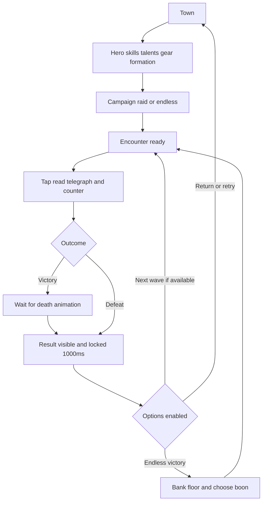
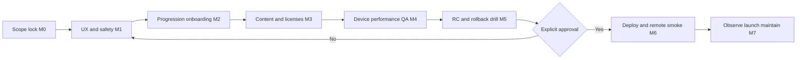
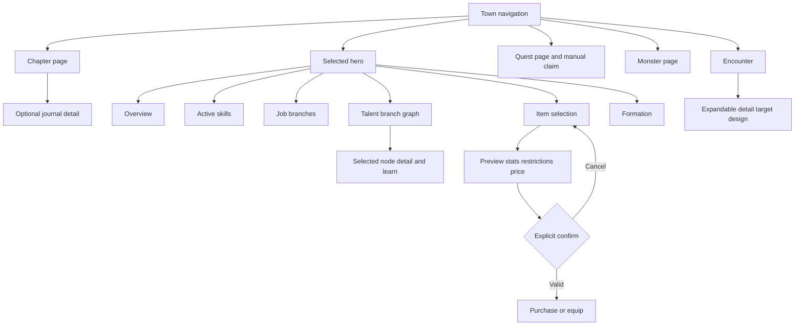
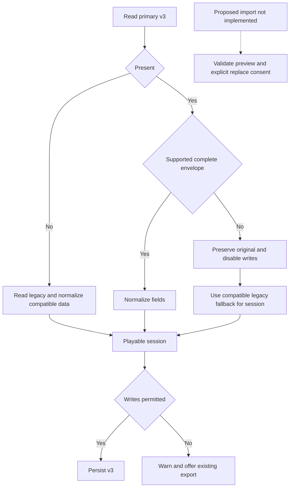
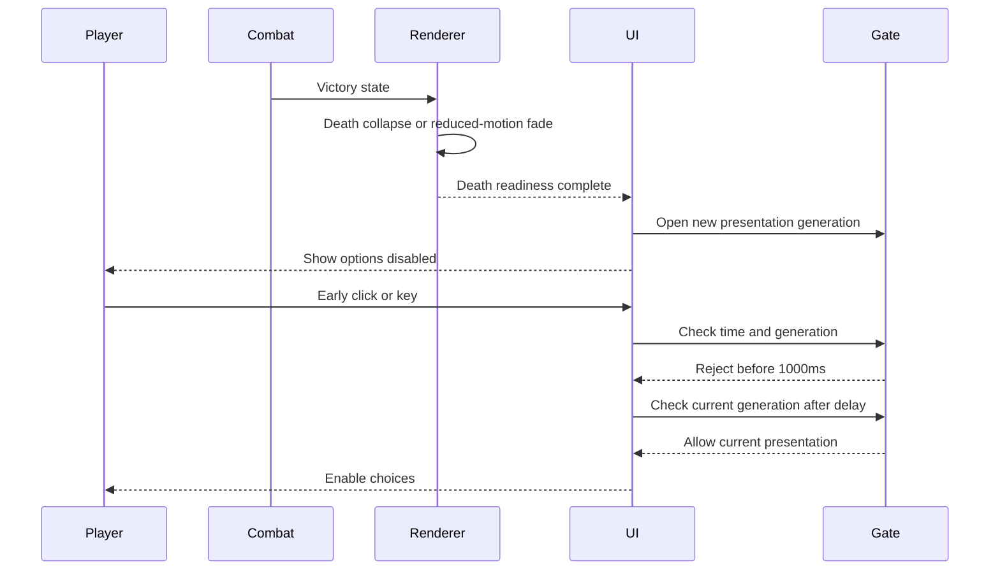

# Editable production diagrams

[Masterplan](../PRODUCTION-MASTERPLAN.md). Diagram menggambarkan baseline atau target yang diberi label, bukan proof implementasi. Edit file `.mmd` terkait saat flow berubah. Preview Mermaid tersedia di Markdown reader yang mendukung Mermaid; rendering grafis belum diverifikasi dalam pekerjaan dokumentasi ini.

## game-loop

[Editable source](diagrams/game-loop.mmd)

## production-flow

[Editable source](diagrams/production-flow.mmd)

## ui-navigation

[Editable source](diagrams/ui-navigation.mmd)

## save-release-safety

[Editable source](diagrams/save-release-safety.mmd)

## result-sequence

[Editable source](diagrams/result-sequence.mmd)

